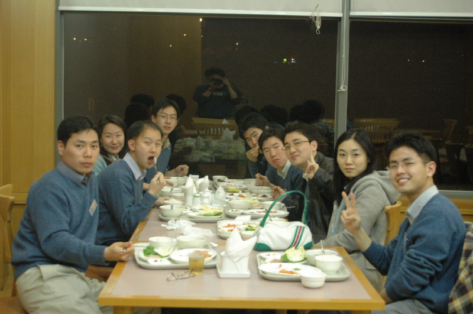
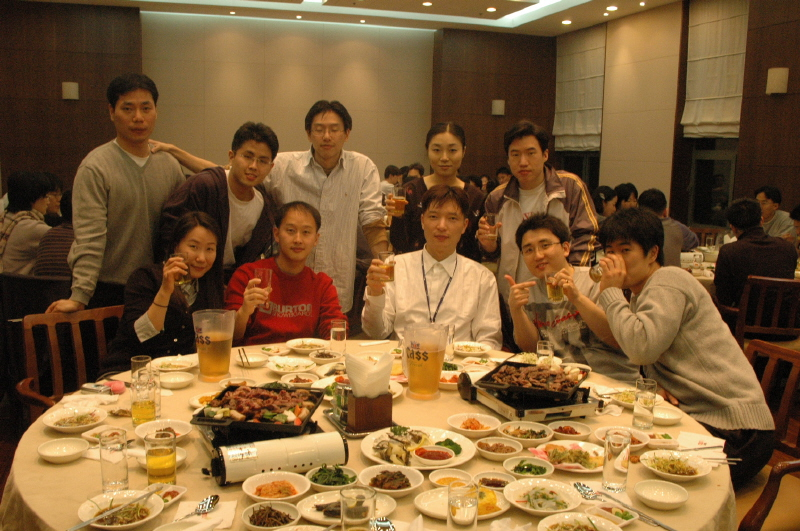

### 지난 겨울 연수원에서..

올 1,2월은 연수원에서 거의 대부분을 보냈다.
작년 말, 논문 인쇄 맡기고 미처 받아보지도 못한 채 1월 3일에 연수원에 들어가서,
거의 두 달간 입사동기들, 또는 계열사 신입사원들하고만 지냈다.
나름대로 즐거운 시간이었고, 새로 많은 사람들도 알게 되어서 보람은 있지만,
좀 더 적극적으로 사람들과 어울리지 못한 점이 아쉽다.
동기 중에는 정말로 성격이 사교적이어서 모든 동기들과 친하게 지내는 사람도 있는가하면,
나처럼 비교적 조용히 지내는 사람도 있었는데, 후자에는 공대출신이 많은 것 같다 (-_-)
잘 어울리는 사람들은 여러 사람들하고 사진도 많이 찍고 술자리도 (거의 매일) 같이 하던데,
나는 술도 약하고 사진 찍는 것도 즐기지를 않으니...
그 덕분에 연수원에서 남은 사진이 그리 많지 않다.
그나마 괜찮은 것 두 장만 올려보면..

분과 나뉘고 첫날이었나.. 같이 모여서 저녁식사 하면서 한 장

연수 중간에 체육대회 하고 저녁이 푸짐하게 나온 날 (아.. 맛있었는데..)

- 2005/04/03 17:59 에 작성