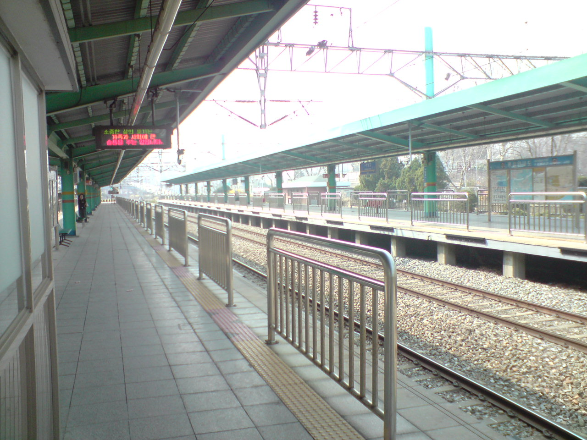
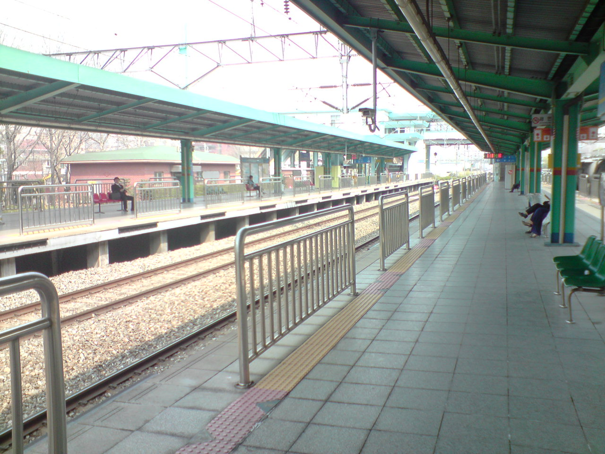

### 결혼식 다녀 오는 길에

이촌동 한 교회에서 있었던 친구 결혼식에 갔다가 돌아오려고 중앙선 서빙고역에 들어갔다.

완연한 봄날씨에 햇살은 따땃하고, 바람은 시원하게 불었다. 울타리 건너편에는 노란 개나리와 하얀 벚꽃이 예쁘게 피었고, 사람 없는 승강장은 고요하기만 했다.

열차가 오기를 기다리며 천천히 승강장을 걷다보니 마음이 편안했다. 정장 차림만 아니라면 그자리에 앉아서 한 시간쯤 잠을 자고 싶을 정도로.

천국이 따로 없었다.

사진은 잘 나왔는데 찍을 때의 분위기가 완전히 느껴지지는 않아서 아쉽다.

- 2008/04/05 21:37 에 작성