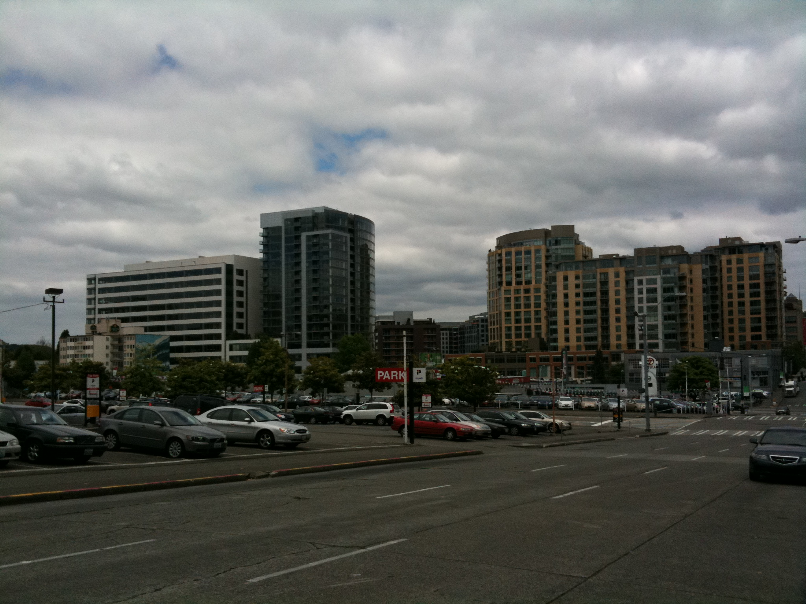
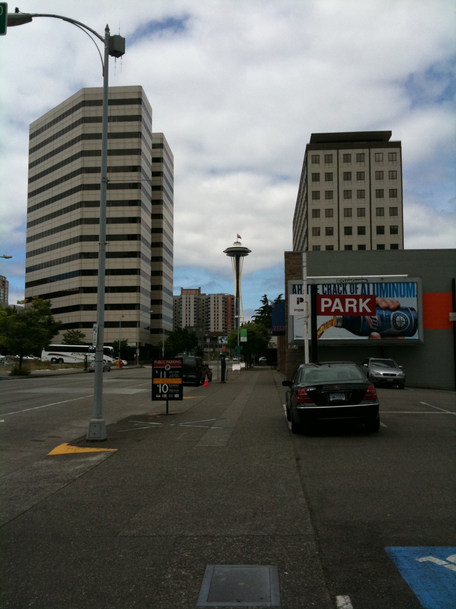
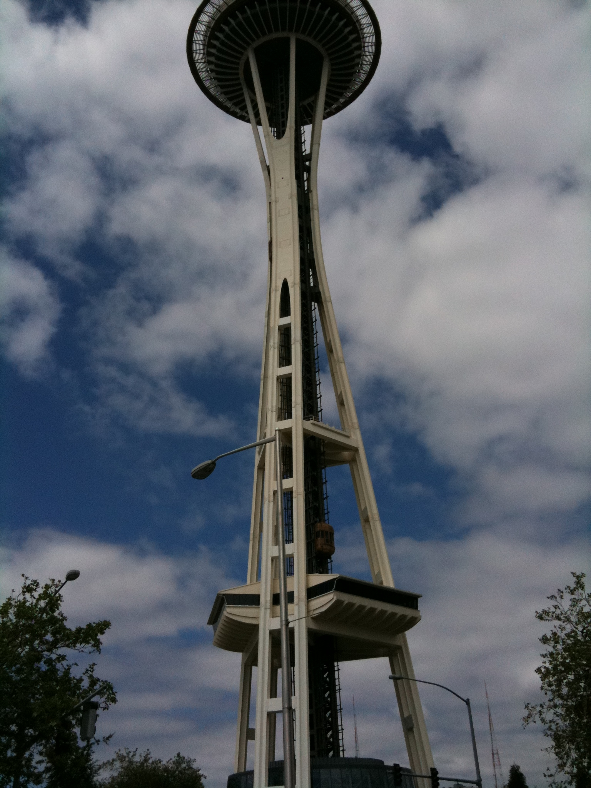
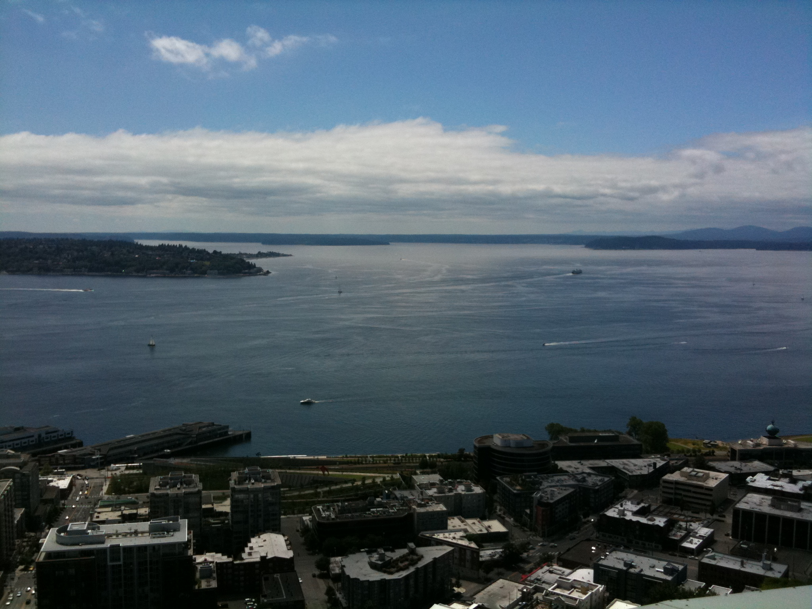
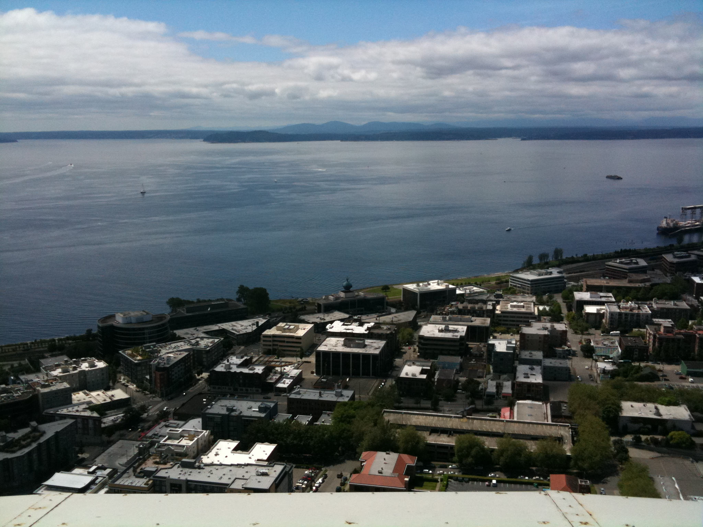
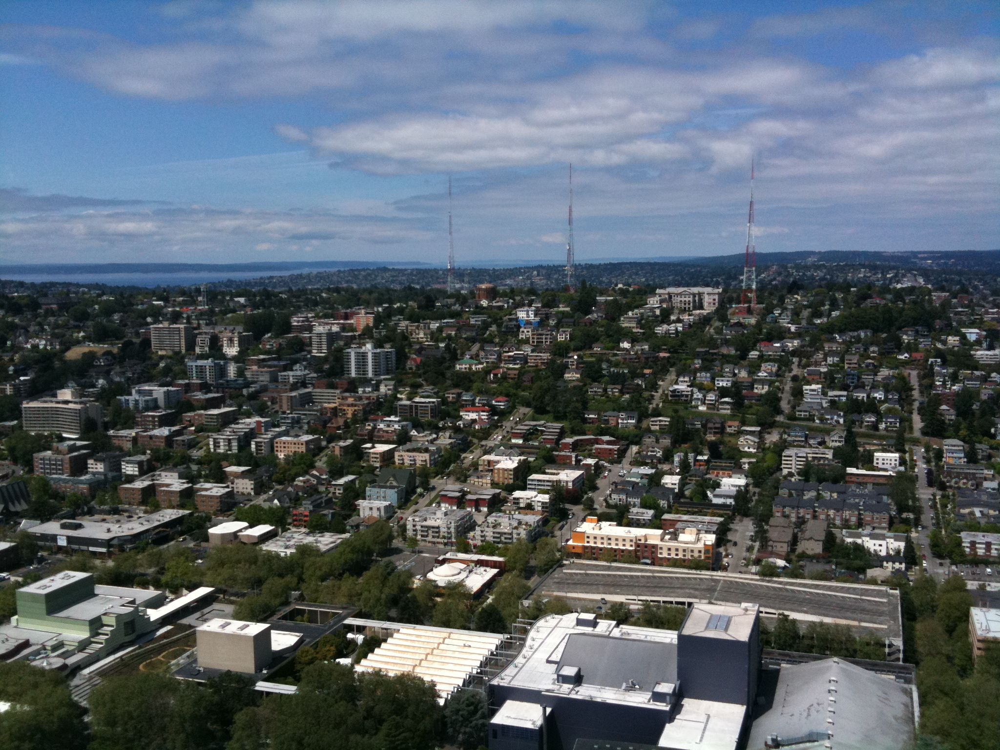
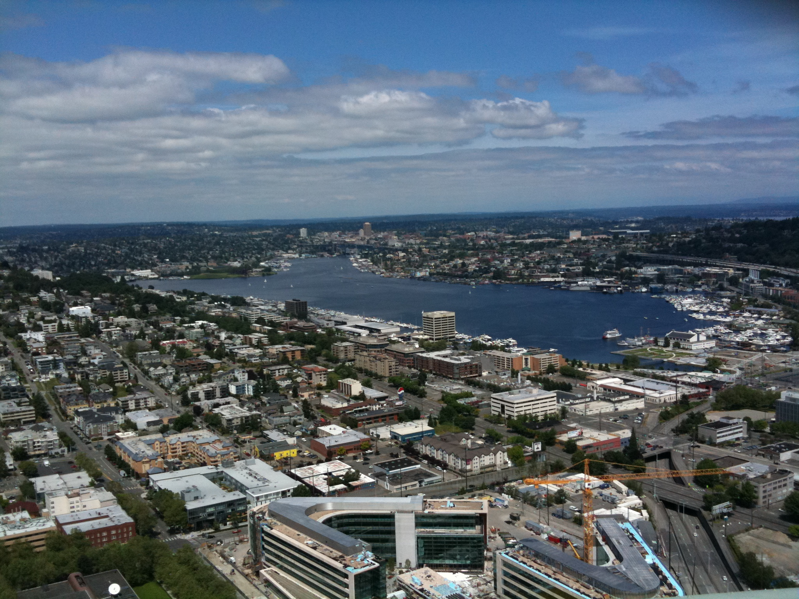
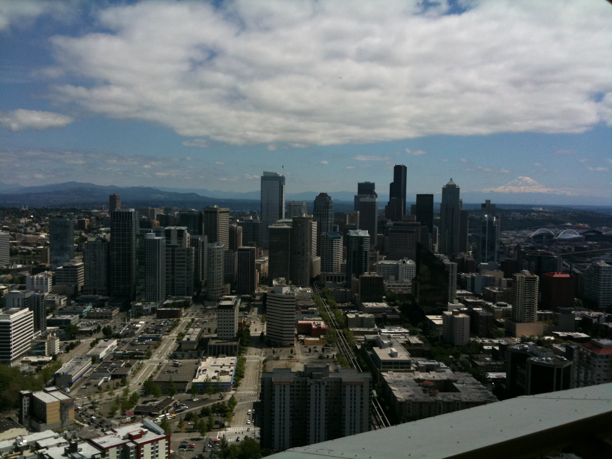
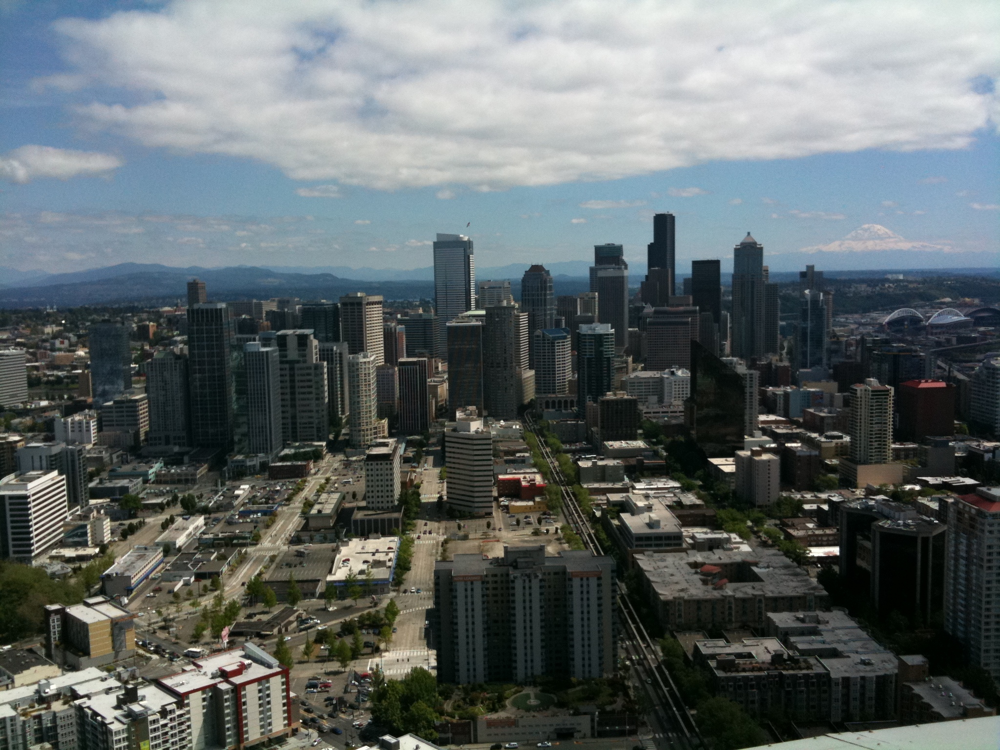
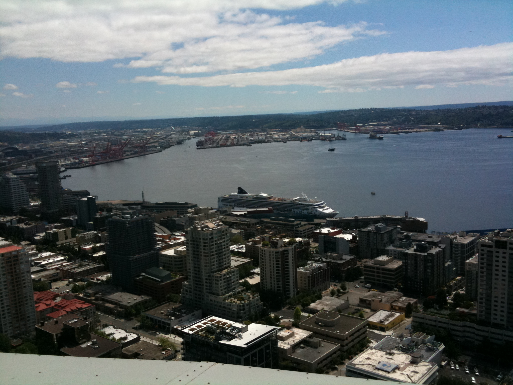

### Seattle - Space Needle

<a href="5302113.html" title="">Seattle - Downtown, Place Pike Market</a> 에 이어서...

시장을 빠져나와 이번에는 Space Needle로 향했다. 아이폰 지도를 보면서 대충 가까운 길을 찾아갔음. 걸어서 한 30분 정도 걸렸나?

가는 길에 의미없이 한 컷.

저 멀리 Space Needle이 보인다.

도착해서 바로 앞에서 전체 샷. 꼭대기가 좀 잘리긴 했다만. 1층엔 기념품 가게가 있고, 전망대로 올라가는 엘리베이터는 2층에서 출발한다. 엘리베이터는 총 세 대가 있는데, 각각 이동 속도가 달랐다. 그런데 한대가 고장났는지 두 대만 움직이는 상황. 입구에서 모든 입장객의 사진을 찍어주는데, 전망대에 올라가면 자기 사진을 합성해서 뽑을 수 있는 것 같다. 하지만 기다리는 사람이 너무 많아서 패스.

520피트 높이에서 바라본 시애틀이다. Space Needle은 이름이 암시하듯이 우주박람회 머시기가 열렸을 때 지어졌다고 한다. 어떻게 하면 우주를 상징하는 건축물을 지을까 고민 끝에 나온 디자인이라고 안내판에 설명이 되어있다. 거의 40년 전에 지어진 건물 치고는 상당한 기술과 센스가 돋보이는 작품이다. 호수 덕분에 주변 경관도 꽤 볼만하다. 야경이었다면 더 멋있었겠지만...

Space Needle에서 내려오니 이미 오후 3시가 되어서 한참 떨어진 Discovery Park는 아쉽게도 다음 기회로 미루었다. 간만에 오래 걸어서 그런지 체력이 달려...

아직 열 번 정도 주말이 더 남았으니 다음번엔 좀 더 여러 곳, 좀 더 먼 곳을 구경해봐야겠다.

- 2010/06/28 04:07 에 작성