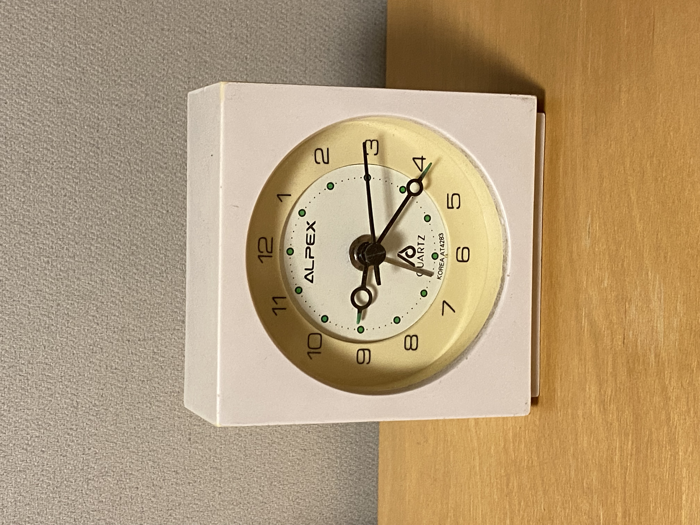

아침에 일을 시작하려고 책상에 앉았는데 탁상 시계가 멈춰 있었다. 건전지가 다 되었다고 생각해서 책상 위에 두었던 쓰다남은 여분의 건전지로 갈아끼웠지만 바늘이 움직이지 않았다. 드문 일이라고 생각했다. 다른 전자기기는 움직이지 못하는 건전지라도 이 시계에 넣으면 움직이는 경우가 종종 있었기 때문이다. 아이 장난감이나 큰 시계에서 쓰다가 다 닳아서 버릴 법한 건전지도 어지간하면 한동안 더 쓸 수 있는 시계였다. 그야말로 마지막 한 방울까지 짜내는 느낌이다. 그래서 평소 내 책상 옆에는 다른 기기에서 빼낸 건전지 한 무더기가 여기로 들어갈 순서를 기다리고 있었다.

다른 여분 건전지로 바꿔 끼웠지만 여전히 시계는 먹통이었다. 몇 개를 더 끼워보다가 안되겠다 싶어서 아예 새 건전지를 넣어보았다. 이래도 안되면 건전지가 원인이 아닐 테니까. 다만 새 건전지를 넣기 전부터 왠지 안될 것 같다는 예감이 들었다. 이미 예닐곱 개가 넘는 중고 건전지로 확인했고, 이들이 모두 완전히 방전됐다고 믿기는 어려웠으니까. 아니나다를까 새 건전지로도 시계는 살아나지 않았다. 건전지가 아니라 시계가 망가진 것이다.

이 탁상 시계는 고등학교 입학 때 어머니에게 받은 것으로 기억한다. 아마 기숙사 생활을 시작하면서 사용하라고 사 주셨을 것이다. 거의 30년 가까이 된 셈이니 망가진다고 해도 이상한 일은 아니다. 흰색 사각형 모양을 한 시계인데, 시, 분, 초침과 자명종 바늘만 달린 기본적인 탁상 시계다. 새 AA 건전지 하나를 넣으면 3년 정도는 가뿐히 움직이는 물건이다. 지금은 색이 바래서 약간 아이보리 색깔에 가까운데, 마치 원래부터 그런 색깔이었던 것처럼 자연스럽다. 문자판과 바늘 끝은 야광 처리가 되어 어두운 방에서도 대충 시간을 알아볼 수 있었다.

고등학교를 졸업한 뒤로 여기저기 옮겨다니면서 살았기 때문에 정확히 언제 곁에 뒀고 언제 부모님 집에 두었는지 기억은 안난다. 아마 대학생 시절에는 기숙사에 두고 살았을 것이고, 취업 후 자취할 때도 옆에 있었을 것 같다. 1년 정도 미국에 있을 때는 어땠는지 모르겠다. 지금 내 방에 놓여있다는 건 귀국 후 자취와 결혼 생활 내내 사용했다는 얘기다. 거의 대부분의 시간을 이 시계로 확인했겠고, 너무 자연스러워서 곁에 있는지 없는지 의식조차 하지 않았다.

그런데 늘 공기같이 옆에 두던 물건이 어느 아침에 갑자기 수명이 다했다. 마지막으로 가리킨 시각은 오전 6시 반 경이었던 것 같다. 시계가 멈춘 걸 확인한 때가 오전 9시가 조금 넘은 시각이었으니 3시간 정도 그대로 놓여있던 셈이다. 혹시나 싶어서 나사를 풀어 껍데기를 열고 내부 기계 장치를 살펴봤지만, 문외한인 내가 할 수 있는 건 없었다. 뭔가 내부에서 윤활유 비슷한 액체가 약간 새어나온 상태였는데, 휴지로 닦고 다시 조립해서 원상태로 돌려놓는 게 전부였다. 분해하고 보며 새삼 느꼈지만 참 단촐한 물건이다. 작은 기계 장치와 종이로 만든 문자판, 사각형 껍데기가 전부다.

수리를 맡길 데도 없거니와 설령 있다고 쳐도 새 시계를 사는 게 훨씬 싸고 빠르다. 예상치 못한 일이지만 받아들이는 수 밖에. 탁상 시계 하나를 붙들고 어떻게 할 지 계속 고민할 수는 없지 않은가. 그래도 반평생 넘게 함께 지낸 반려무생물이라 그런지 씁쓸한 느낌 한 조각은 분명히 느껴진다.

물건을 두고 조문(弔文)을 쓴다는 게 좀 웃긴 일이지만 함께 있던 시간을 생각하면 이 정도 성의는 보여야 하지 않을까 싶다. 지금까지 다른 시계는 물론이고 수많은 전자기기를 써왔지만, 이 녀석처럼 묵묵히 오랫동안 자리를 지킨 물건은 없었다. 방이 조용할 때 째깍째깍 들리는 초침 소리가 제법 좋았는데, 이제는 기억 속에서만 들리는 소리가 됐다.

