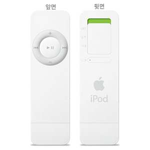

### iPod Shuffle

지난 달 말일에 산 아이팟 셔플입니다.

디카가 아직 없어서 직접 찍진 않았지만 (조만간 디카도 생길 예정입니다 얼쑤~)
어차피 사진에 나와있는 그대로이니 상관없습니다.

왜 이녀석을 사게 되었냐면요, 지난달 말에 본사 출근 시작하고 교육 받으면서 '이제 월급도 받았고 출퇴근 시간도 오래 걸리니 그 사이에 뭐라도 듣자'는 생각에서 MP3 플레이어를 알아보았습니다.
원래 복잡한 기능이 붙어있는 걸 싫어하는 터라 최대한 단순한 걸 알아보는 중에, 주변에 형들이 곧 애플에서 셔플이라는 게 나온다고 하더군요.
마침 인터넷에서 알아보니 딱 출시될 시기라 잘됐다하고 바로 예약주문을 했습니다.
그리고 2월 28일에 퇴근하는 길에 용산에 들러서 물건을 받았구요. (국내에서 젤 처음이라구요 -_-v)
절대로 최신 모델을 산 일이 없는 제가 이런 연유로 셔플을 사게 되었습니다만, 
(얼리어답터의 반대로 레이터답터 쯤 되려나?)
기능이 단순한 것에 비해서는 가격이 쪼오금 비싸지 않나 하는 생각도 듭니다.
1G짜리 처음 주문 때 18만원(512M는 12만원)이고 지금은 조금 떨어졌는데, 주로 20만원대 초반의 모델이 주류인 걸 보면서 좀 더 쌌더라면 하는 아쉬움이 약간 있네요.
하지만 어쨌든 이미 산 거고, 또 디자인이 단순하고 깨끗한게 꽤 마음에 들어서 기분좋게 쓰고 있습니당. 후후..

근데 가장 큰 약점 하나. 되감기 기능이 없네요. -.-
원래는 어학공부 목적이 더 큰 이유였는데, 한 번 듣기 시작하면 멈추질 못합니다.
하긴, 출근길에 복잡한 지하철에서 버튼누를 여유도 없긴 하지만.. 그런 점에서는 딱이랄까요?
어쨌든 요즘 이녀석 덕분에 출퇴근 길이 무의미하지는 않게 되었습니다.

* 원래 이 카테고리는 회사일이나 일상적인 일 외에 모든 것, 취미, 어학, 개인공부, 기타 관심분야 등등에 포함되는 모든 걸 쓸 생각이었습니다. 그래서 제일 글을 많이 쓰게 될 거라 생각했는데, 막상 쓰다보니 이게 첫 글이네요.. -.-;

- 2005/03/19 15:03 에 작성