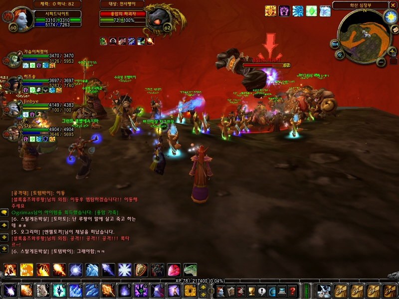
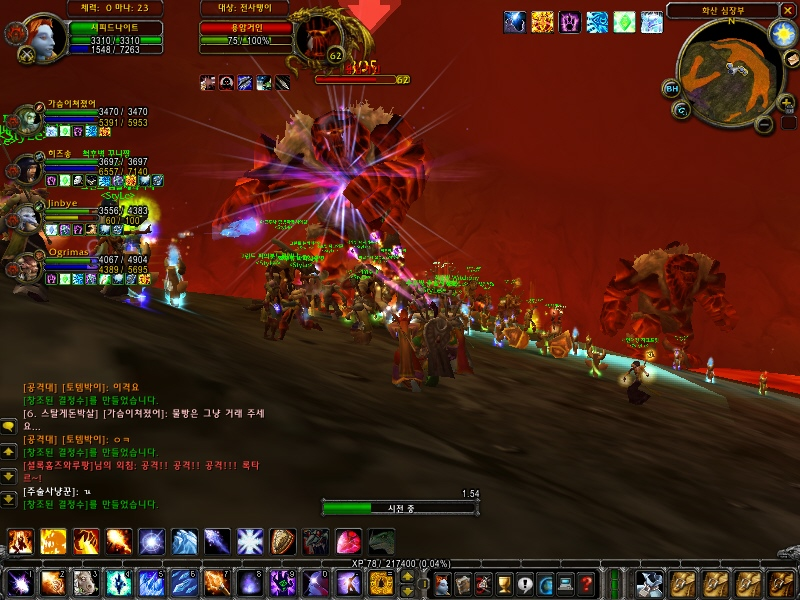
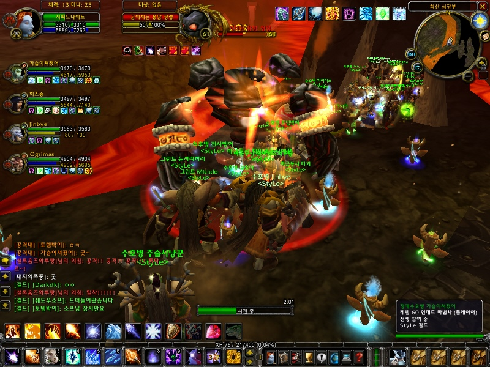
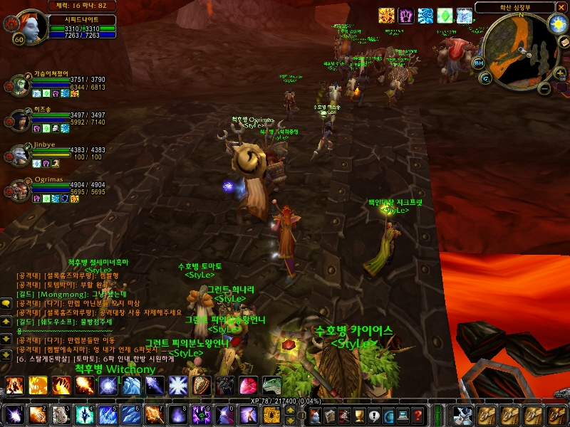
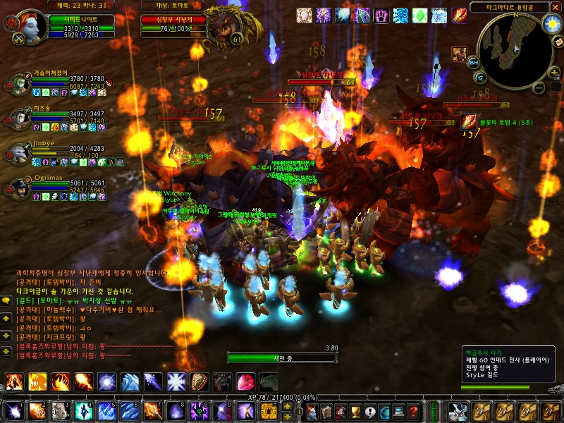
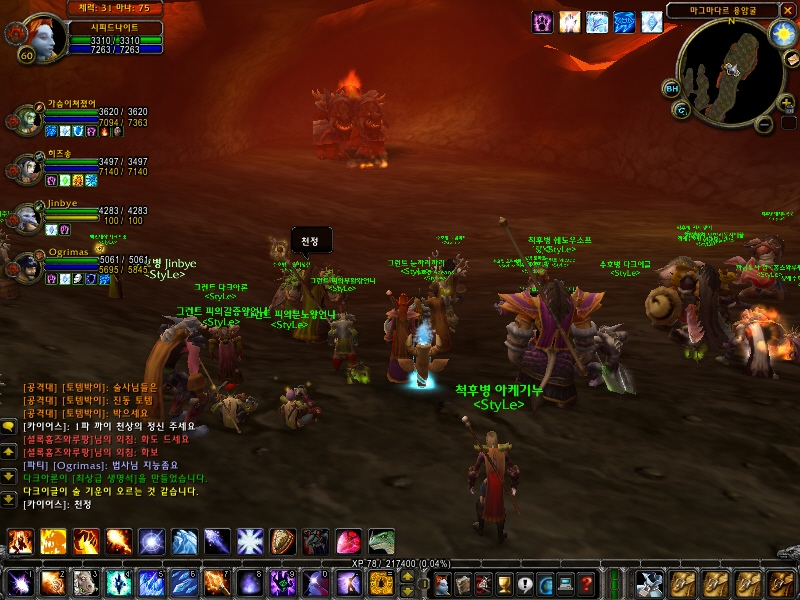
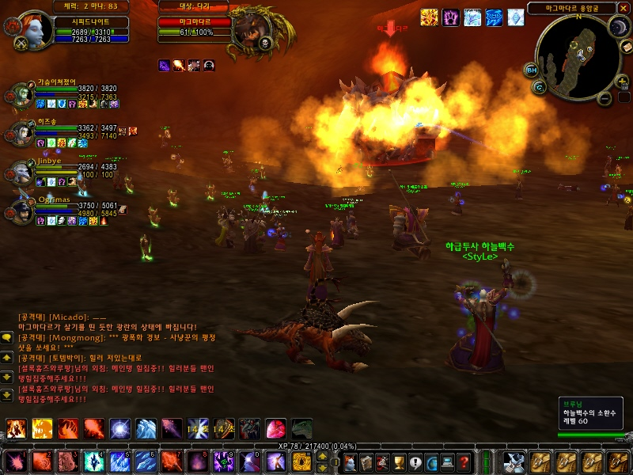
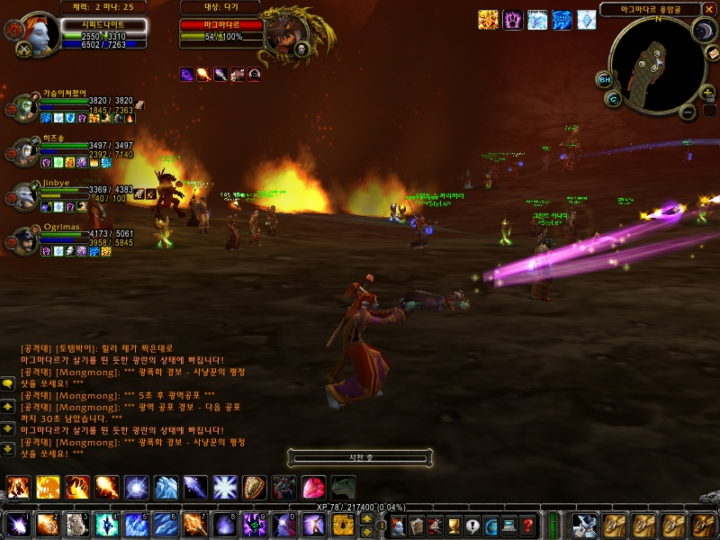
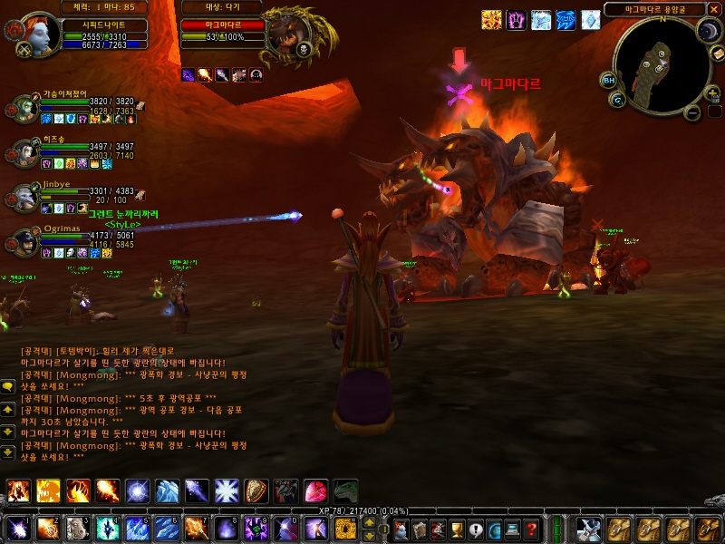

### 화산심장부 방문기

어제 길드가입 이후 처음으로 화산심장부를 가봤습니다.
인원은 40명(중간에 한두 명 빠지기는 했지만), 시간은 약 세 시간 남짓 걸렸습니다.
레이드 인던 경험은 처음이었는데, 역시 보통 인던과는 차원이 다르더군요.

시작은 7시, 접속하자마자 길드분한테 납치당해서 공격대 편입.
열심히 인던입구까지 날아가서 합류하고 진입 퀘스트도 마친 다음 본격적으로 시작.

시작부터 만만치 않은... 웬만한 몹 하나가 인던 보스급 수준 이상이더군요.

거인들도 (그것도 둘씩이나) 날뛰고..

이쯤되면 난장판입니다. 정신 못차려요.

열심히 다리도 건너고...

대규모 (그래봤자 다섯 마리) 똥개군단에 대항해서 열심히 광역마법도 써주(다가 눕기도 하)고,

자, 이제 저 멀리 네임드(준보스급) 괴물이 보입니다. 폭풍(광풍) 전야.

미친듯이 불을 뿜는 괴물녀석. 앗싸 뜨겁구나!! (디아블로의 라이트닝에 버금가는 수준인 듯. 가만히 맞고 있으면 멍청이에요.)

곳곳에 솟아오른 불구덩이, 열심히 덤벼드는 호드의 용사들과... (오, 독사진이다 독사진)

한 번에 몇 명은 가볍게 눕히는 멋지신 네임드 몹님.

10분 가까이 걸린 사투끝에 결국 네임드 몹은 무릎을 꿇고 말았습니다. 후후..(의기양양)
이녀석 말고도 훨씬 많고 강력한 괴물들이 수두룩한 곳이 화산심장부입니다만.
첫번째 화산심장부 참가는 (어쨌든) success!!

참고로, 전 18섭(줄진)에서 트롤마법사입니다. 

- 2005/08/14 11:53 에 작성