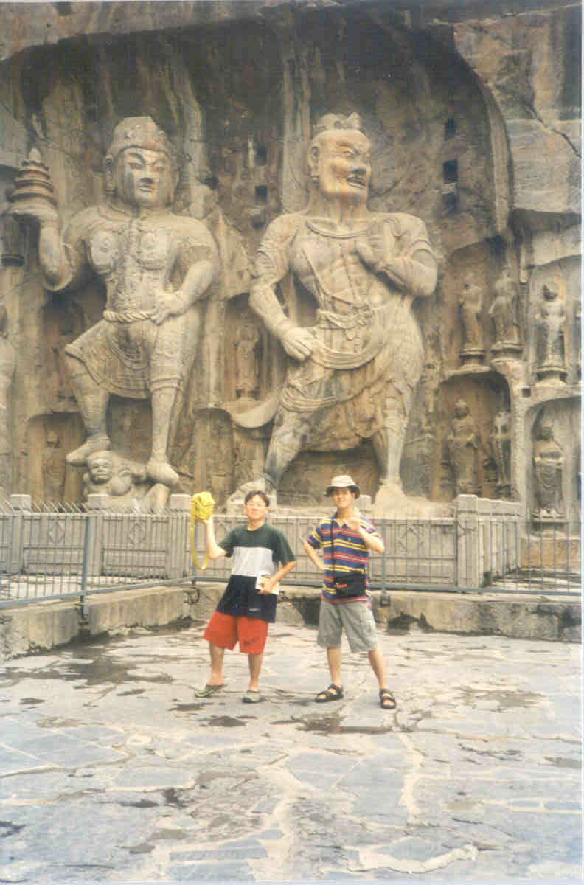
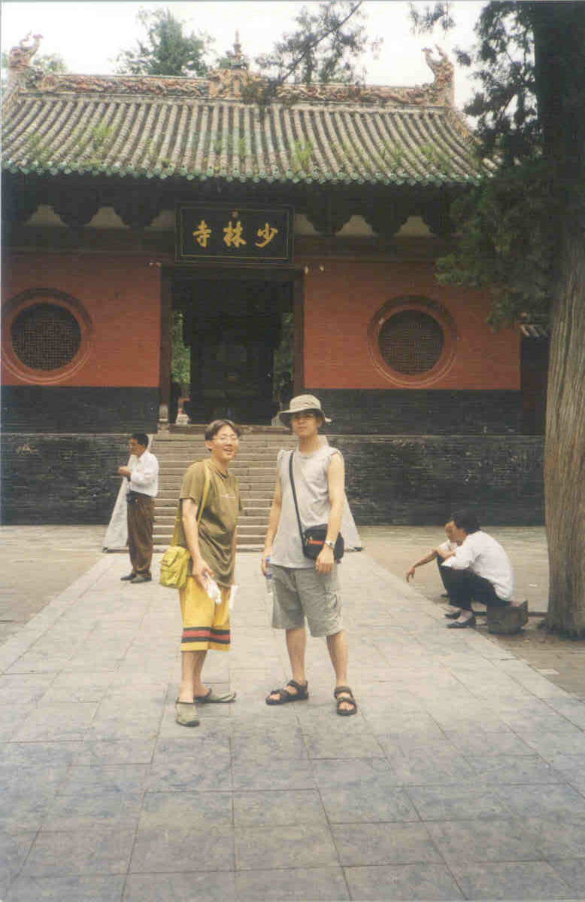

## 제목
중국여행기 - 2.뤄양 글타래

## 날짜
2005/08/30 22:44

## 본문
2. 뤄양 (낙양 : 洛陽)
 

   뤄양은 우리식으로 흔히 낙양이라고 부르며, 후한 시대의 수도였고 삼국지에서도 중심 무대로 등장한다. 사실 삼국지를 너무 많이 읽어 달달 외울 정도인 나로서는 뤄양이라는 중국식 발음보다 낙양이 훨씬 친근하고 생생하게 느껴진다. 한때 인구 백만을 헤아리던 한 왕조의 수도. 당시의 지도를 펼쳐놓고 본다면 뤄양은 고대 중국의 문화 중심인 화북의 정중앙에 위치하여, 주변의 모든 국토를 호령하는 듯한 인상을 준다.

   하지만 옛날은 옛날이고 지금은 지금이다. 사실 오늘날의 뤄양은 별로 볼거리가 없다. 여행 안내 책자를 펼쳐보아도 그리 많은 말이 쓰여 있지는 않다. 다른 유수 도시에 비해 크게 발전된 편도 아니라서 도심지에도 별로 다닐 만한 곳은 없다. 어쨌든 나로서는 제일 기대를 했고, 그만큼 제일 실망했던 도시가 바로 뤄양이다. 아마 내가 이곳에서 많은 재미를 느꼈다면 이 글을 내가 좋아하는 낙양이라는 호칭으로 도배했을지도 모른다.
 

   게다가 도시는 별볼일 없는 주제에 공기는 베이징 뺨치게 더럽다. 이곳은 도심 주변에 높은 빌딩이 적은 덕분에 주변에서 도심이 한눈에 들어오는데, 문제는 항상 누리끼리한 매연으로 덮여 있어서 잘 보이지 않는다는 점이다. 도시 밖에서 그 엄청난 광경을 보고 있자면 어떻게 저 안에서 사람이 살까하는 궁금증이 생길 정도다.

   대신, 택시는 다른 도시에 비해 아주 싸다. 비교적 택시비가 싼 베이징도 기본료가 7위안(약 1000원)인데, 이곳은 기본이 5위안(약 7-800원)이다. 게다가 킬로미터당 1.2위안(약 200원)정도여서, 웬만한 거리는 택시를 타고 다녀도 부담이 없다. 물론 여기서 익숙해진 물가관념 덕택에 이후의 비싼 도시들에서는 고생 좀 했지만.
 

   기차역에서 내리자마자 수많은 호객꾼들이 발길을 잡는다. 외치는 소리는 거의 똑같다. <샤오린쓰(小林寺:소림사)!>. 즉 우리가 잘 아는 소림사에 가려는 사람들을 태우려는 사람들이다. 이거야 원, 기차역에서 내리자마자 소림사부터 가는 사람이 어딨냐고...

   아무튼 이 근방에서는 소림사가 꽤나 유명한, 그리고 거의 유일한 구경거리인 듯 싶다. 사실 가까운 곳에 룽먼(龍門) 석굴이 있기는 하지만, 소림사가 세계적으로 유명한 곳인지는 중국 사람들도 잘 아는 것 같다.

   가 볼 곳은 위에서 말한 두 곳, 소림사와 룽먼 석굴, 머물 시간은 이틀이니 뻔한 결론이다. 하루는 석굴, 또 하루는 소림사.
 

   룽먼 석굴은 역 앞에서 버스를 타면 한 시간 정도 걸리는 거리다. 도심을 빠져나와 한산한 도로를 달리다보면 강이 하나 흐르고 있고, 그 강 옆에서 내리면 바로 보인다. 강변을 따라 버드나무가 줄지어 늘어서 있고, 유유히 흐르는 강과 그 옆을 같이 흐르는 산세와 어우러져 제법 분위기를 갖추고 있다. 물론 내가 버드나무를 무척 좋아하는 것도 한 이유지만. 그러나 이렇게 좋은 첫인상은 매표소에 도착하는 순간 하늘 저멀리 날아가 버리고 만다. 입장료 60위안. 안내 책자와 몇 배는 차이가 나는 금액이다. 중국의 물가가 지난 수년간 몇 배가 상승했다고 보기는 어려운 일이고...

   잠시 고민한 끝에, 결국 들어가 보는 길을 택했다. 그래도 역사적인 유물인데다 10만 개나 되는 석불이 있다니 나름대로 볼 만하지 않을까하는 기대감을 안고. 정말 10만 개인지는 모르겠지만 그렇다고 해도 적어도 5만 개 정도는 제모습이 아니었다. 상당수의 불상이 머리가 없는 채였다. 마오쩌둥의 문화대혁명 때문에 없어진 것일지, 아니면 그 불상에 대한 무속 신앙 등의 이유로 사람들이 가져가 버렸는지 궁금하다. 작은 것은 20센티미터 정도, 아주 큰 것은 10여 미터에 이르는 것도 있다. 가장 볼 만했던 것은 좌우에 사천왕을 두고 절벽따라 우뚝 서 있는 불상이었다. 사천왕의 앞에서 그들의 자세를 흉내내며 기념사진 한 방.

   그러나 이 날의 덥고도 눅눅한 날씨로 말미암아, 거기에 더해서 석굴을 오르내리는 계단이 너무 많았던 탓에, 나를 비롯한 모든 일행이 지쳐버렸고, 결국 이것 하나만 보고 일찍 숙소로 돌아가 버리는 사태가 발생하기도. 귀중한 시간에 참 아쉬운 일이다.
 

   이튿날은 기대하던 소림사 여행. 뤄양에서 약 80킬로미터 정도 떨어진 곳이라 하는데, 실제로 거기까지 가는 시간은 두 시간도 더 걸린 것 같다. 이유는 형편없는 중국의 도로 사정, 우리 나라에서 10년 전에 폐차되었을 법한 낡아빠진 승합차, 사람을 꽉 채우기 전에는 출발하지 않는 장삿속 때문... 이 절대로 아니라, 가는 도중 몇 차례나 어딘가에서 차를 세우고 엉뚱한 시간을 보냈기 때문이다. 기억하기로 세 번쯤 차가 멈췄던 것 같다. 처음에는 그냥 차 안에서 기다리려 했지만 결국 내려서 들어가 보았더니 바로 아침을 먹을 식당이었다. 아침 일찍 나오느라 제대로 먹은 게 없던 상황에서, 그 허름한 식당에서 볶음밥과 그밖에 정체불명의 요리를 시켜서 맛있게 먹었다.

   소림사에 도착하니 과연 이곳이 유명하구나하는 생각이 들게끔 주변은 무술도구와 기념품을 파는 가게들이 늘어서 있다. 좀 더 걸어가니 커다란 문이 나오고, 그 앞에서 표를 팔고 있었다. 표를 내고 들어가는 문도 관광지의 문이라고 하기에는 좀 허접한 게 아닌가 싶었는데, 아뿔싸, 나중에 알고보니 그 문이 바로 일주문이었던 것이다. 내가 사찰 구경을 많이 다녀본 것은 아니지만, 일주문에서 표를 받는 이런 황당한 경우는 못 본 것 같다. 아무리 사람들이 많이 오는 관광지라고는 하지만 그래도 역사가 오래 된 사찰인데 일주문이 이런 용도로 쓰인다는 건 아무리 좋게 보아도 세속화의 극치라고 할 수밖에.

   일주문 뿐이 아니다. 본격적으로 가람배치가 시작되는 사천왕문 앞에도 사람들과 장사꾼들이 상당수 모여 있었다. 왠지 유서 깊은 사찰이라기보다 그냥 평범한 관광유원지에 온 기분이었다. 역사도 전통도 자본의 흐름 앞에서는 무력해지고 마는 것인가. 우리 나라에서와 같은 조용한 분위기를 기대했던 나로서는 씁쓸함이 이만저만 아니었다.
 

   소림사가 있는 숭산(崇山)은 중국 불교의 4대 명산이라고 한다. 확실히 소림사 하나만으로도 그만한 가치는 있겠지만, 그에 앞서 이 산은 산세 또한 묘하게 사람을 끄는 데가 있다. 산세가 험하지 않아 마치 우리 나라의 산들을 보는 듯한 느낌이었다. 게다가 우리가 갔던 날은 잠시 소나기가 내렸는데, 비를 피하기 위해서 잠시 들어간 누각에서 보는 산등성이는 구름과 안개에 살짝 가린 채 그림과 같은 풍경을 연출하고 있었다. 과연 이런 산이라면 명찰을 키울 만 하겠다는 생각이 들었다.
 

   뤄양에서는 앞서 말한 석굴과 소림사, 정확히 이 두 가지만 들러보았다. 사실 더 볼 것도 없는데다, 젊은 사람들이 좋아할 만한 구경거리는 별로 없기 때문에 다들 오래 머물기를 꺼리는 눈치였다. 하긴, 애시당초 시안으로 가는 길목에 잠시 들를 계획이었으니.

   중간에 우리 나라 여행객을 만나서 이야기를 나누었다. 그 사람들은 핑야요라는 곳에 갔었다고 했는데, 오래된 성벽과 건물들이 많이 남아있어 볼만하다고 했다. 나같은 역사광으로서는 통탄할 일이지만 미리 조사를 하지 않은 잘못이니 아쉬움만 남기고 돌아선다. 다음은 전한(前漢)의 수도였고 뤄양과는 고도(古都)로서 쌍벽을 이루는 시안(西安).