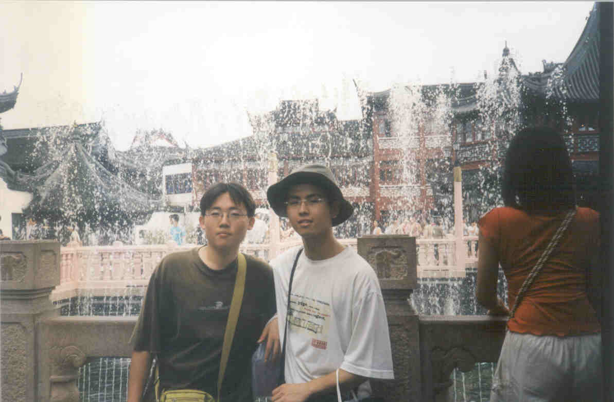
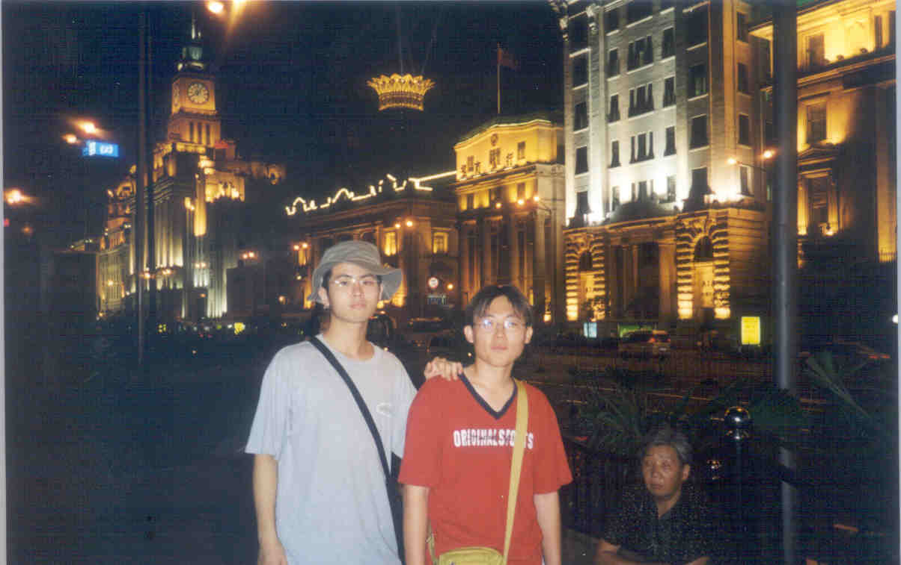

## 중국여행기 - 7.상하이

7. 상하이 (상해 : 上海)
 

   드디어 중국 여행도 막바지에 이르렀다. 상하이에 도착할 즈음엔, 여행을 처음 시작할 때의 마음과는 상당히 달라져 있었다. 우선 여행 초기의 설렘은 사라진 지 오래다. 한 달 가까이 지내오면서, 먹는 것은 항상(엄밀히 말하면 항상은 아니지만) 중국 음식, 들리는 말이라고는 온통 중국말이다보니, 어느새 나 자신이 중국인이 되어버린 듯 아무렇지도 않게 된 것이다. 또 귀국할 날이 다가오면서, 이제는 여행에 대한 기대감보다는 귀국의 기대가 더 커져버린 점도 들 수 있겠다.

   그리고 무엇보다 이때쯤에는 상당히 지쳐버린 상태였다. 홍콩을 나와 광저우로 돌아간 뒤, 상하이로 오는 기차를 타려 했지만 표를 구할 수가 없었다. 이래저래 고생 끝에 간신히 구한 것이 상하이에서 6시간 정도 떨어진 난징(南京)으로 가는 기차표였다. 하는 수 없이 난징으로 가서 하루를 묵고, 이튿날 상하이로 향했지만, 그것조차 바로 가는 열차가 없어서 뱅부(?埠)라는 낯선 도시에서 다시 기차를 갈아타야만 했다. 이런 고생을 하고 간신히 상하이에 도착했으니, 거의 탈진하다시피 하는 것도 이상한 일이 아닐 것이다. 그나마 난징에서는 숙소라도 쉽게 잡은 편이지만, 광저우에서는 기차표와 숙소를 구하는 데 애를 먹어서, 하마터면 일행이 뿔뿔이 흩어져 미아가 될 뻔한 일도 있다.

   이런 고생을 하고 도착한 상하이에는 과연 어떤 구경거리가 있을까. 여행의 마지막 사흘간 일정이 시작되었다.
 

   상하이는 여러모로 우리에게 친숙한 도시이다. 지리적으로도 가까운 편인데다, 일제 시대에는 임시정부청사가 이곳에 있었다. 또 가요의 가사에 등장하기도 하는 몇 안되는 해외도시 중 하나다. 그렇지만 이런 것들은 모두 책에서 읽고 귀로 들었을 뿐이지, 직접 방문하여 그 모습이 눈에 들어온다면 또 다른 느낌일 것이다.

   근대 역사에서 상하이는 중국의 근대화의 상징이라고 볼 수 있겠다. 일단 지리적으로 외국의 접근이 쉬웠기 때문이리라. 당시의 여러 강대국이 상하이에 조계지를 두어 자신들의 세력을 확장하는 데 이용했던 당시에 지어진 여러 건물들이 아직 온전히 남아있다. 또한 신흥 경제 중심지로서 발돋움하고 있는 도시인지라, 어떤 곳은 아직 한창 개발이 진행중인 곳도 있다. 어쨌든 우리가 다녀본 도시들 중에서는 홍콩 다음으로 번화한 도시가 바로 이곳이다.

   당연한 일이지만, 상하이에 도착하여 가장 먼저 본 것은 거대한 기차역. 플랫폼이 전부 몇 개나 있었는지는 기억나지 않지만, 우리가 내린 곳이 11번이었으니, 적어도 십 수 개는 된다는 얘기다. 기차역을 빠져나와 가장 먼저 하는 것은 숙소를 잡는 일. 이제는 수많은 호객꾼들 사이에서도 당황하지 않고 웬만큼 여유있게 흥정을 할 정도로 익숙해졌다.

   몇 사람과 흥정한 끝에 결국 한 초대소(招待所)로 결정했다. 중국에 처음 왔을 때 초대소에 대한 설명은 조금 들었지만 실제로 묵어보는 것은 처음이다. 그렇다고 이전까지 묵었던 숙소들과 특별히 다를 건 없었다. 어차피 돈없는 배낭여행족이 묵을 수 있는 곳들은 고만고만한 비용이 들고, 수준을 비교하는 것도 도토리 키재기에 불과하다. 굳이 좋은 점을 꼽자면 기차역까지 걸어서 갈 수 있을 정도의 거리라는 점 정도.

   이쯤되면 다들 가져온 중국돈이 떨어져서 환전을 해야할 필요가 있다. 그런데 여행자수표를 받는 은행을 찾기가 쉽지 않아 환전한는 것도 꽤 시간이 걸리는 일이 되었다. 덕분에 역 주변의 거리를 죽 둘러볼 수 있었지만.

   상하이에서 머문 기간동안은 조금 바빴다. 어쩌면 몸보다 마음이 더 바빴는지도 모른다. 이미 이야기한 대로 하루를 쪼개어 쑤저우를 구경하러 간 것도 그렇고, 이제 여행이 끝나간다는 생각에 왠지 조급함을 느낀 것 같다. 물론 지인들에게 줄 선물을 염두에 두고 있는 것도 한 몫 거들었고. 하지만 도시의 분위기 역시 활기차서 우리가 서두르는 것이 조금도 어색하지 않았다. 단지 다른 사람들의 행동에 이끌려가는 듯이 보일 뿐...

   사실 이틀간 상하이를 돌아다녔다고는 하지만 실제로 다닌 곳은 그리 많지 않다. 역과 숙소에서 그리 멀리 떨어진 곳은 가지 않았다. 하긴 아는 사람들이 상하이에서 볼만한 곳은 와이탄(外灘) 한 군데밖에 없다고 말했지만. 크게 보면 이 와이탄·난징루(南京路)와 푸동(浦東)지구, 그리고 위위안(豫圓), 세 군데를 보았다.

   임시정부청사는 아쉽게도 보지 못했다. 안내책자에는 그리 볼 건 없다고 쓰여 있었다. 하지만 역사적으로 의미있는 장소를 방문한다는 것은 중요한 일일 것이다. 아마도 뭔가 새로운 것을 보러 다니기에는 다들 지쳐있었나 보다.

   우리가 둘러본 시내의 지리를 간단히 설명하자면, 시내의 중심 부근에 기차역(숙소 근처)이 있고, 거기서 지하철을 타고 동쪽, 즉 바다 쪽으로 향하다 보면 강이 하나 흐르고 있다. 이 강을 중심으로 기차역 쪽으로는 개화기 때 지어진 유럽풍의 건물들이 강변을 따라 늘어서 있다. 이 안쪽은 상당히 번화가인데, 그중에서도 중국 최대의 번화가라는 난징루가 자리잡고 있다.

   강 건너편에는 최근에 지어진 마천루들이 위용을 뽐내고 서 있다. 이것이 바로 상하이의 신흥 중심지로 떠오르는 푸동지구이다. 여기에는 높이 수 백 미터의 건물들이 상당수 자리잡고 있는데다 아직도 개발이 한창이다. 급진하는 중국을 극명하게 드러낸다고 할 수 있다.

   또다른 볼거리인 위위안은 앞의 두 곳과는 정반대로 오랜 역사 유적이다. 와이탄의 남쪽에 자리잡고 있으며, 주변은 우리 서울의 인사동과 흡사하게 기념품 가게들이 모여 있는 곳이다. 위위안은 오래된 정원으로 많은 관광객이 찾는 곳이기도 하다.

   이렇게 세 명소가 삼각형을 이루는 근방이 상하이의 중심부라 할 수 있겠다. 수백 년 된 문화재와 전통 양식의 목조 건물들, 19세기 근대화를 상징하며 강변을 따라 위엄있게 서 있는 석조 건물들, 그리고 새로이 발전하는 중국을 대표하는 최신식 건물들이 가까이 모여 있는 이곳에는 시공을 초월한 세계가 펼쳐져 있는 느낌이다. 지난 수백 년의 세월을 거슬러 올라갔다가 다시금 순식간에 근미래의 세계로 빨려오는, 신비한 시간여행을 할 수 있는 셈이다.
 

   그 중에서도 도착한 첫날 저녁은 난징루를 거쳐 와이탄을 가 보았다. 난징루는 길이만도 수 킬로미터는 됨직한데, 동·서로 나뉘어 있다. 우리가 다닌 곳은 주로 동쪽이었는데, 인민광장이라 불리는 곳에서 시작하여 와이탄에 이르기까지 곧게 뻗은 길이다. 이 길은 차도없이 보도로만 이루어져 있고, 중간중간에 차도를 가로지르는 곳도 있다. 폭이 이십 미터는 될만한 넓은 길인데도 사람이 워낙 많아 북적거린다. 또 간간이 관광용 무궤열차가 지나가기도 한다.

   주변은 온통 백화점과 쇼핑몰, 호텔과 가게들로 숲을 이룬다. 과연 중국 최고의 번화가라는 호칭이 붙을 만 하다. 거리도 제법 잘 가꾸어 놓아서, 걷기만 해도 즐거워 질 수 있는 곳이다. 그리고 지금은 대부분 호텔로 바뀌었지만 와이탄에 가까워지면서 조금씩 늘어나는 유럽식 건물들도 좋은 구경거리가 된다.

   한참을 걷다보니 멀리 길이 끝나는 곳이 보였다. 조금 더 가까이 가보니 사람들이 길 건너 수많은 사람들이 모여 있는 곳이 있었다. 길에서는 보이지 않았지만, 그곳이 유명한 와이탄이라는 걸 짐작케 하는 광경이었다. 약간 높은 곳에 있어서 강이 보이지 않았기 때문에 궁금증이 더해졌다. 서둘러 길을 건너 강변을 따라 나 있는 난간에 다가갔다.

   잠시 뒤, 눈앞에 펼쳐진 야경은 환상 그 자체였다. 홍콩의 야경과 버금갈 정도였다. 강을 중심으로 이쪽에는 수많은 근대 건물들이 조명을 받으며 늘어서 있고, 건너편에는 화려한 푸동지구의 마천루들이 우뚝 솟아 있었다. 그중에서 가장 눈에 띄는 것은 다름아닌 둥팡밍주(동방명주 : 東方明珠). 이것은 높이가 350여 미터에 이르는 텔레비전 송신탑으로, 아시아에서 가장 높은 송신탑이라고 한다. 그 모양은 아래의 둥근 공을 솥발처럼 떠받치고, 그 공이 다시 수백 미터 높이의 기둥을 세워 그 위에 또 다른 커다란 공을 올려놓은 형상이다. 언뜻 보면 우주선같기도 하고, 아무튼 기묘한 형태였다. 위쪽의 커다란 구형은 전망대로서, 사람들이 많이 찾는 명소라고 한다.

   하지만 아쉽게도 와이탄에서 오래 머물지는 않았다. 아무래도 도착한 첫 날이라 그런지 다들 피곤한데다(이때는 일행들이 뭐든지 귀찮아져서 여기저기 돌아다니는 것보다 앉아서 쉬는 걸 더 좋아하게 되었다. 나로서는 정말 아쉬운 일), 사람들이 너무 많아서 구경하기 어려운 탓도 있었다. 강변에는 2008년 베이징 올림픽을 상징하는 조형물이 설치되어 있었는데, 이곳 사람들에게 있어서도 상당히 기대되는 행사인 듯 싶다.
 

   이동할 때는 주로 지하철을 이용했다. 기차역에서 노선이 시작하기 때문에 이용하기 좋고, 난징루에서 내릴 수 있기 때문이었다. 서울의 지하철에 비한다면 규모는 보잘것없지만, 비교적 깔끔한 편이었다. 우리가 타는 곳이 출발역이어서 열차는 항상 빈 차였는데, 중국 사람들 자리맡는 것을 보면 가관이다. 열차가 도착할라치면 모두들 입구가 있는 쪽에 바싹 모여든다. 역무원이 호루라기를 불며 제지해도 소용없다. 그러다가 열차가 멈춰서면 모두 우르르 문앞으로 모여들고, 이윽고 문이 열리면 온힘을 다해 뛰어든다. 그런 다음은 먼저 앉는 사람이 임자인 것이다. 옆에서 보고 있는 것만으로도 정말이지 기가 질린다. 우리 나라에서 우스개로 아줌마들 자리맡는 모습을 이야기하지만, 아무리 심한 아줌마라도 여기서는 맥도 못 출 듯 싶다. 우리 나라 사람들은 역시 양반이다.

   난징루에는 쇼핑을 위한 장소 말고도 이런저런 먹거리도 많이 눈에 띈다. 물론 베이징에서처럼 거리의 포장마차는 아니었지만. 한번은 피자헛에서 점심을 먹기도 했는데, 나는 우리 나라와 다른 게 뭔지 잘 모르겠다. 샐러드가 리필되지 않는다는 점을 빼면.
 

   상하이에서의 일정도 하루가 남았다. 원래는 이틀째에 쑤저우를 다녀오고 상하이의 마지막 날을 보내려 했지만, 사정이 생겨서 (한마디로 다들 귀찮아서) 마지막 날로 미루어 버렸다. 그런고로 상하이에서 보내는 것도 사실상 하루만 남은 셈이다.

   앞서 말한 세 곳 중 남은 곳은 위위안과 푸동지구이다. 위위안으로 향하는 길은 제법 시간이 걸렸지만 주위를 둘러보며 걷는 일은 언제나 즐겁다. 중국의 거리 이름은 특이하게도, 다른 도시의 이름을 따서 짓는 경우가 대단히 많다. 웬만한 도시에 가면 베이징루(北京路), 난징루(南京路), 상하이루(上海路) 등의 이름을 쉽게 찾을 수 있다. 같은 지방의 지명도 아닌 다른 도시 이름으로 짓는 이유는 대체 무엇일까. 단, 자기 도시의 이름만은 보이지 않으니 이것 또한 재미있는 점이다.

   위위안은 주변이 전통 중국식으로 꾸며져 있는 기념품 가게들이 시장을 이루고 있다. 좁은 골목길을 따라가며 좌우에 늘어선 인형이며 공예품들을 보는 것도 쏠쏠한 재미를 준다. 게다가 이제 슬슬 귀국 후 나누어 줄 선물도 생각을 해야했기 때문에, 단순히 보고 즐길 수만은 없는 노릇. 어떤 게 좋을까 생각하며 유심히 살펴보기도 했다.

   중국 사람들은 장사를 할 때 정가를 정해놓고 팔지 않는다. 그래서 멋모르고 처음 부르는 값에 샀다가는 몇 배 바가지를 쓰는 셈이다. 이런 사실을 대강은 알고 있었지만, 역시 직접 겪어보니 당황스러웠다. 한 예로 친구에게 줄 선물을 고르다가 너무 비싼 듯 해서 사지 않으려 했더니, 그 자리에서 값을 절반 이하로 부르는 것이 아닌가. 머리가 혼란스러울 정도였다. 어찌어찌해서 더 깎아서 사기는 했지만, 아마 그래도 결국 바가지를 쓰기는 했을 것이다. 이후에는 좀 익숙해져서 대충 가격을 생각하고 흥정을 하기는 했지만.

   위위안의 입구에서는 마침 여행을 시작한 지 얼마 안 된 한국사람 일행을 만났다. 안내책을 줄 수 없겠느냐는 부탁에 선선히 주었는데, 왠지 베테랑 여행자라도 된 듯한 기분이어서 은근히 뿌듯했다. 근 한 달간 함께 해 온 책을 떠나보내는 것은 아쉽지만, 우리가 갖고 있는 것보다 훨씬 유용히 쓰일 것이라고 생각하니 금방 괜찮아졌다.
 

   해가 기울기 시작할 때쯤 푸동지구에 도착했다. 강을 건너는 것도 관광용으로 개발되어 있는데, 가격은 꽤 비쌌다. 이 큰 도시에 다리가 몇 개 없는 것도 다 이런 이유 때문일까.

   와이탄에서 보는 야경과는 또다른 느낌이다. 안쪽으로 조금만 들어가면 전날 보지 못했던 건물들도 많이 눈에 띈다. 내 관심을 가장 끄는 것은 높이 400여 미터의, 세계에서 가장 높다는 건물 중 하나인 진마오(金?)타워. 비록 그 형태는 평범해서 동방명주에 비해 눈길을 끄는 건물은 아니지만, 그래도 세계적인 마천루를 이렇게 가까이서 볼 수 있다는 것만으로도 큰 수확이다.

   조금 돌아보는 와중에 금방 날이 어두워졌다. 다시 강변으로 나가서, 전날과는 반대로 와이탄 쪽의 야경을 감상하기로 했다.

   어쩌면 그렇게도 아름다울까. 하늘이 조금씩 짙은 감청색으로 변해가는 가운데 강변을 따라 늘어서 있는 웅장한 건물들의 아래, 휘황한 조명들이 위쪽으로 비추고 있었다. 더불어 거리의 조명과 거대 기업들의 광고판이 불을 밝히기 시작하면서, 강변 일대는 화려한 자태를 뽐내기 시작했다. 유유히 강을 따라 오르내리는, 전체가 레스토랑으로 꾸며진 거대한 배는 이러한 풍광의 한가운데에 자리잡고 위용을 과시하였다.

   이 모든 것들이 강물에 비치어 어른거리고, 시원한 저녁바람을 맞으며 강건너를 바라보고 있자니 마치 꿈을 꾸고 있는 듯 하다. 모든 것이 여유롭고 걱정거리 하나 없는 시간이었다. 적어도 그 순간은. 이렇게 환상적인 야경 속에서, 상하이에서의 마지막 하루와, 또 지난 한 달간의 여행이 서서히 막을 내리고 있었다.

   밤이 되어 푸동지구를 다시 한 번 돌아보았다. 동방명주를 중심으로 사람들이 무척 많았다. 대부분 야경을 즐기러 나온 시민들인 것 같았다. 어느 중국 도시보다도 도회적이고 풍요로운 모습이었다. 홍콩에서도 이런 광경은 낯익은 것이었지만, 그때는 중국 사람보다도 외국인이 더 많았기 때문에 중국이라는 실감이 나지 않았지만, 이렇게 순수한 중국 사람들로 들어찬 거리를 걸으니, 중국에 온 후로 처음 보는 듯한 느낌이 들었다.

   마침 한 쇼핑몰이 문을 열었다. 우리가 간 날이 개장한 지 사흘밖에 되지 않아서, 아직 내부가 완전히 채워진 것은 아니었다. 그러나 그때까지 완성된 일부만으로도 우리 나라의 쇼핑몰과 비교해도 상당히 큰 규모였다. 이것이 완성되면 대체 얼마나 거대한 시설이 될 것인가. 안에는 이미 밤시간을 보내러 나온 사람들로 북적거렸다. 여기서도 역시 부유한 상하이 사람들의 면모를 확인할 수 있었다. 역시 대도시에 사는 것은 상당히 큰 혜택임은 틀림없는가보다. 건물을 나와서 크기를 가늠해보니, 높이는 5층 정도, 너비는 50미터 정도, 길이는 거의 백 미터에 가까운 규모였다. 여지없는 중국의 건물다웠다.
 

   이렇게 나의, 우리의 긴 여정은 모두 끝이 났다. 물론 상하이와 쑤저우를 떠나 텐진으로 가서도 하루이틀 더 보내긴 했지만, 사실상 여행은 모두 끝난 셈이다. 여행이 끝나갈 무렵은 시작했을 때와는 사뭇 다른 모습이었다. (외관만을 얘기하는 것은 아니다.) 우리와는 많이 다른 중국인의 생활과 사고방식을 접하면서, 처음에는 약간 경멸하는 생각도 들었지만 어느새 그들과 조금씩 동화되어가는 나를 발견할 수 있었다. 아마 한 달이 아니라 1년을 보낸다면 완전히 중국인이 될지도 모르겠다, 후훗.

   나름대로 아쉬운 점도 많은 여행이었다. 첫 배낭여행이어서 그런지 너무 기대를 많이 했던 것 같다. 여행을 하다보면 예상외의 난관을 만나거나 일정이 어긋나기 십상인데, 이런 것들도 여행을 계속 하면서 하나씩 깨닫게 되었다. 이런 걸 두고 성숙했다고 할 수 있을지.

   이제 언제 다시 이런 기회가 있을까. 학교를 졸업하고 사회인의 신분이 된다면 아마 한동안 꿈도 꾸지 못할 일이 아닐까 싶다. 그래서인지 이 한 달간의 기억이 더욱 소중하게 느껴진다. 여행은 끝이 났지만, 그때의 마음가짐은 오래도록 간직하고 싶다. 그리고 또 한가지, 그때 찍은 많은 사진들은 앞으로 두고두고 단조로운 일상에 목을 축일 수 있는 휴식처가 되기를 바란다.

- 2005/08/31 22:55 작성