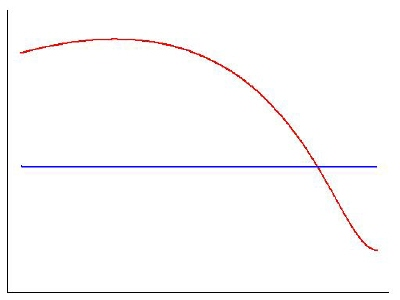

### 온라인 세상도 충분히 신사적일 수 있는 곳

이번 토요일은 졸업한 지 근 1년 만에 연구실 사람들을 만나러 대전에 내려갔다. 오랜만에 만나서 반가운 얼굴들에게 맛있는 점심 식사도 대접하고, 연구실로 돌아와서 이런저런 이야기를 하다가 간만에 4천만의 영양간식... 이 아니고 놀이 문화가 되어버린 스타크래프트를 하기로 하였다.

몇 판 하던 도중, 먼저 전멸되어서 하릴없이 친구의 화면을 뒤에서 지켜보고 있는데, 갑자기 누군가 말을 걸어왔다. 내용인즉슨 친구의 아이디가 해킹한 것이 아니냐는 것이다. 처음 말을 걸 때부터 기분나쁘게 반말조로 나오는 터라 뒤에서 보고 있던 내가 오히려 울컥하는 기분이 들었다. 그 친구가 해킹따위를 할 인물이 절대로 아니라는 걸 알기 때문이다.

그런데 이 녀석은 우리 편이 둘이나 전멸당한 터라 혼자서 셋을 상대하는 와중에, 말을 건 상대방에게 지금 게임 중이니 잠시 기다리라고 대꾸하는 것이었다. 같은 상황에서 나라면 귓말을 씹거나 적당히 '즐'이라고 대꾸하고 말았을텐데, 바쁘게 답글을 남기는 도중 오타로 실패하자 될때까지 시도해서 결국 성공하였다. (게다가 그 게임에서 혼자서 남은 세 명을 밀어버리는 기염을 토했다. 정말 대단하다는 말 밖에는 표현할 길이 없었다.)

게임이 끝나고 그 친구는 연구실 사람들에게 잠시 기다려 달라고 하고는, 아까 귓말을 보낸 상대에게 자기가 있는 채널로 오라고 귓말을 보내고, 상대는 기다리고 있었다는 듯 바로 접속했다.

이때부터가 정말 멋진 장면인데... 자신의 친구의 아이디를 해킹한 게 아니냐고 따져묻는 상대에게, 원래부터 자신이 쓰던 아이디였다는 것을 차근차근 설명하는 내 친구의 자세는 그야말로 신사라 할 만했다. 친구의 설명을 따르면, 이 아이디는 2001년부터 자신이 아껴왔던 아이디인데, 얼마 전까지 몇 달간 누군가 해킹해서 사용하는 바람에 쓰지를 못했다, 그리고 자신의 이메일 주소를 미리 등록했던 덕분에 패스워드를 알아내어서 다시 사용할 수 있게 되었다, 만약 당신 친구의 아이디가 맞다면 어째서 내 이메일 주소가 등록되어 있었겠느냐 등등, 일목요연하고도 차분하게 설명을 해 나가자 처음엔 기세등등하던 상대방은 이내 꼬리를 내리고 사과하였다. 거기다가 당사자와 이야기를 하고 싶으니 메일 주소라도 알려달라는 요구에도 순순히 응하였다. 아마도 두 사람의 어조를 그래프로 표현하면 아래와 같을 것이다.당사자가 친구인지 사실은 본인인지, 메일 주소는 맞는지 아닌지 진실을 알 길은 없지만, 중요한 건 시종일관 흥분하지 않고 차분한 말투로 대응을 한 자세였다. 만약 반말로 시비를 거는 상대가 기분 나빠서 이쪽에서도 무어라 한 마디라도 했더라면, 그 대화는 그걸로 끝장났을 것이다. 하지만 모든 대화를 '~~습니다.', '~~가 아닙니까?' 라고 정중하게 이끌어나간 덕분에 상대방도 이쪽의 의견에 귀를 기울일 수 있었고, 결국 납득할 기회가 생겼다.

대화가 끝나고 결국 원하던 당사자의 이메일을 얻어낸 다음 돌아서면서 씩 웃는 얼굴로 연구실 사람들에게 "아, 이제 이 자식 죽었어!" 라고 외치는 친구 녀석의 얼굴을 보니 별일이 있을 것 같지는 않다. 대화 중 자신의 표현대로 신사적인 모습을 충분히 보여주었고, 얼굴을 마주하지 않는 온라인 세상에서도 이와 같은 자세가 얼마든지 상대의 태도를 바꿀 수 있다는 걸 몸소 증명하였다.

최근 여러 인터넷 사이트들에서 욕과 비방이 난무하는 소위 '의견 남기기 란'을 자주 접하면서 서로를 존중하는 토론은 온라인 상에서는 정녕 불가능한 것인가하는 회의감이 많이 들었는데, 아직은 가능성이 남아있는 것 같다. 내가 감탄한 이 친구의 자세를 스스로 갖고자 노력하기만 한다면, 불꽃튀는 격론의 장에서도 상대에 대한 존중과 예절은 남아있을 수 있지 않을까. 물론 그 정도의 인격수양을 하려면 상당한 노력은 필요하겠지만.

- 2005/12/04 14:04 에 작성