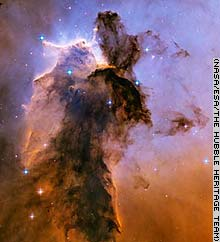
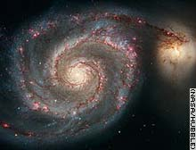
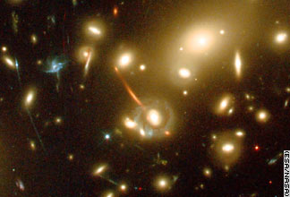
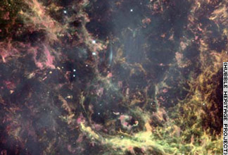
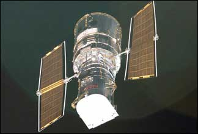

## 제목
허블 이미지들

## 날짜
2005-05-02 22:23:32

## 본문
어릴 땐 천문학자가 꿈이었다.현실과 이상의 괴리로 인하여 결국 현재 모습이 되었지만..아직도 우주의 모습을 담은 사진은 날 두근거리게 만든다.(설명은 CNN 사이트에서 퍼온 것. 귀찮아서 원문 그대로 냅둔다 -_-)A new photo from Hubble shows the Eagle Nebula -- its energy creates a billowing tower of cold gas and dust that is 9.5 light-years high.The spiral galaxy M51, also known as the Whirlpool Galaxy.Keck galaxy Astrophysicists said February 15 they have detected a tiny galaxy that is the farthest known object from Earth. The researchers used the Hubble telescope in space and the Keck Observatory's telescopes in Hawaii to make their findings. They also were aided by the natural magnification provided by galaxy cluster Abell 2218, which acts as a powerful lens magnifying galaxies beyond it.Crab Nebula This star burned out -- becoming a supernova -- as astronomers in China watched almost a thousand years ago. An explosion in space and another fireworks display marked the beginning of the end of another star. 그리고..이것이 허블 망원경이다!가장 좋아한 우주사진 중에 Hubble Deep Blue라는 게 있었는데 이미지를 구할 수 있으려나..