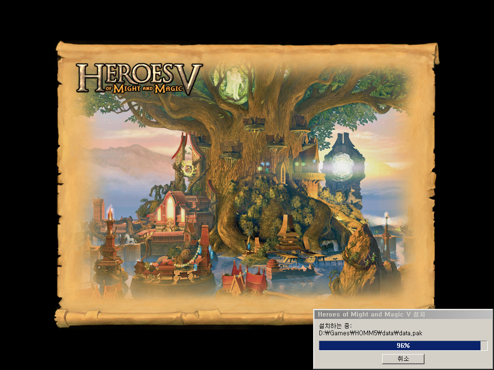
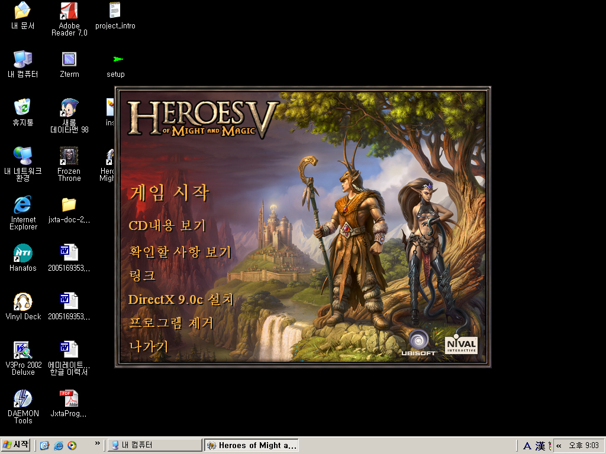
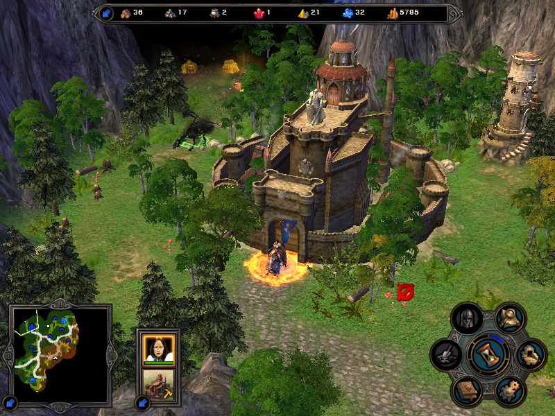
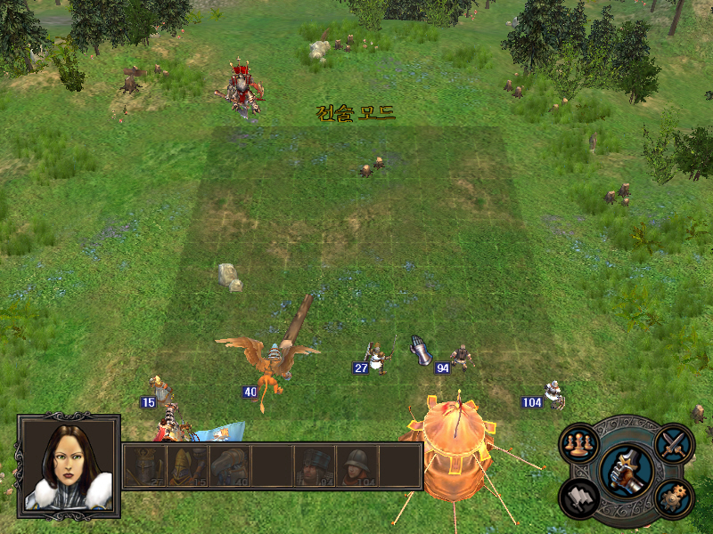
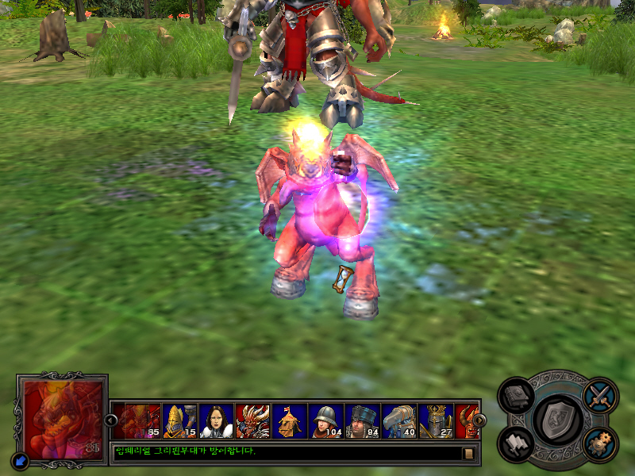
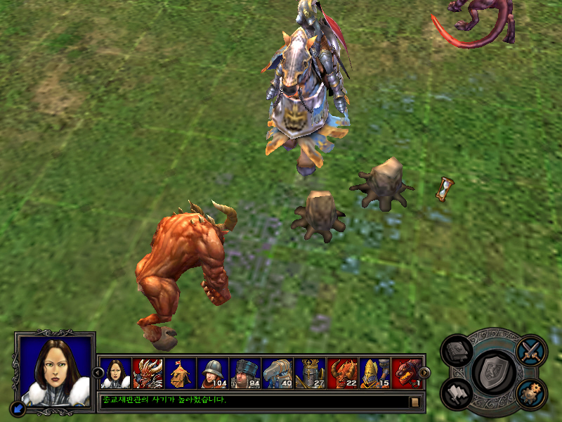
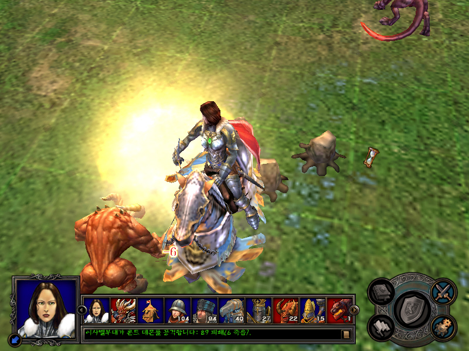
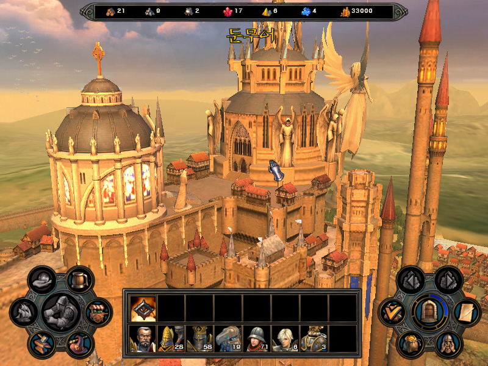

## 제목
Heroes of Might and Magic V

## 날짜
2006-07-02 20:21:13

## 본문
두 주 전쯤 인터넷으로 주문한 것 같은데, 마침 타이밍 좋게 지난 금요일에 도착했습니다.시디로 세 장, 매뉴얼 하나, 초판 기념인지 타롯 카드 한 벌.타롯 카드는 받아놓고 촉감이 좋아서 뒤적이긴 하는데 전혀 관련 지식이 없어서...일단 인스톨을 하고,

처음 실행을 했습니다.

HOMM 시리즈를 해보신 분은 익숙한 화면 구성일 듯.. VI부터 3D로 바뀌긴 했지만

전투에 앞서서 부대 위치를 지정해야 합니다.

고놈 복스럽게 생겼네.

영웅은 어디든지 공격할 수 있습니다. 이렇게 말타고 달려가서...

후리기!

여러 건물이 지어진 도시 내부의 모습

주말 내내 십여 시간을 투자해서 간신히 첫번째 미션을 끝까지 마쳤습니다. 첫번째 미션은 헤이븐(3에서 캐슬, 4에서 라이프의 후계자라고 보면 될 듯)이고, 총 5장으로 구성되어 있습니다.

어쩐지 5장이 끝날 때까지 스토리가 지지부진하다는 느낌이었는데, 전체 6개 미션으로 이루어져 있나 봅니다. 두 번째 미션을 잠깐 맛배기로 들어가보니 이어지는 내용이더군요.

자동 저장도 안하는 객기를 부리는 바람에 예상보다 훨씬 많은 시간이 걸렸는데, 어차피 앞으로도 시간은 많으니 조금씩 해나갈 생각입니다. 타워 - 오더를 주종족으로 해오던 터라 아카데미에 관심이 많이 가긴 하는데...

한 번 잡으면 두어 시간이 훌쩍 가버리니 주중에는 좀 어렵지 않을까 싶네요.

덧1) 대체로 마음에 드는데, 한글화는 영 아니올시다. 너무 급하게 한 건 아닌지... 대충 하면서도 여기저기 잘못된 부분이나 어색한 번역이 많이 보이네요.

덧2) 데몬으로 실행하려고 여러모로 시도를 했는데 결국 실패했습니다. 그것땜시 3.46 버전도 새로 깔았는데... 매번 할 때마다 시디를 넣기는 너무 불편하고...

덧3) 타롯 카드는 대체 어떻게 쓰는 것인지? 그림이 있는 카드도 있고, 숫자만 있는 녀석도 있고, 글자가 쓰여 있는 놈도 있는데 말이죠.