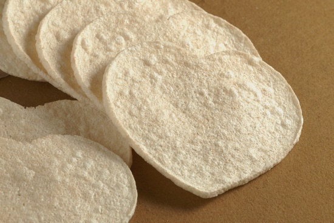

## 제목
작은 기쁨을 느낄 수 있다면 잡다한 일상

## 날짜
2008/03/07 00:57

## 본문
어렵게 생각하면 힘든 세상이지만행복은 그리 먼 게 아냐작은 기쁨을 느낄 수 있다면 이미 넌 행복한거야- 듀스, <Go Go Go> 중에서 -

학원 숙제가 생각보다 오래 걸려서 잠자는 시간이 평소보다 많이 늦어지긴 했지만, 어차피 늦은 김에 쓰고 싶었던 글이나 하나 쓰고 오늘 하루를 마무리하련다.

시작부터 참 힘든 하루였다. 아침에 일어나서 보이는 건 어질러진 방바닥과 싱크대에 쌓인 설거지 그릇들. 다른 날보다 늦게 일어난 덕분에 그나마 최근 시작한 아침 운동도 거르고 사무실로 들어갔다.
오전부터 새로 개발한 서비스에서 발견된 버그를 고치기 위해 업체에 연락을 해도 잘 안되고, 문제의 파일을 보내주려 해도 서버의 문제까지 겹치는 바람에 전달할 수가 없었다.
내일까지 완료해 달라고 작성한 작업 신청서는 검토 단계 중간에서 정체되어 있고, 재촉하는 쪽지를 보내도 묵묵부답.
새로 옮긴 웹서버에 접속해보니 일부 페이지가 보이지 않는 문제가 생겨서 담당자에게 연락했더니 저녁때나 할 수 있다는 답변만 들었다.

퇴근 전 두 시간 정도는 거의 멍한 상태로 웹서핑 잠깐 하고 자료 좀 잠깐 보다가 화장실에 가는 둥 알맹이 없이 흘려보냈다. 좁은 인간관계 탓인지 메신저에 하소연할 상대도 별로 보이지 않았다. 게다가 십중팔구 이런 푸념을 해도 이해해줄 리 없고, 오히려 팔자 좋은 소리라는 핀잔만 안들으면 다행인 처지에 선뜻 말 걸기도 쉽지는 않다.

일주일간의 피로가 쌓인 목요일 오후라서 더욱 그랬는지 모르겠지만, 하는 일도 없이 몸도 마음도 지쳐버렸다. 의욕이 다 떨어져서 저녁 운동도 대충 끝내고 일주일에 두 번 뿐인 피아노 학원도 빼먹은 채 곧바로 집으로 향했다.

지하철 역을 나와서 집까지 반쯤 왔을까, 길 옆에 못보던 트럭이 한 대 서 있었다. 지나가면서 슥 곁눈질하니 웬 아저씨 둘이서 뻥튀기 과자를 팔고 있었다. 종류별로 다양한 뻥튀기들이 비닐 봉투에 담겨져 나란히 늘어서 있었다.
처음에는 그저 '웬 뻥과자?'하고 대수롭지 않게 지나쳤지만, 이내 늘어선 봉투 중에서 하나가 내 눈에 들어왔다. 다들 잘 알만한 납작한 원반 모양의 뻥튀기였다. 예전에 수원에 있을 때에도 어머니가 가끔 사오셔서 즐겨 먹던 것이었는데, 그저 무심히 지나가는 다른 녀석들과 달리 유난히 선명하게 눈에 들어왔다.
0.5초간 생각했지만 단지 저녁을 안먹어서 배가 고프기 때문일 것이라고 단정하고 가던 걸음을 재촉했지만, 불과 십여 보를 못가서 슬그머니 멈춰섰다. 어쩐지 저 과자를 사서 먹으면 기분이 좋아질 것만 같은, 그런 예감이 들었다.

결국 잠깐 고민한 끝에 다시 돌아섰고, 걸어오던 사람들을 지나쳐서 트럭 앞으로 향했다. 한 봉투에 얼마인지 물어보니 3천 원이란다. 기껏해야 1,2천 원 정도 할 것으로 예상했는데, 생각보다 값이 비쌌다. 하지만 그정도로 작은 기쁨이나마 얻을 수 있다면 괜찮은 것 아니겠는가. 

한번 먹어보라고 내민 뻥튀기를 입에 물고, 지갑에서 돈을 꺼내서 낸 다음 봉투를 받아서 다시 집으로 향했다. 입에는 둥그런 뻥튀기를 물고 한 손으로 과자가 담긴 큼직한 봉투를 휘휘 흔들면서. 우습게 보일 내 모습을 생각하니 점점 더 즐거웠다. 작은 행복이라는 건 별 게 아니구나. 우연히 만난 뻥튀기 과자만으로도 오늘 하루의 우울함을 잊어버릴 수 있었으니.

