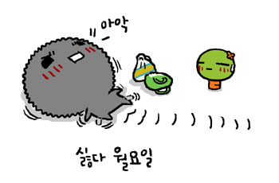

### 내가 상상했던 자취방의 저녁 시간은

어느 책에 나올 법한 장면이었다. 

감미로운 재즈 음악이 흐르고, 열린 창밖으로는 멀리서 들려오는 도시의 흔적.

(커피는 안마시니) 향기로운 차를 한 잔 하면서 느긋하게 기대앉아 소설이나 수필을 읽는 모습을 기대했다.

하지만 현실은...

어질러진 방바닥에, 다행히 얼마전 누나에게 받은 시디로 음악은 틀어놓았지만,

반찬으로 먹고 남은 생선 가시를 쓰레기봉투에 담은 다음 손에 묻은 비린내에 얼굴을 찌푸리고

좁디좁은 싱크대에서 비누거품 튕겨가며 설거지를 마친 다음, 

자기 전까지 무언가를 해야 한다는 강박관념에 매여 안절부절 못하고 있다.

어째서 이렇게 다른 거야!!!

절대로 내일 회사에 가야 한다는 생각에 이런 건 아니라고! 아오!

- Courtesy of<마린블루스>-

- 2008/03/16 21:42 에 작성