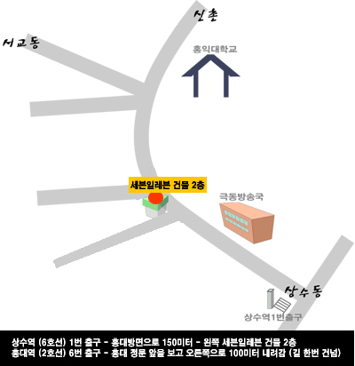
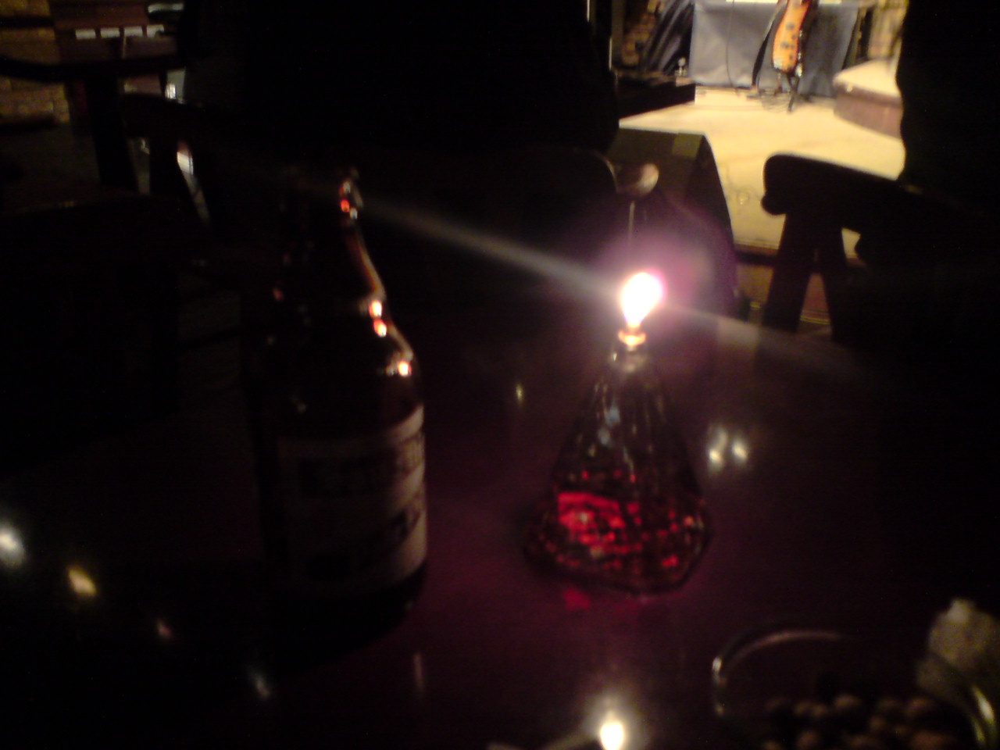
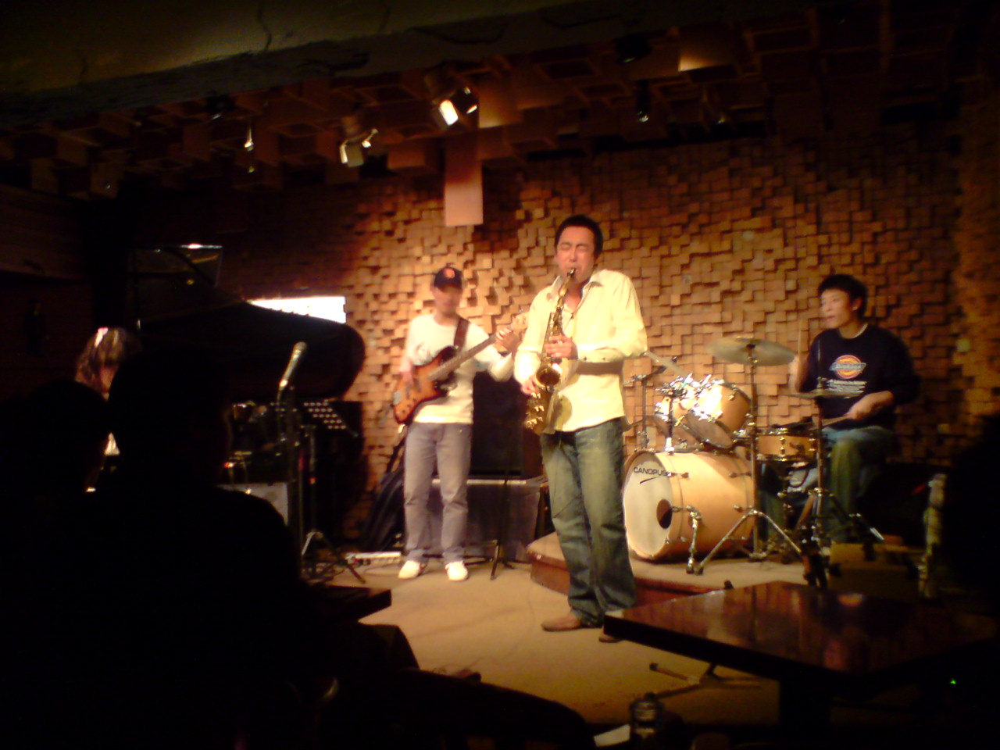
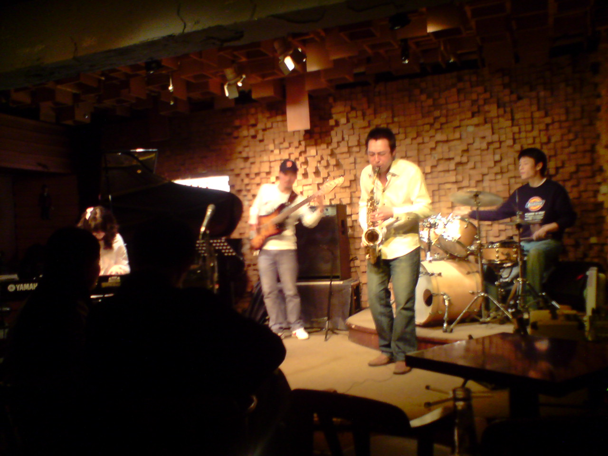

## 재즈 클럽 &lt;Evans&gt;

지난 화요일, 오래만에 재찬이를 홍대에서 만났다. 이 친구는 국민학교 동창인데, 취미로 색소폰을 분다. 단순히 취미라고 하기에는 실력이 상당한데, 음대를 가지 않고도 군악대에서 복무를 했고, 외국에 나가서 거리 공연도 한 경험이 있다. 아쉽게도 직접 연주하는 것을 듣지는 못했고, 동영상으로 녹화한 것만 보았다. 프로급은 아니지만 초짜인 내가 듣기에도 아마추어 치고는 꽤 잘 분다.

지난 연말에 보고 몇달만에 보는 것인데, 그때 내가 재즈를 즐겨 듣는다는 얘기를 듣고 자기가 알고 있는 홍대에 있는 재즈클럽에 같이 연주를 들으러 가자고 제안했다. 서로 바쁘다보니 차일피일 미루다 결국 지난 화요일로 약속을 잡았다.

7시쯤 홍대입구 역에서 만나서 저녁을 먹고, 8시 반쯤 클럽 건물에 도착했다. 클럽 이름은 <<a href="http://www.clubevans.com/Main/detail.asp">에반스</a>>이다.

(대충 이런 위치에 있다.)
클럽은 작은 테이블이 열댓 개쯤 다닥다닥 붙어있는 작은 가게였다. 무대 위에는 피아노, 키보드, 드럼 등 악기들이 곳곳에 놓여 있었다. 적당한 자리에 앉아서 맥주 두 병을 시키고 연주가 시작하기를 기다렸다. 맥주를 가져다주면서 연주 프로그램을 같이 주었다.수, 목, 금요일의 공연 안내도 같이 인쇄되어 있는데, 매일매일 공연팀이 바뀌는 모양이었다.

연주는 9시에 시작했다. 남자 셋, 여자 하나였는데 20대 초중반쯤 되어 보였다. 리더는 색소폰주자, 나머지는 드럼과 베이스, 여자애는 피아노를 맡았다. 연주는 자작곡과 스탠다드, 퓨전이 고루 섞여 있었다. 전체 공연은 1, 2부로 구성되는데, 2부에서는 여자애가 피아노 대신 키보드로 바꾸었다.

카메라는 없었지만 폰사진은 찍을 수 있었기에 몇 장 남겼다. 조명이 어두워서 별로 기대를 안했는데 생각보다는 잘 나왔다.

안타깝게도 맨 앞자리에 앉은 커플이 키보드 치는 여자애를 가려버렸다. 88년생이라는데 웨이브 머리와 까만 뿔테 안경이 인상적이었다. 그보다 더 부러웠던 건 건반 위를 자유자재로 날아다니는 손가락이었지만... ㅠㅠ

공연은 정확히 2시간이 걸렸다. 클럽을 나와서 재찬이가 알고 있던 미국 친구(치고는 나이가 좀 있지만)를 만나서 좀 더 이야기를 나누다 들어왔다. 그 친구를 만난 장소는 여기보다 더 기이한 곳이지만 따로 사진은 찍지 않았다.

전체적으로 분위기 좋고 연주도 꽤 괜찮았다. 테이블을 꽉 채운 손님 중 다수가 남녀 쌍쌍이었는데 데이트 장소로도 확실히 괜찮을 것 같다. 연주 중에는 소리가 커서 대화를 나누기 어렵기는 하지만. 언제 여자랑 가볼 일이 생길라나 모르겠다.

맥주값은 다른 술집과 비슷하고, 그외에 연주자 지원금이라고 해서 일인당 5천원씩 낸다. 일종의 공연비인 셈이다. 둘이서 대충 2만~3만원 정도면 맥주 한두 병 마시고 나올 수 있을 듯. 월요일에는 잼세션도 있다고 하는데 재찬이는 한 번 와서 공연을 해보고 싶어하는 눈치다. 기회가 되면 구경해보고 싶다.

- 2008/04/05 17:10 작성