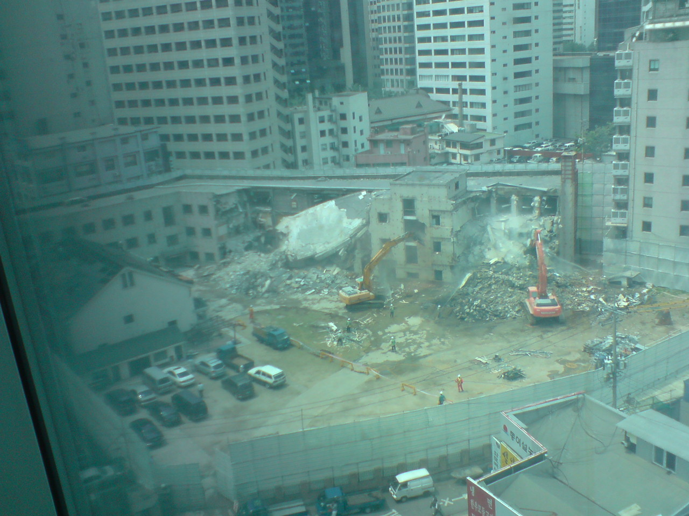

## 제목
건물, 무너지다 학교, 혹은 회사

## 날짜
2008/05/22 21:08

## 본문

위 사진은 우리 회사 건물 뒤쪽, 그러니깐 청계천을 가는 길목에 있던 동국제강 본사 건물이다. 

굳이 허물고 있는 남의 회사 건물을 찍은 이유는 왠지 모르게 안타까운 마음이 들어서이다.

저 건물은 ㄱ자형으로 된 3층짜리 건물이다. 보시다시피 건물 앞에는 널찍한 앞마당도 있다. 허물기 전까지는 잔디밭이었다.

도심 한가운데 있는 회사 사옥 치고는 정말 특이한 녀석이라서 관심이 있었는데, 

얼마 전에 우연히 원래는 청계국민학교 건물이었다는 얘기를 듣고 납득하였다.

사무실의 화장실 입구 쪽에서 보이는 건물이라 양치질을 할 때마다 창가에 서서 바라보곤 하였다.

내심 저런 건물에서 일하는 것도 참 괜찮겠다는 생각을 하였다. 

건물도 별로 높지 않고 마당도 널찍하니 가끔씩 쉬러 나오기도 좋고...

소문을 듣자하니 주인이 저 건물을 허물고 그 자리에 고층 주상복합 빌딩을 지을 계획이란다.

자본주의 사회에서 돈 벌고 싶은 욕심에 자기 건물 부수는 걸 뭐라고 할 수는 없는 일이지만, 씁쓸한 건 어쩔 수 없다.

오래된 학교 건물이라면 그 자체로도 의미가 있는데다, 삭막한 도심 속에 신선한 광경이었기 때문이다.

재작년에 샌프란시스코 근교에 있는 시스코 본사 견학을 간 적이 있다.

워낙 땅이 넓은 동네라 그런지 대부분의 건물이 1,2층이고, 서로 널찍널찍 떨어져 자리잡고 있었다. 정말 부러운 환경이었다.

혹시 운이 좋아서 스스로 회사를 차리고 성공을 거둔다면... 회사 직원들에게 그런 공간을 제공하고 싶다는 마음이 들었다.

매일 사진의 건물을 바라볼 때마다 되새기곤 했는데, 이젠 그럴만한 대상이 없어져 버렸다.

며칠 전에 찍은 사진인데, 지금은 완전히 다 허물어서 무너진 돌더미만 남아있다. 좀 있으면 돌더미도 다 없어지겠지.