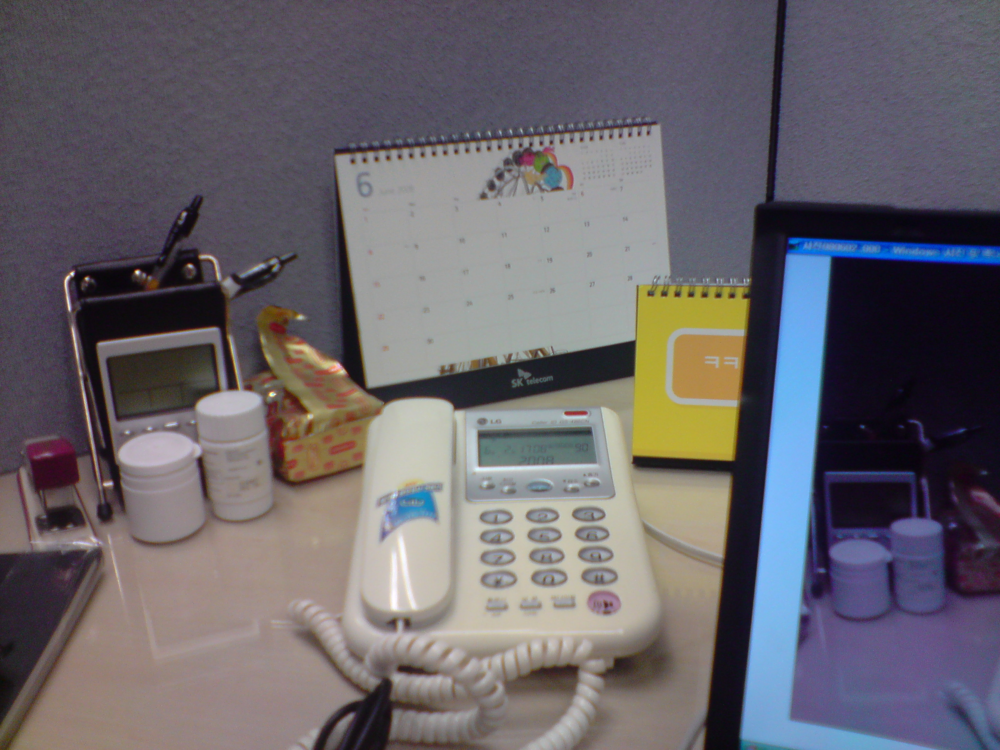
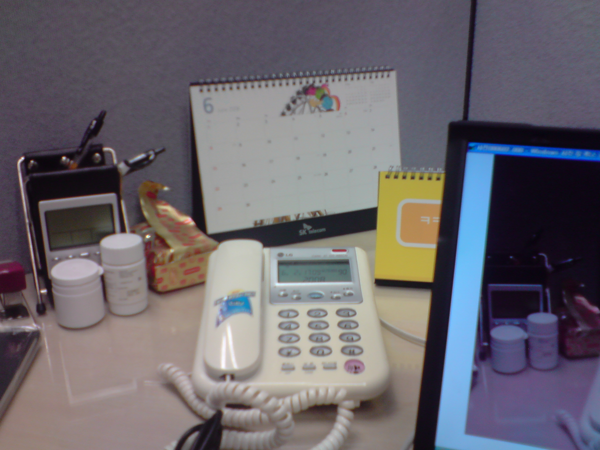
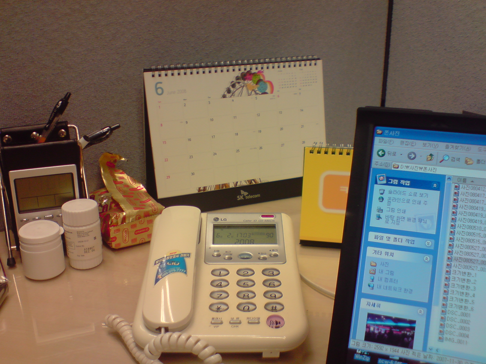

## 제목
카메라 테스트

## 날짜
2008-06-02 17:30:33

## 본문
회사에서 할 일 없이 빈둥대다가 (일이 없는 건 아니지만 이렇게 빈둥댈 때도 있다.) 왠지 카메라 성능 테스트를 해보고 싶어졌다.지금까지는 항상 자동설정으로 맞추고 사진을 찍었는데, 기대했던 것만큼 화질이 나오지 않아서 좀 불만스러웠던 터라.게다가 손떨림 방지 기능이 기본으로 설정된 것이 아니라는 사실을 안 것도 그리 오래되지 않았으니... -_-;어쨌든 자리에 앉아서 같은 사물을 설정을 달리 해가면서 찍어보았다.찍은 순서는 아래와는 다르지만 화질의 차이를 보이기 위해 순서를 바꿔서 늘어놓는다.참고로 화소수는 최대(5M), 화질도 최고급으로 설정하였다.1. 우선 자동 설정 (광원, 초점) + 손떨림 방지 기능 해제이게 바로 내가 폰을 처음 바꾸고 두 달 넘게 쓰던 방식이다. 당연히 불만스러울 수밖에... 2.그다음엔 자동 설정 (광원, 초점) + 손떨림 방지 기능 적용손떨림 방지 버튼을 눌러야 한다는 사실을 4월 말에야 알았다. (교훈: 제품설명서는 항상 맨처음에 잘 읽자.)하지만 결과적으로 위 사진과 별로 다른 점은 못느끼겠다. 왜 있는겨...3.마지막으로 수동 설정 (형광등, 초점 조정) + 손떨림 방지 기능 적용이제서야 상당히 만족스러운 사진이 나왔다. 실제 크기로 보면 달력의 숫자도 제법 또렷이 보이는 수준이다. 디카를 들고 다니는 것보다야 못하겠지만, 어디 여행가서 찍어도 저정도만 나와주면 감사하겠다. 문제는 주위 상황에 맞춰서 광원을 바꾸고 초점을 수동으로 맞춰야 한다는 것인데, 매번 그렇게 하기가 쉽나...수동으로 찍는 것이 익숙해지면 꽤 괜찮을 것 같다. 다만 시간이 오래 걸린다는 거...