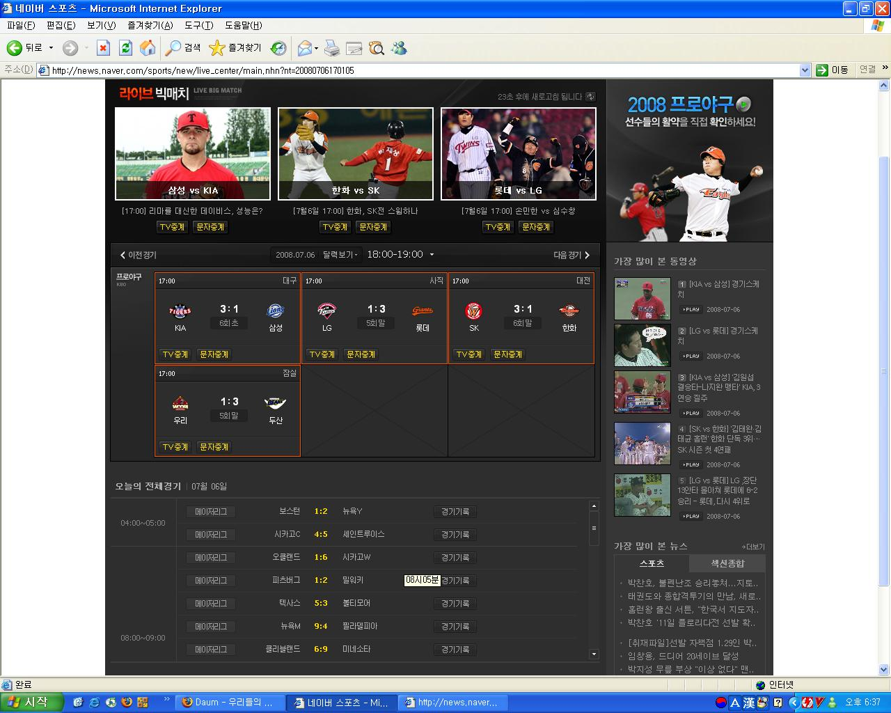

## 제목
모두 3:1 잡다한 일상

## 날짜
2008/07/06 19:21

## 본문
네이버 야구 중계를 보던 중 재미있는 상황이 발생해서 한 컷.

모든 구장에서 점수가 똑같이 3:1이 되었다.

원래 세 구장을 빼고 SK:한화 경기에서만 3:0이었는데, 마침 한화 김태균의 솔로 홈런으로 3:1이 되었음.

하지만 불과 몇 분 만에 이범호가 백투백 홈런을 치는 바람에 4개 구장 3:1 스코어는 깨져버리고...

신기해서 스크린샷을 저장했다.

프로 야구 역사상 모든 구장에서 똑같은 점수로 경기가 끝난 날이 하루라도 있을까?

