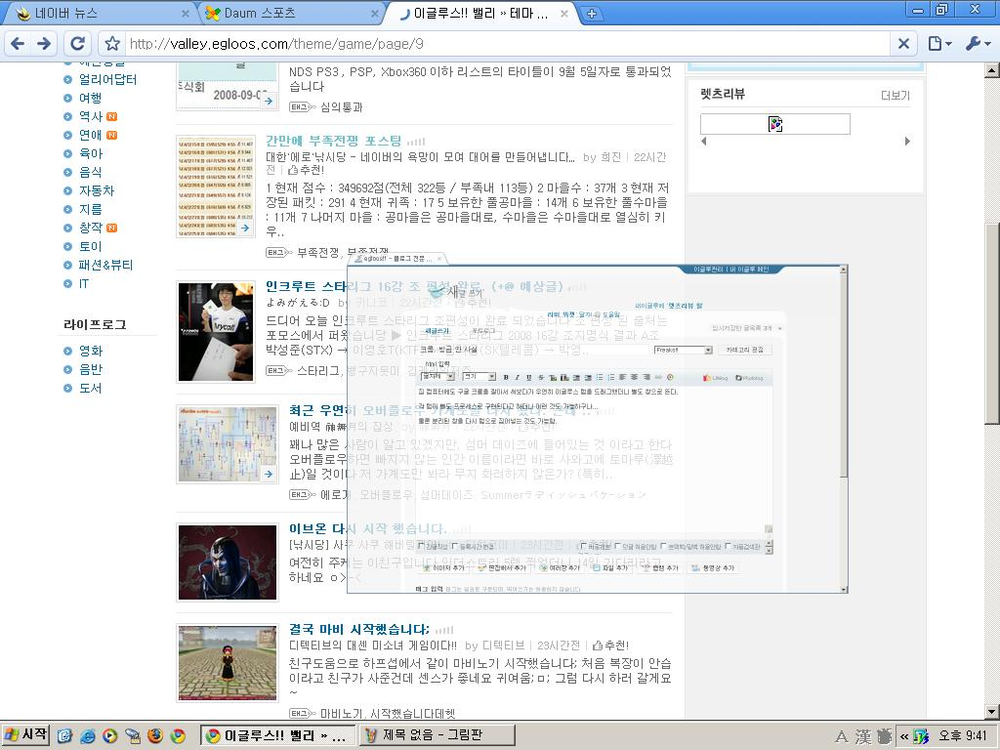
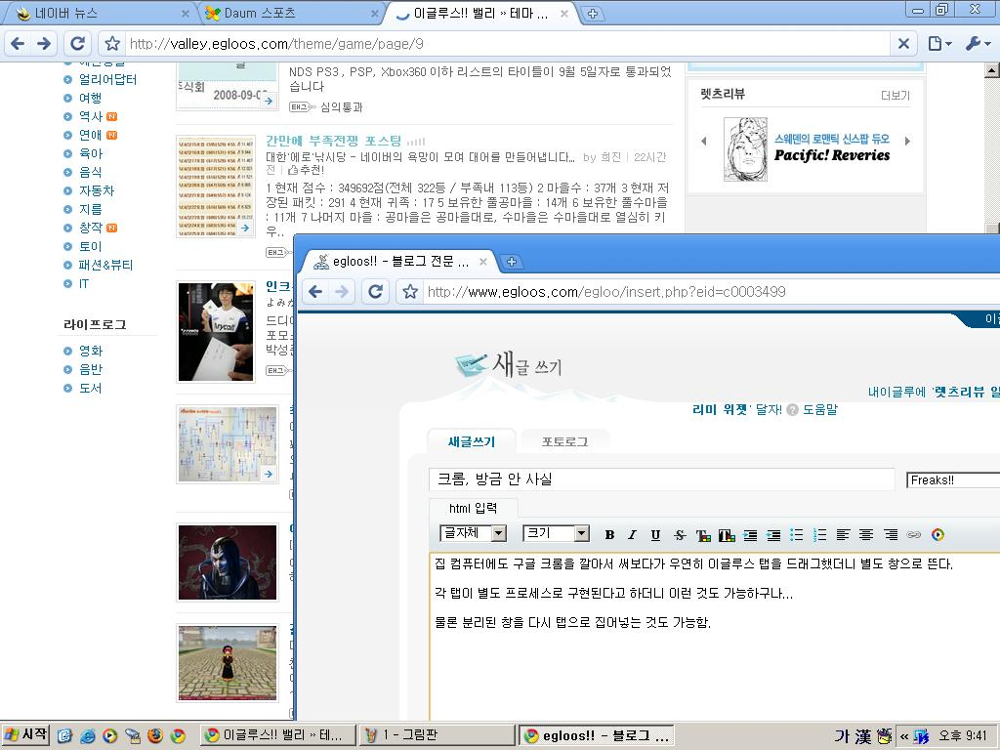

## 제목
크롬, 방금 안 사실 Freaks!!

## 날짜
2008/09/06 21:44

## 본문
집 컴퓨터에도 구글 크롬을 깔아서 써보다가 우연히 이글루스 탭을 드래그했더니 별도 창으로 뜬다.

각 탭이 별도 프로세스로 구현된다고 하더니 이런 것도 가능하구나...

물론 분리된 창을 다시 탭으로 집어넣는 것도 가능함.

p.s. 게다가 글쓰는 입력창 크기 조절도 된다. 이거 처음엔 몰랐는데 신기한 거 많구만...