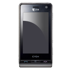
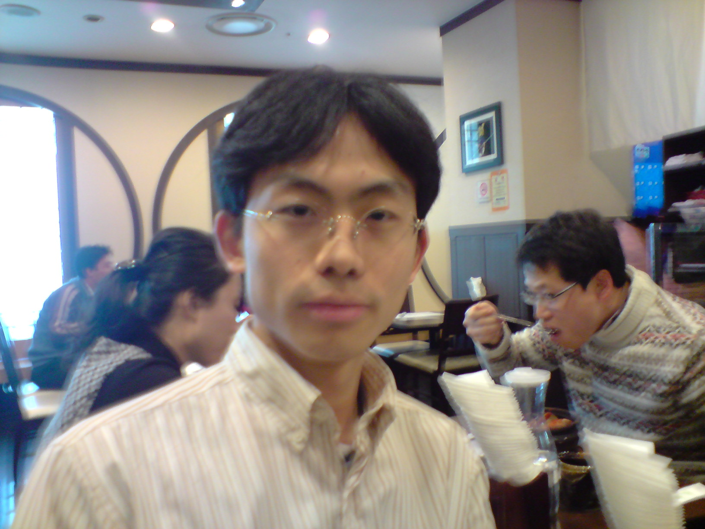

## 제목
폰 사진 정리

## 날짜
2008-01-29 22:25:29

## 본문
얼마 전에 핸드폰을 바꾸었다. (안타깝게도 폰으로는 핸드폰 자체를 찍을 수 없어 다른 이미지로 대체..)<LG-SH210, 일명 '뷰티폰(Viewty)'>폰에 대한 설명은 인터넷에 넘치고 넘쳤으니 관두고, 선택할 때 마음에 들었던 이유 중 하나가 사진 기능이다. 여행갈 때조차 디카를 들고 다니려 하지 않는 극도의 귀차니즘 때문에 수많은 구경거리를 그냥 지나쳤던 터라, 작고 가벼운 핸드폰 겸용 디카라는 점이 상당히 매력적이었다.아직 많이 찍지는 않았는데, 그중에서 약간만 추려보면, (사진 개제 허락은 안받았음)대충 이정도 화질이다. 최대 해상도로 설정하지 않은데다 손떨림 영향도 있어서인지 생각만큼 만족스럽지는 않지만, 나름대로 쓸만한 사진은 찍을 수 있을 것 같다.