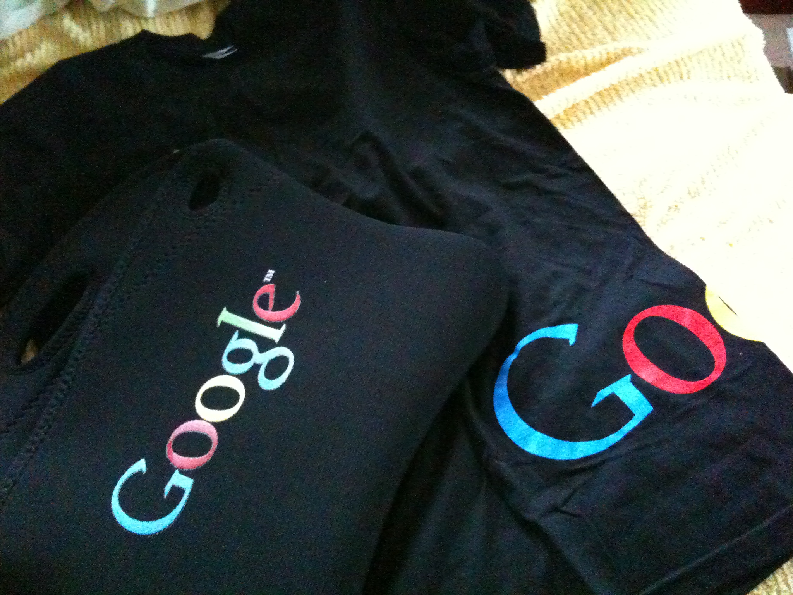
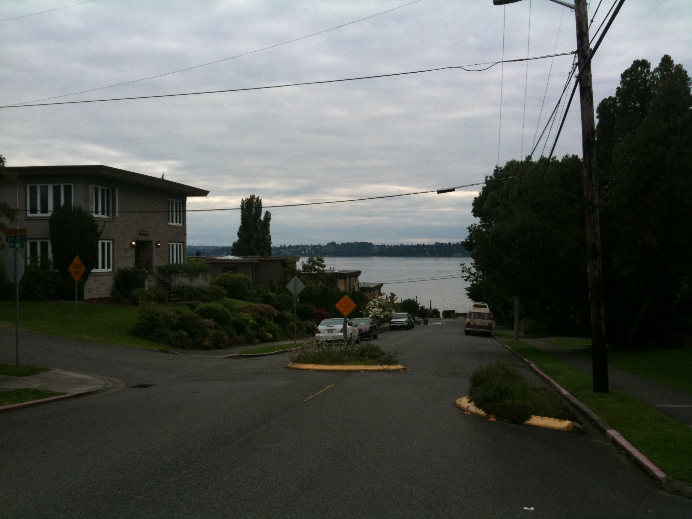

### 인턴 출근 첫날

가장 기억에 남는 건 역시 식사시간.차마 그많은 사람들 속에서 사진을 찍어올 용기는 없었지만, 듣던대로 식당은 정말 좋았다. 샐러드바를 포함해서 세 군데, 과일과 음료, 과자도 다양하게 있고. 아예 자기 방으로 가져가서 먹는 사람도 있음.대신 하는 일은 만만찮을 듯 싶다. 프로젝트 리더가 대강 내용을 설명해주는데 솔직히 좀 걱정도 되더라. 아직 내용을 잘 모르기 때문이기도 하겠지만. 오리엔테이션 프로그램도 내일까지 계속된다.내부 사진은 못찍었지만 대신 오늘 받은 가방과 티셔츠로 인증샷.그리고 이건 집 앞 길에서 찍은 Washington 호수. 건너편이 시애틀이다. 실제 모습보다 덜 이쁘게 나왔다.신고

- 2010/06/22 11:55 에 작성