### Seattle - Downtown, Place Pike Market

사실상 첫 주말을 맞아서 시애틀 도심을 구경하고 왔습니다. 아이폰으로 허접하나마 이곳저곳 사진 찍어서 올림.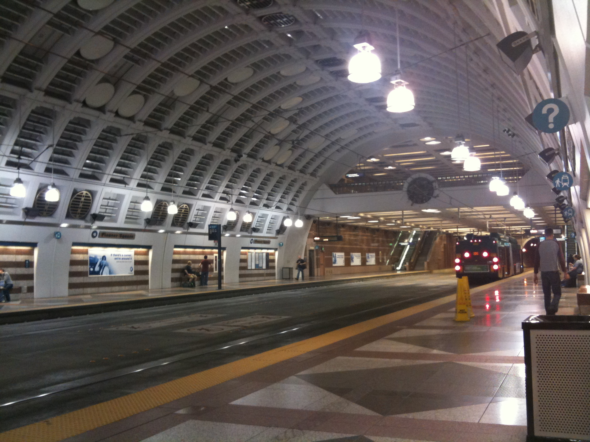가장 먼저 신기했던 장면은 내가 탄 버스가 시애틀에 들어서면서 지하터널로 들어간 것이다. 사진은 지하역에서 내려서 찍었다. 바닥에 레일이 보이다시피 이 위로 전철이 다니는데, 버스도 같은 길 위를 달리면서 역마다 정차한다. 사진에 보이는 건 버스이고, 전차는 그보다 훨씬 길다. 시간표가 정해져 있어서 도착이 겹치지는 않는다. 처음에는 모든 버스 노선이 지하로 다니는가 싶었는데 그런 건 아님. 전 도심에 터널을 뚫는 것은 불가능할테니. 역도 그렇고 전철도 버스도 매우 깨끗하다. 에스컬레이터 두 번 타면 지상으로 나옴.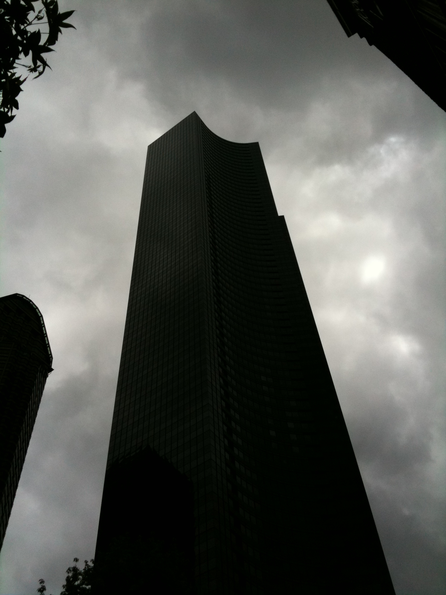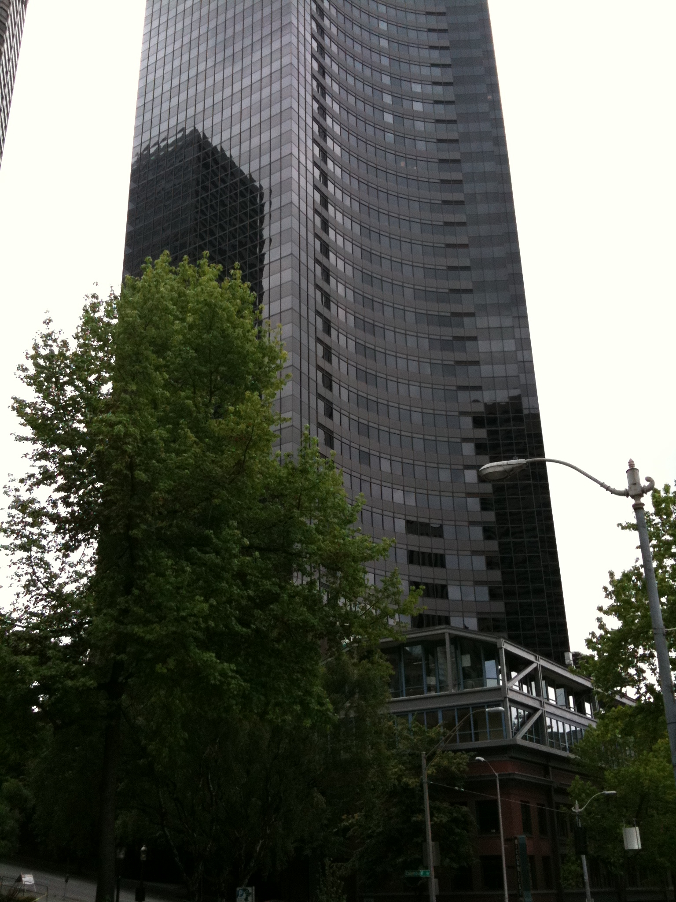인턴은 대부분 UW 학생들이라서 시애틀 거주자가 많다. 사진에 건물은 Columbia Center라고, 시애틀에서 가장 높은 빌딩이라고 들었음. 가까이 가봤는데, 그냥 업무용 건물인 듯, 특별한 건 없었다. 한 장에 다 담으려니 잘 안나와서 두 장으로 나눠서 다시 찍었음.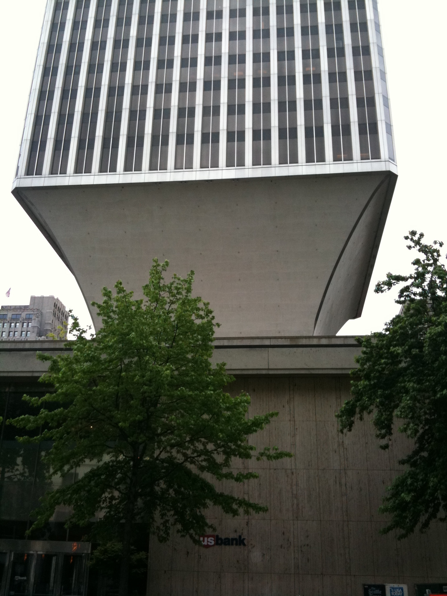시애틀 도심엔 생각외로 기묘한 형태의 건물이 많다. 이 사진도 그 중 하나.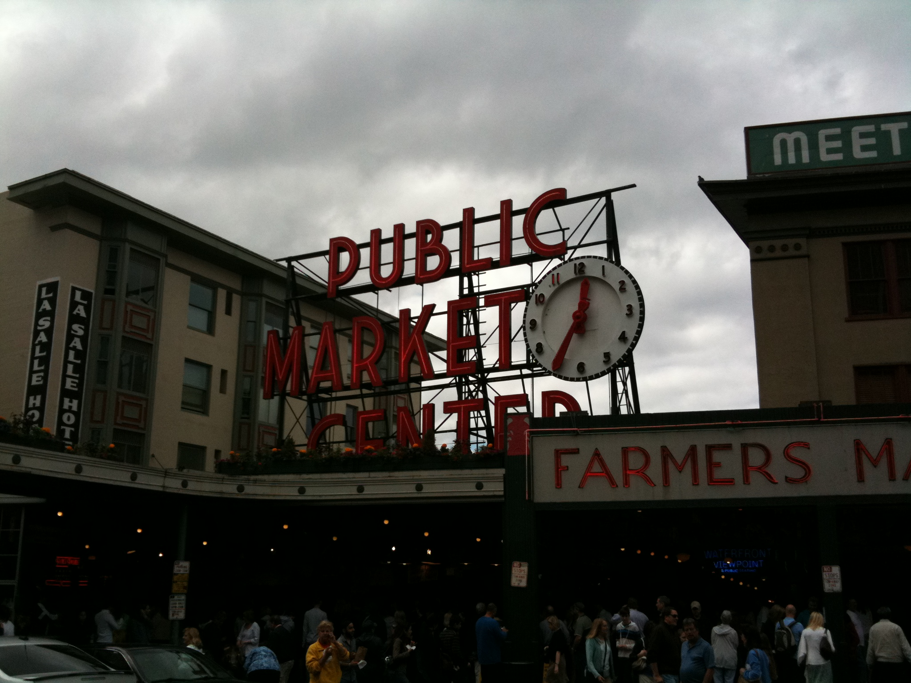도심에서 호수쪽으로 좀 걸어나오면 Pike Place Market이라는 재래시장이 있다. 한국의 여느 재래시장과 비슷한 분위기인데, 정작 물건 사는 사람보다 관광객이 더 많아 보였다. 외곽, 그러니깐 호수쪽은 지대가 낮지만 도심은 그보다 꽤 높아서 언덕길이 꽤 가파르다.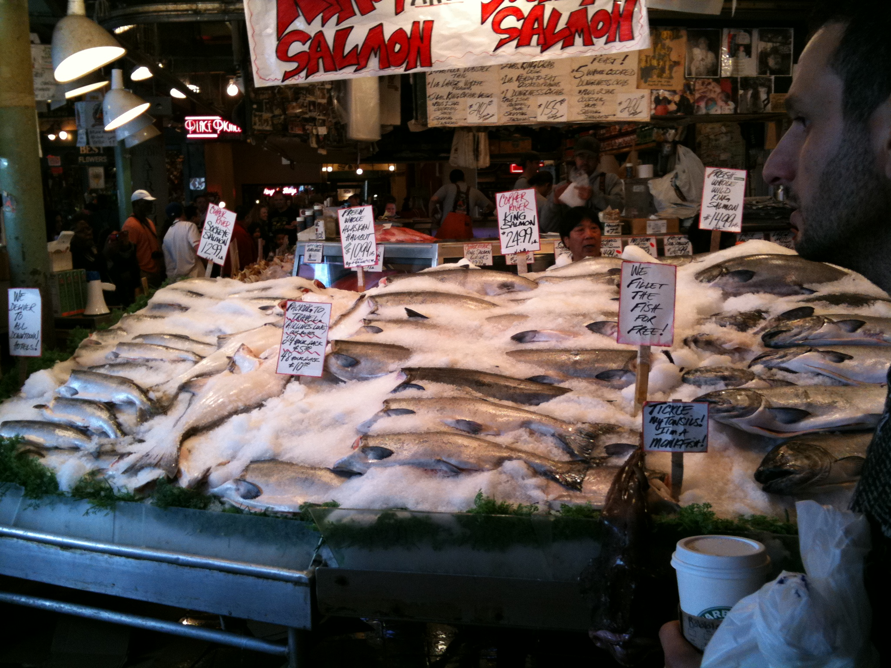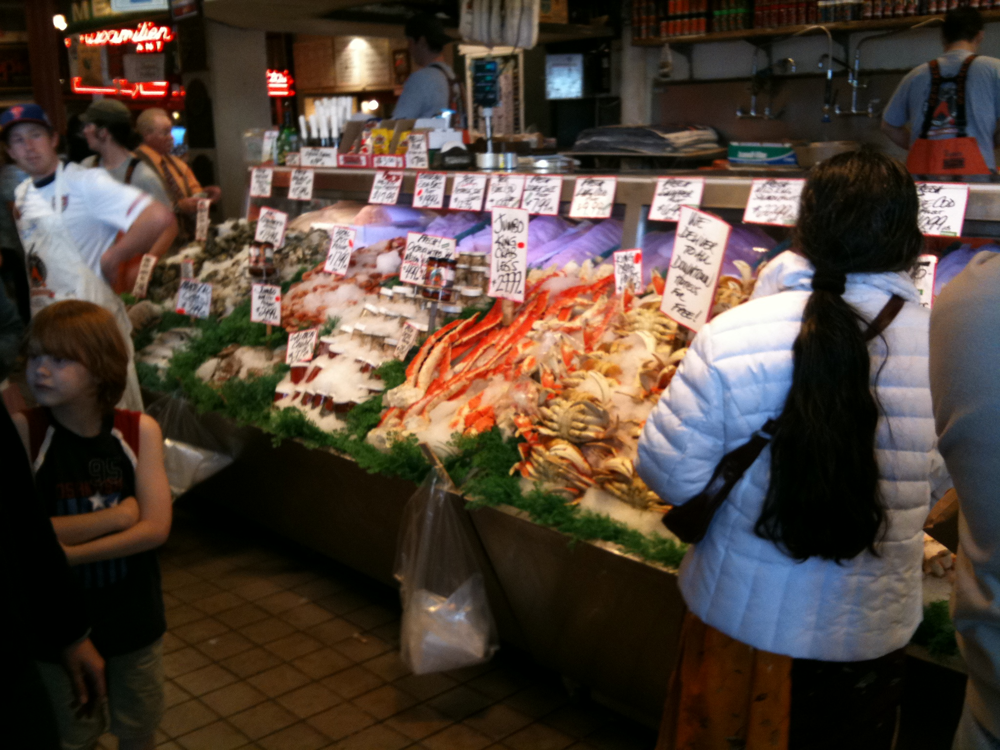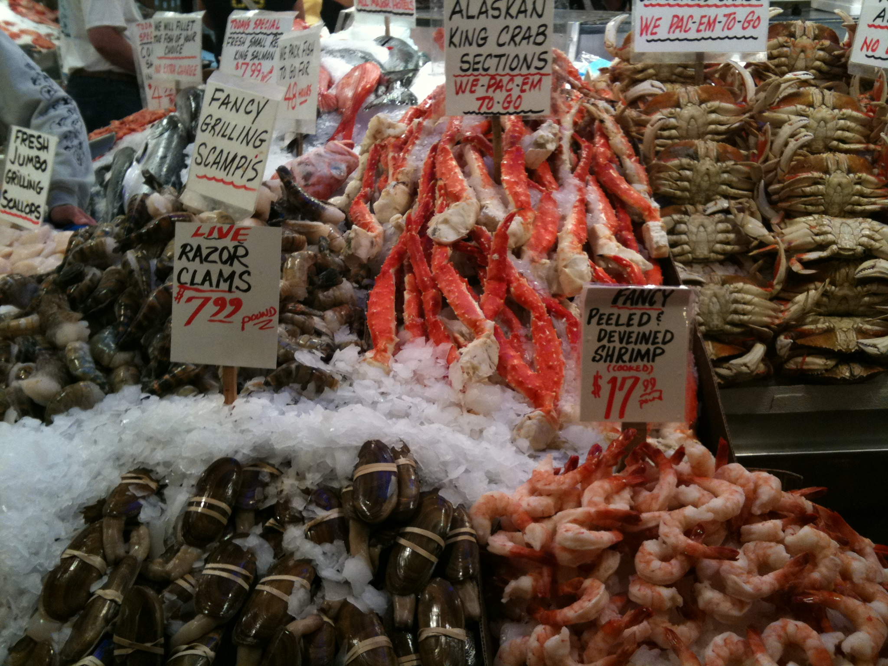해안가 시장답게 주종목은 해산물이다. 위사진은 입구 바로 앞에 있는 점포인데, 큰 연어를 통채로 팔고 있었다. 관광객이 가장 많이 몰린 가게라 사진 찍기 힘들었음. 중간 사진은 게 종류. 아래 사진은 새우와 랍스터.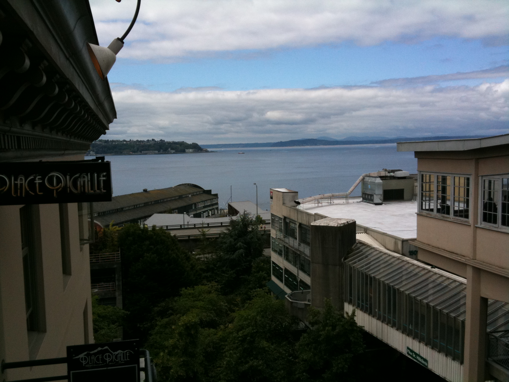시장에서 보이는 호수. 이름은 호수인데 아마 바다랑 다 연결되어 있을 거다.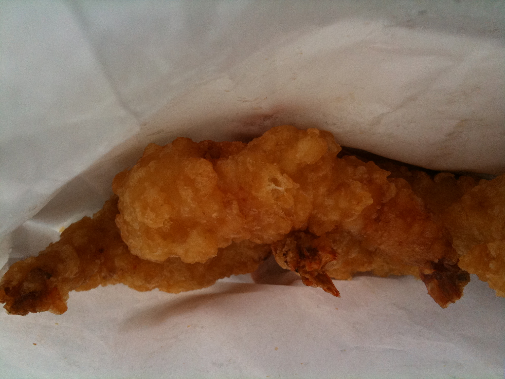군것질거리를 파는 가게들이 몇 군데 보이길래 마침 출출하던 참이라 새우튀김을 샀다. 왕새우는 맛있는데 튀김옷은 쫌 느끼하고 눅눅했다. 그래도 백년만에 먹어본 튀김은 우왕굿.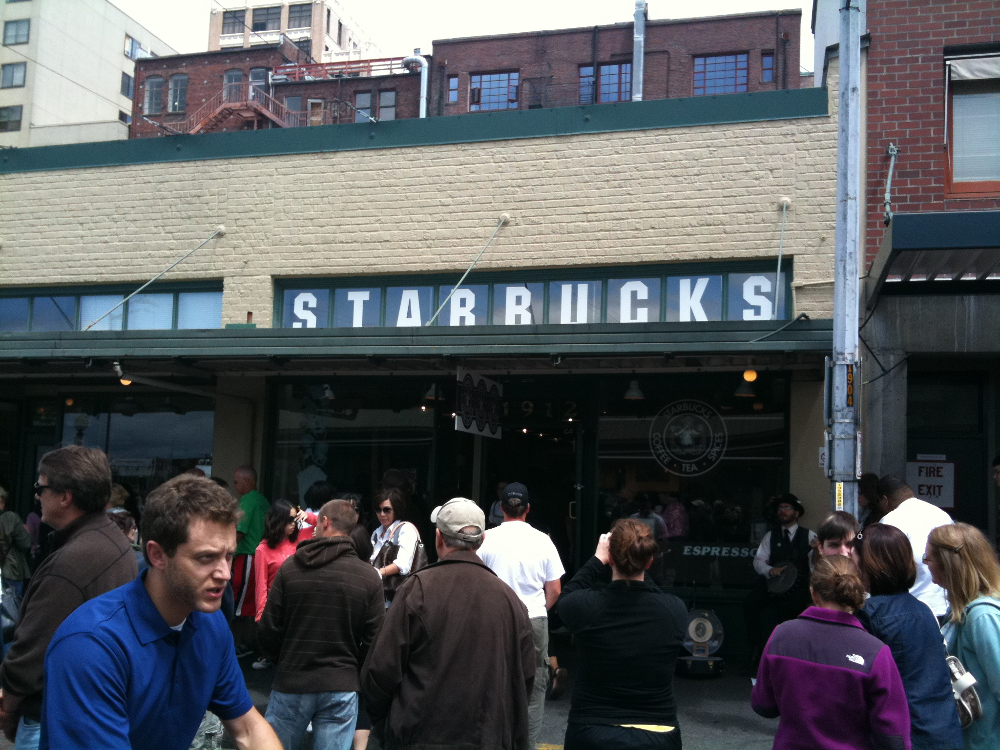이 촌스런 간판의 정체를 아시는 분? 바로 스타벅스 1호점입니다. 시애틀 오피셜 홈페이지에 따르면 일부러 옛 모습 그대로 보존하고 있다고 함. 시애틀은 스타벅스가 시작된 도시답게 점포가 정말 많다. 하지만 사람은 여기가 제일 많음.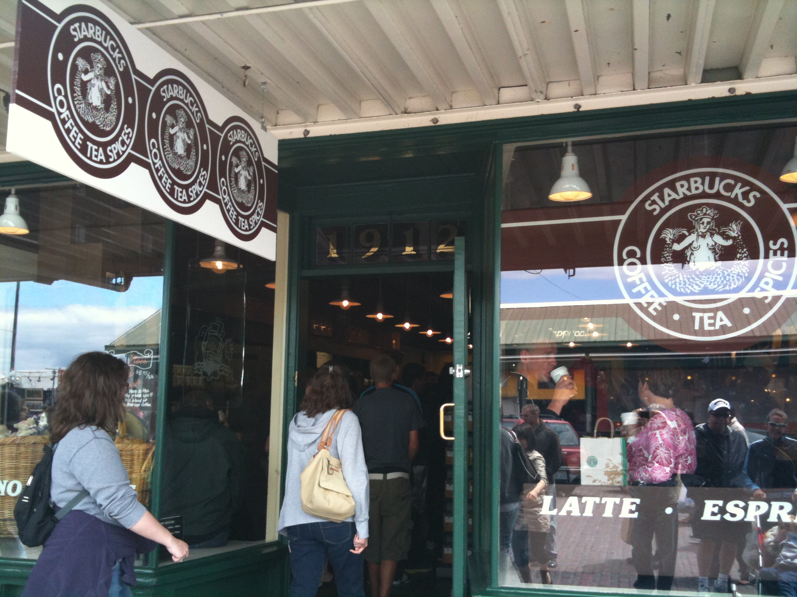가까이서 찍은 사진. 문 위에 1912라는 숫자가 보이시는지? 스타벅스가 설립된 게 1971년인데 왠 1912냐..라고 생각해서위키피디아를 찾아보니 연도가 아니라 주소라 함. (1912 Pike Place) 가게는 손바닥만한데 사람이 듫끌어서 감히 들어가서 뭘 사지는 못했다. 아마 돌아가기 전에 한번쯤 기회가 더 있겠지.오전에 출발할 때는 구름낀 날씨라 쌀쌀했는데 시장을 돌아다니다보니 어느새 해가 조금씩 나오고 있었다. 사진이 많은지라 두 개로 나눠서 올림.신고

- 2010/06/28 03:47 에 작성