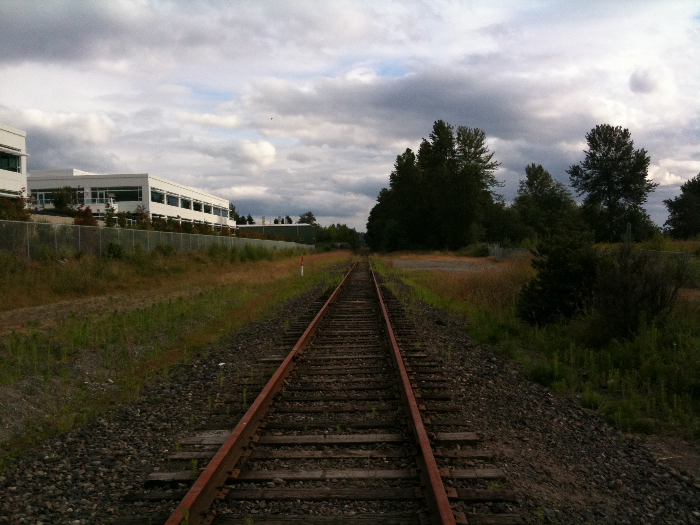
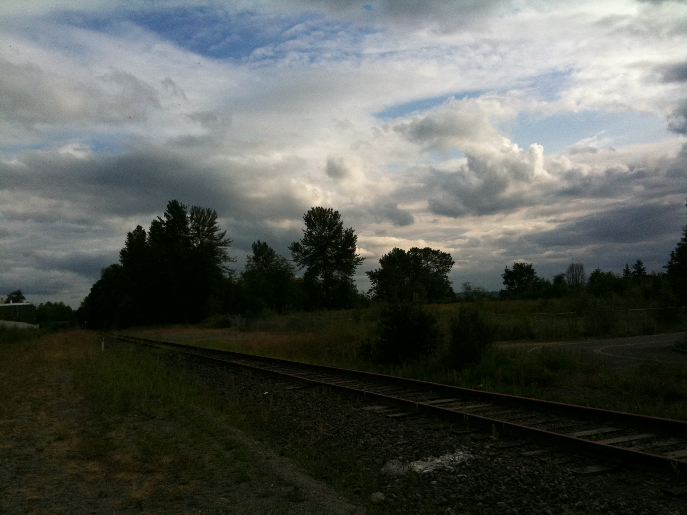
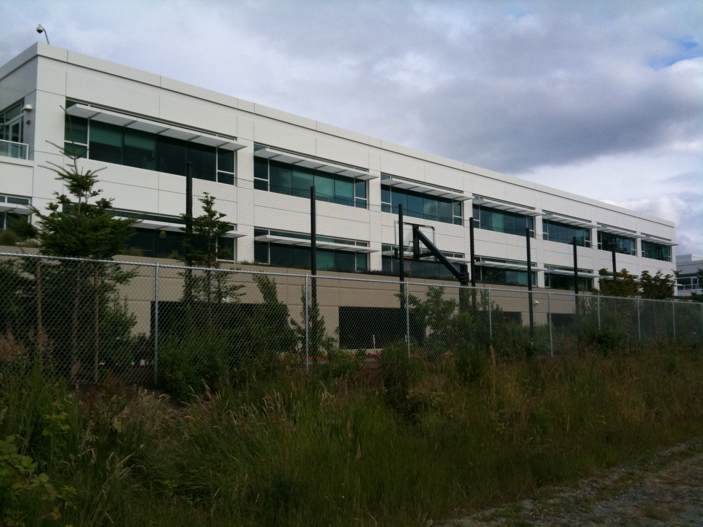

## Kirkland

회사에서 집에 오는 길에 찍은 사진 몇 장회사 옆으로 지나가는 철길. 하지만 기차는 다니지 않는다.이동네는 항상 하늘에 구름이 끼어있다. 가장 멋진 경치는 저녁의 호수 위로 펼쳐진 구름과 그 사이로 보이는 새빨간 노을. 조만간 찍어서 올려야지.회사 건물 뒷편. 우리 집으로 가는 길은 건물 뒤쪽의 개구멍을 지나 철길을 넘어 작은 도로를 타고 5분 정도 걷는다. 앞쪽에는 회사 로고가 있음. 건물이 세 동 있는데 모두 2층짜리 건물이다. 최근 새로 완성된 건물로 이사 준비가 한창이다.신고

- 2010/07/04 04:10 작성