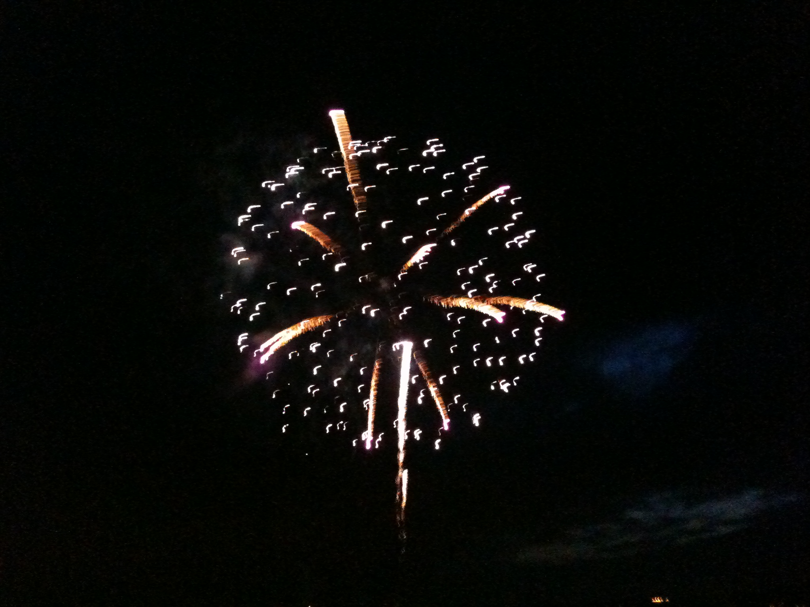
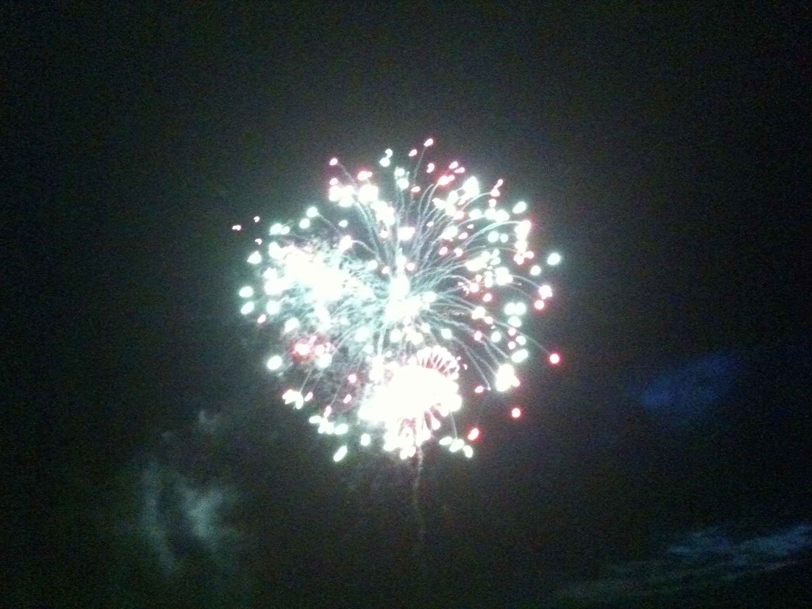

## 제목
July 4th (미국 독립기념일) - 불꽃놀이 in Kirkland

## 날짜
2010/07/05 14:52

## 본문
오늘은 미국 독립기념일이다. 이 날은 전국적인 축제일이다. 낮에는 도심에서 퍼레이드가 벌어지고, 밤에는 도시마다 불꽃놀이가 펼쳐진다.

이곳 Kirkland에서도 밤10시부터 약 30분 가까이 불꽃놀이가 있었다. 조금 전에 구경하고 집에 들어왔다. 아래는 아이폰으로 잡은 몇 컷 중 그나마 괜찮은 것.

불꽃놀이는 참 아름답고 경이롭다. 그리고 매번 볼때마다 어릴적 기억이 떠오른다. 수원에서는 매년 가을에 문화제가 열렸는데, 어두워지면 팔달산 위로 불꽃놀이가 펼쳐졌다. 우리집에서는 보이지가 않아서 복도를 따라 반대편으로 넘어가야 했는데, 마루에 앉아 숙제를 하곤 하다가도 첫번째 불꽃 소리가 들리자마자 잽싸게 밖으로 튀어나가서 구경을 했다. 아마도 두번째 불꽃이 채 터지기 전이었을 거다.

불꽃이 터지는 소리는 독특해서, 소리만 듣고도 구별해 낼 수 있었다. 묵직하면서도 멀리 퍼져나가는, 내가 아는 다른 어떤 것도 낼 수 없는 소리였다. 보통 내가 가장 먼저 복도에 나와서 구경하기 시작하면, 우리 가족과 이웃집 친구, 동생, 부모님들도 나와서 모두 한자리에 모여 불꽃을 구경했다.

사실 불꽃놀이는 상당히 비싼 유희라서, 오늘 미국에서 본 것처럼 화려하거나 오랫동안 계속되는 쇼를 볼 수는 없었다. 하지만 동네 사람들과 모여서 한 발 한 발 터질 때마다 감탄하며 감상했던 경험은 - 어린 시절 기억이 대개 미화되는 법이기도 하지만 - 아직도 내생애 가장 아름다운 불꽃놀이로 기억에 남는다. 그리고 언제 어디서든 불꽃놀이를 볼때마다 그때가 그리워진다.