## 제목
Classic Car Show

## 날짜
2010-07-19 13:51:42

## 본문

오늘은 Kirkland에서 Class Car Show가 열렸다. 문자 그대로 옛날 차들을 모아서 전시하는 이벤트다. 다운타운에 주차장과 거리를 막고 주민들이 갖고 있던 차들을 세워놓았다. 다행히 날씨는 맑고 기온도 적당해서 야외 전시하기에 최적의 조건이었다.일요일이라고는 해도 사람이 엄청 많았다. 오늘로 정확히 Kirkland에 거주한 지 한 달이 되었는데, 이제껏 이렇게 많은 사람을 한자리에서 본 적이 없다. 인구 5만이 될까말까한 소도시인데 주민의 절반은 쏟아져 나온 듯...Car Show이니 긴 말 필요없고 사진 올리겠슴다. 전부하면 40장 정도 되지만 다 올리기는 벅차니깐 선별해서 올렸음.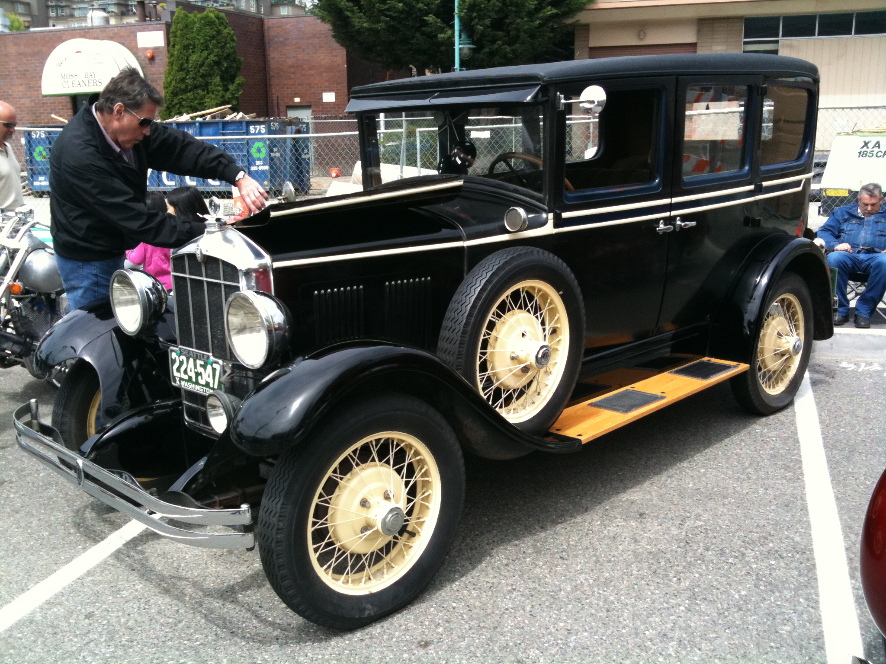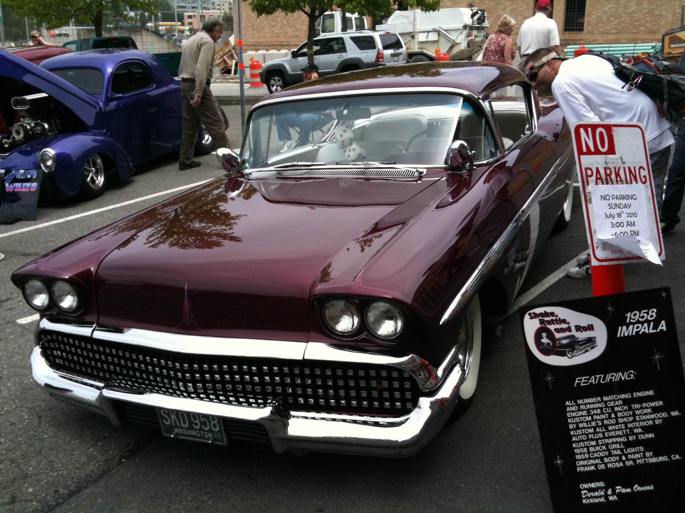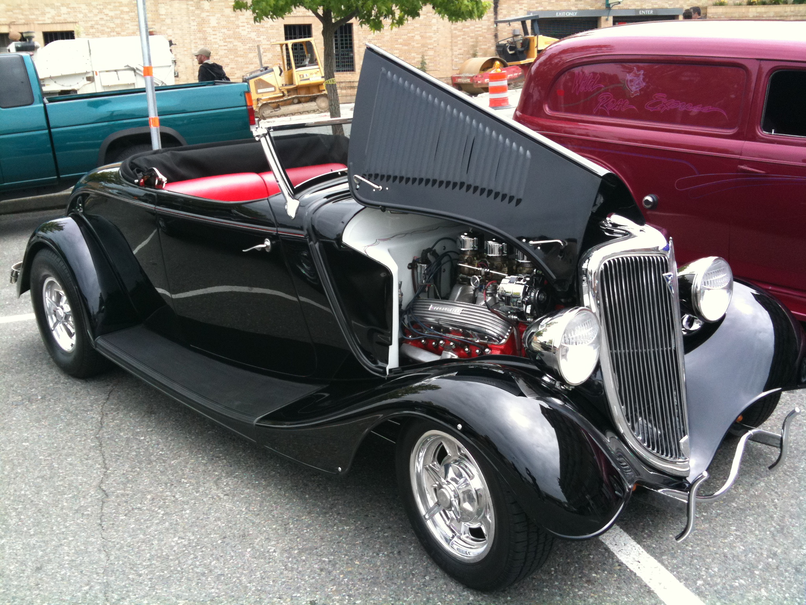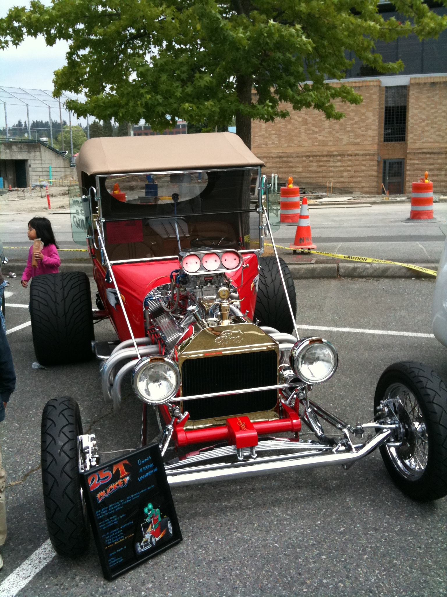도착해서 가장 먼저 구경한 차들. 1958년도라는 팻말이 보여주듯, 진열된 차들은 적게는 3,40년에서 많게는 70년 가까이 된 차들도 있었다.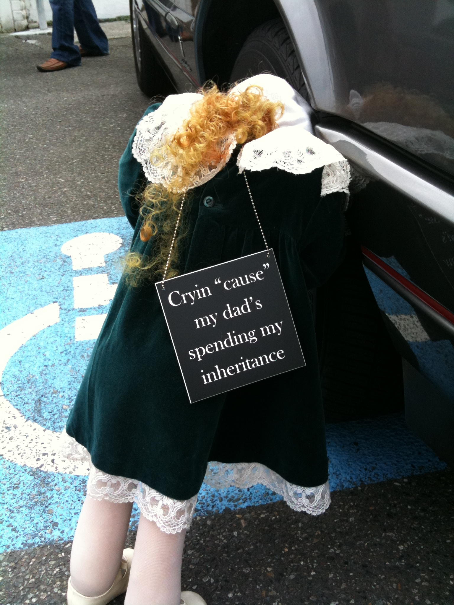가끔 이런 익살스런 장식품도. "아빠가 내가 물려받을 것들을 써버려서 울고 있어요"출품한 차들은 저마다 개성이 넘친다.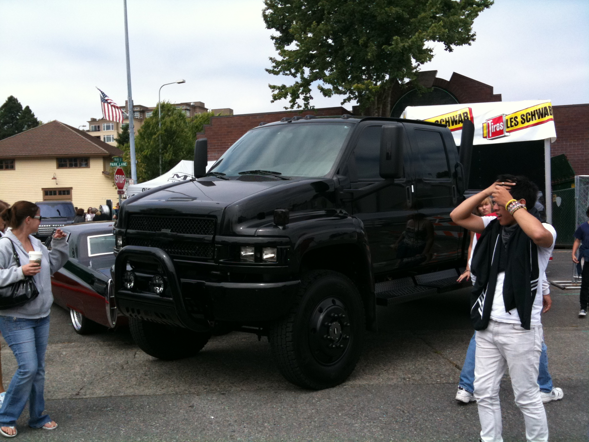덩치도 있는가하면...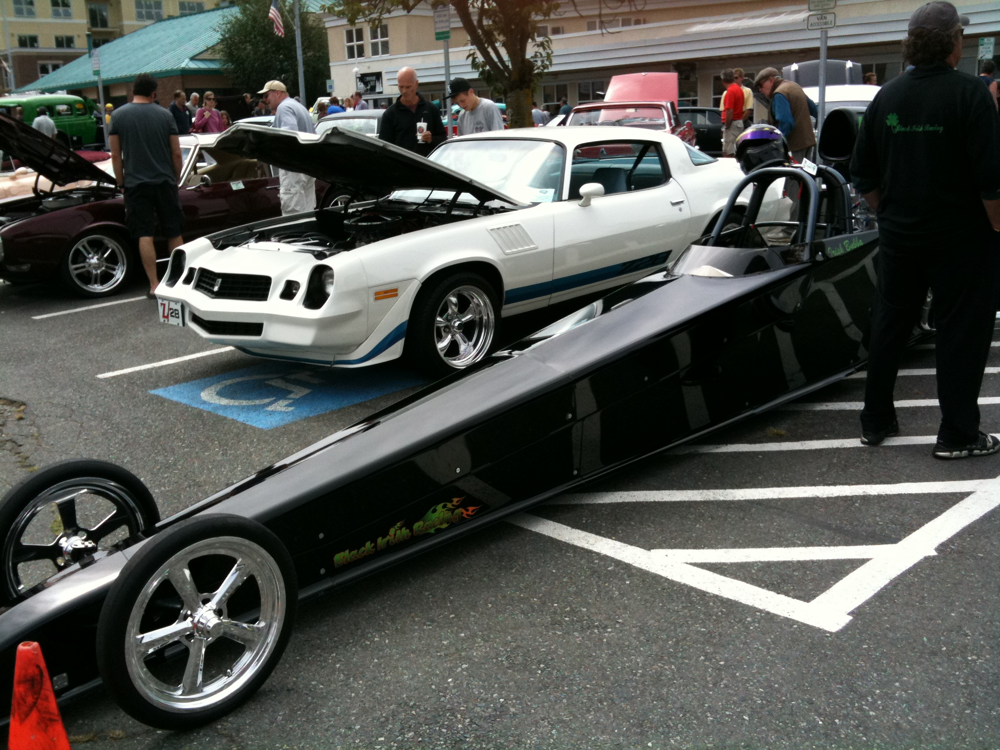길쭉이도 있고...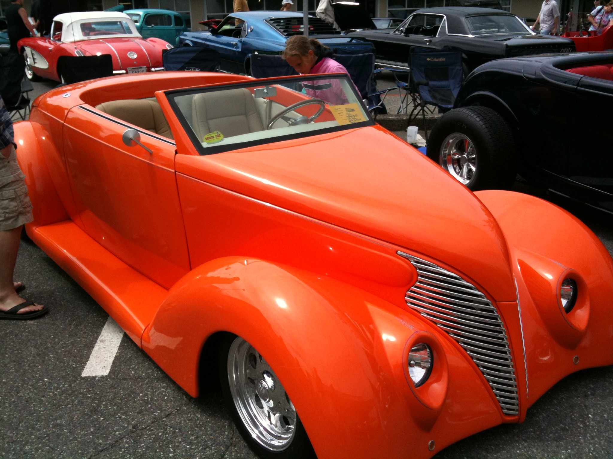빨간 놈이 있는가하면...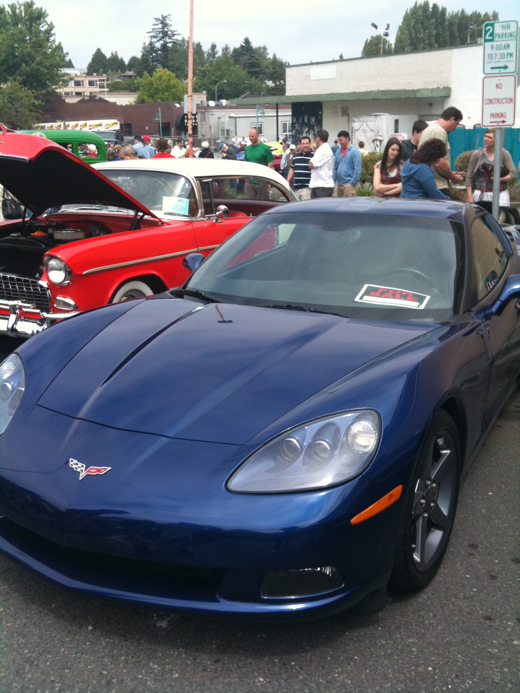파란 놈도 있다.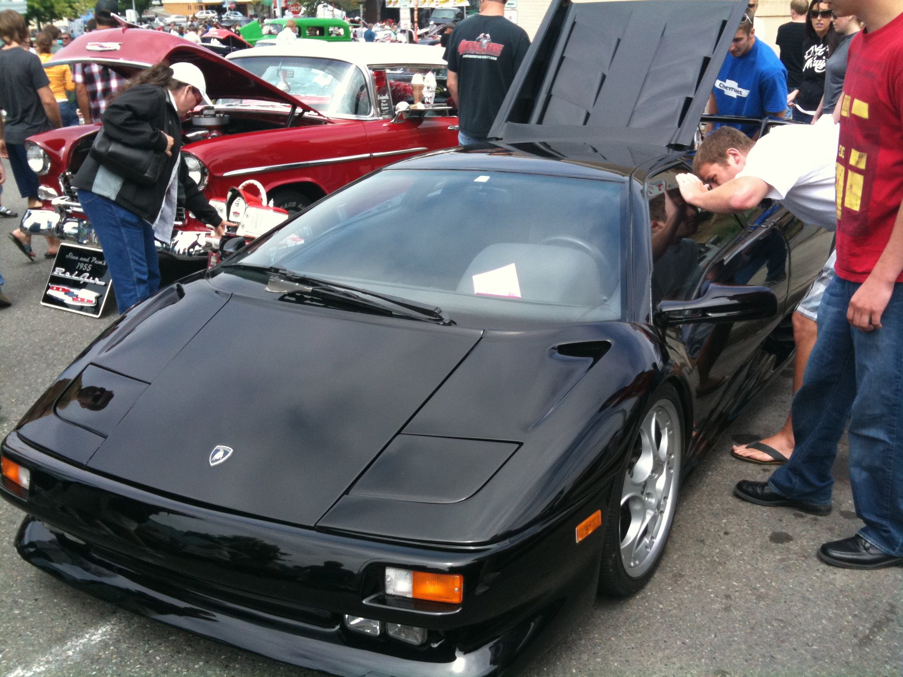사진만 보고 무슨 차인지 맞출 수 있는 분? 답은람보르기니 디아블로이거슨 아름다운 뒷태.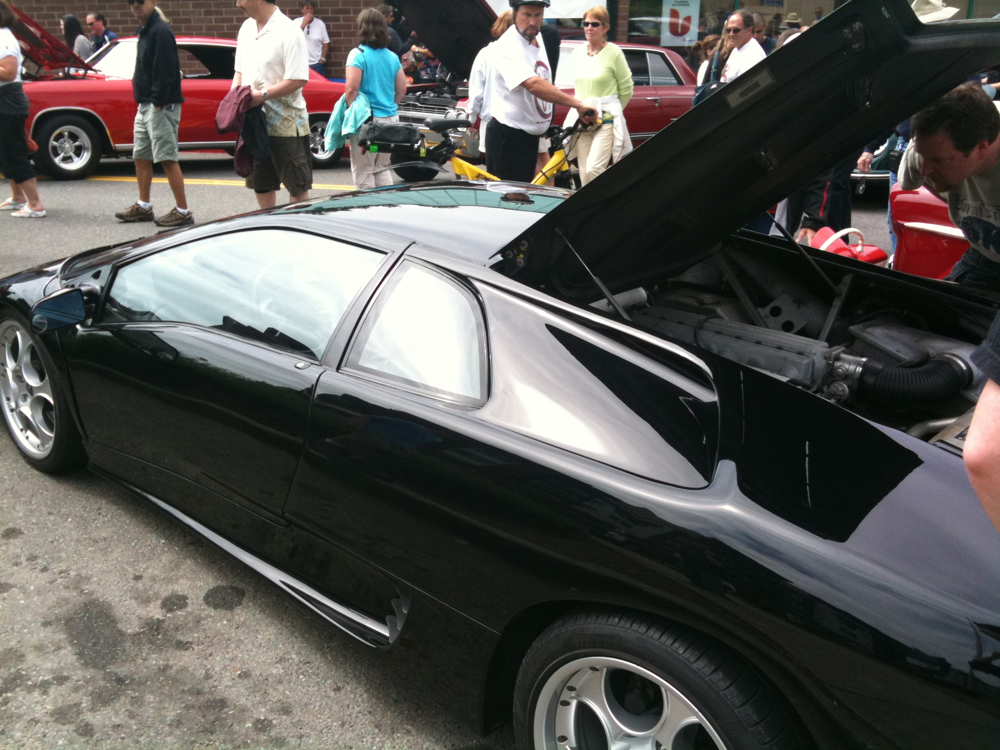(내 쩌는 뒷태를 보고 열폭하라고!)그런데 이런 차도 Classic으로 분류가 되는걸까?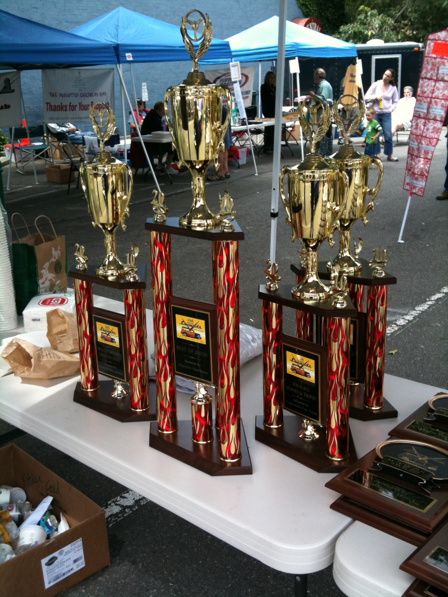쪼그만 동네 잔치인 줄 알았는데 관객 심사로 상도 준다. 트로피가 꽤 화려하군요.한번에 다 올리려니 사진이 너무 많아서 둘로 나눠서 올린다.