## Classic Car Show (이어서)

먼저 글에 이어서...

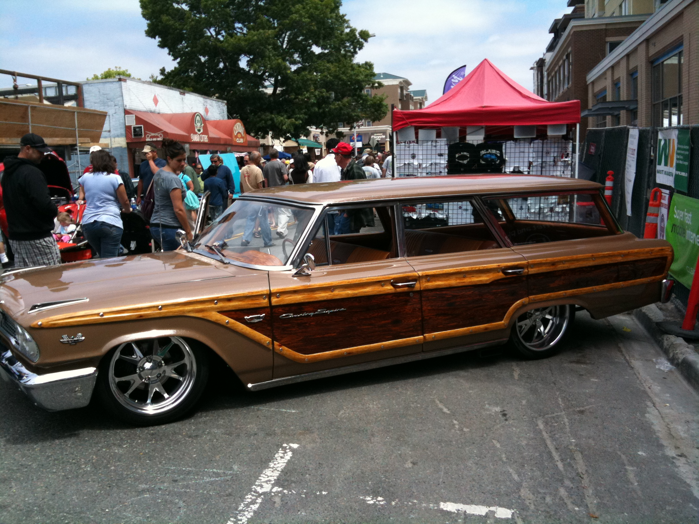정말 난생 처음 보는 차들도 많았다.

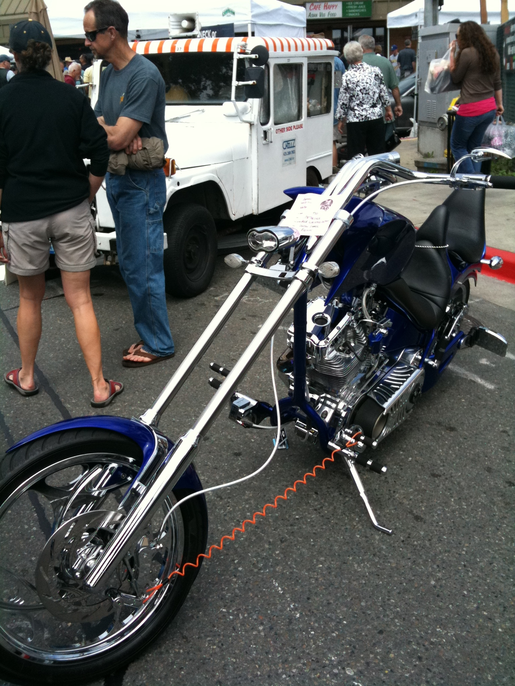뭐 이륜차도 차는 차니까...

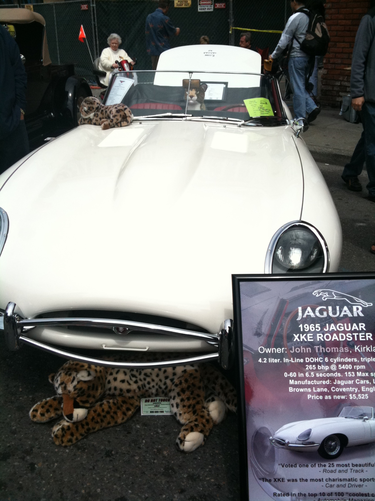재규어 위에 재규어, 재규어 밑에 재규어.

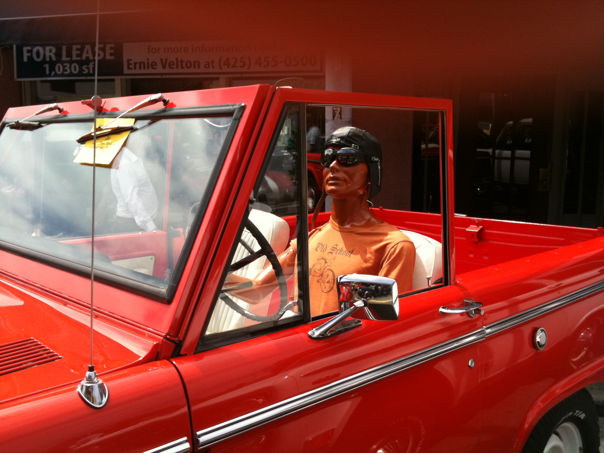음... 무슨 말을 해야 할 지...

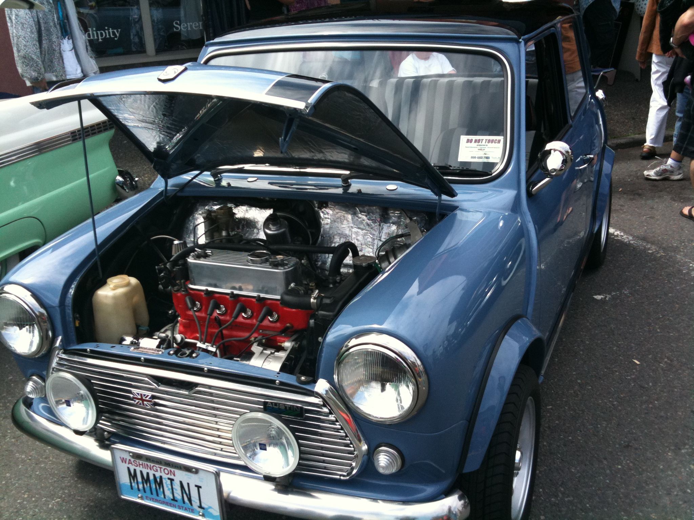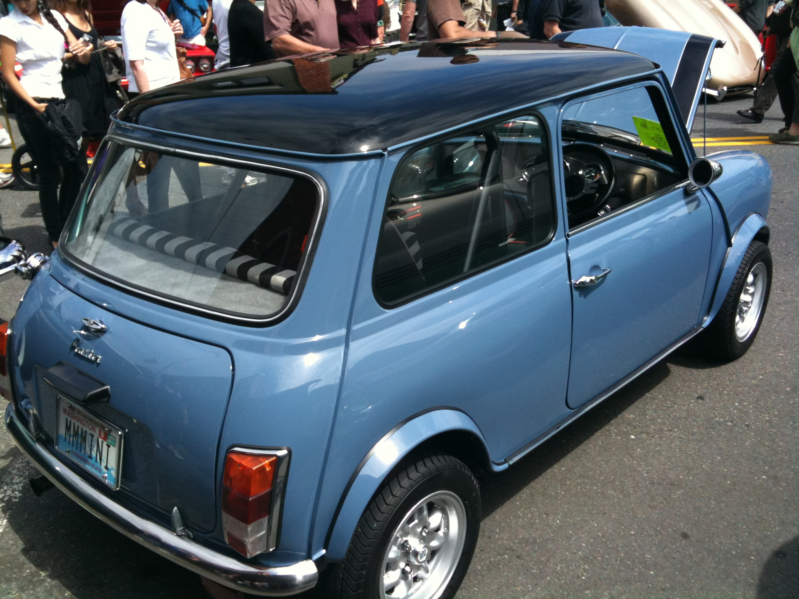어쩐지 친숙한 외관이죠? 번호판에도 쓰여있듯이 오리지널(?) 미니.

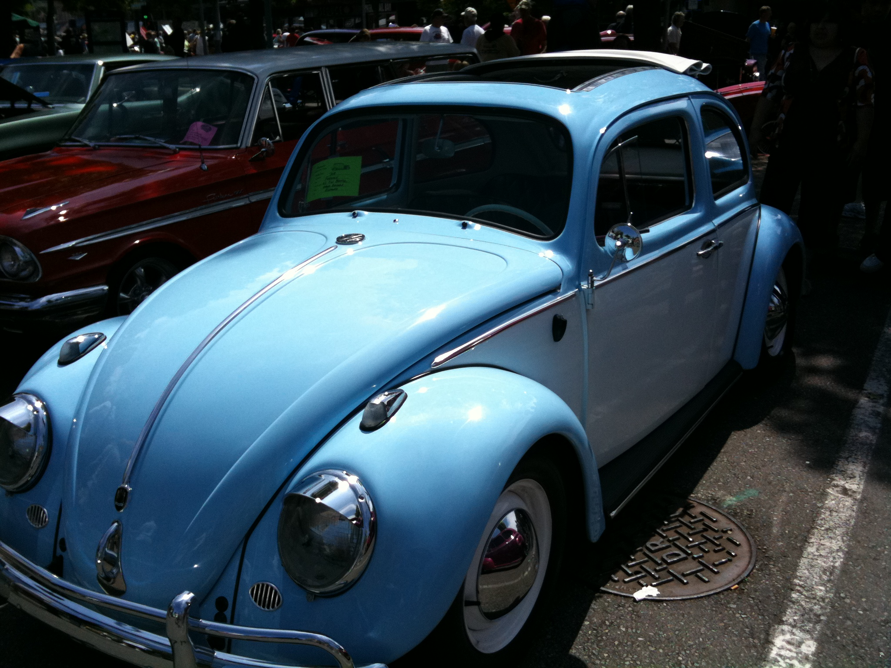질 수 업뜸! 난 비틀.

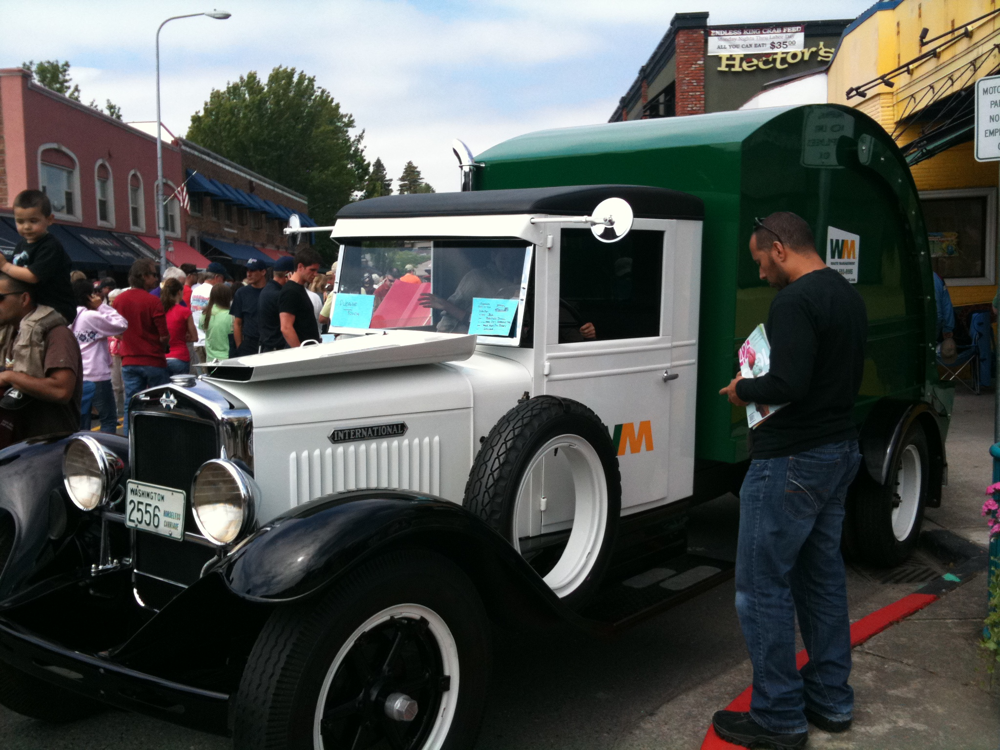쓰레기 수거차(Waste Management)마저도 옛스럽게 개조하였다. 이사람들 참...

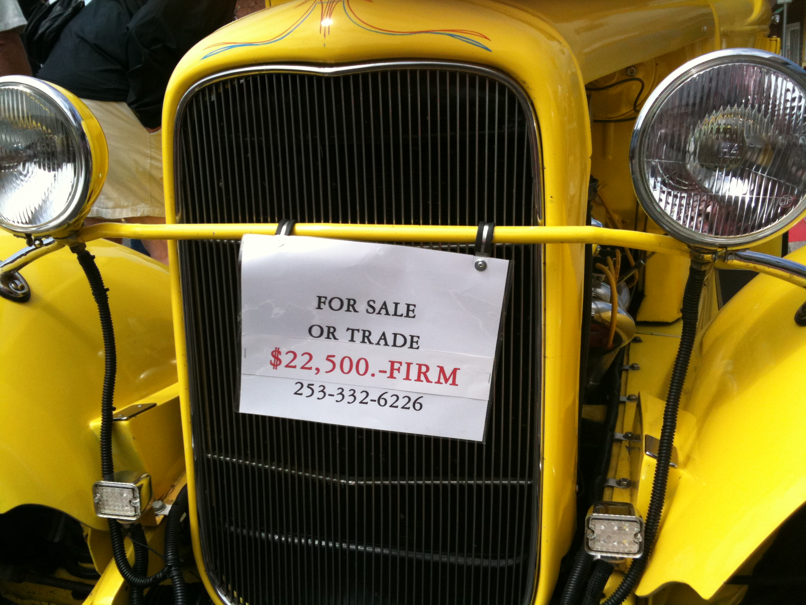진열된 차 중에는 실제로 팔려고 내놓은 차도 꽤 있다. 그런데 바로 위 팻말이 보여주듯 결코 똥차 값에 내놓지 않는다. 사실 옛날 스타일이긴 해도 모든 차들이 차체와 내부는 광이 날 정도로 깔끔하게 관리했다. 미국사람들 진짜로 차를 좋아하는구나하고 새삼 느꼈다. 하지만 난 돈이 있어도 저런 차는 안살거야. 저 값이면 Honda Civic 풀옵션이나 Accord 중간 옵션으로 새차를 뽑을 수 있는데... ㅜ.ㅜ

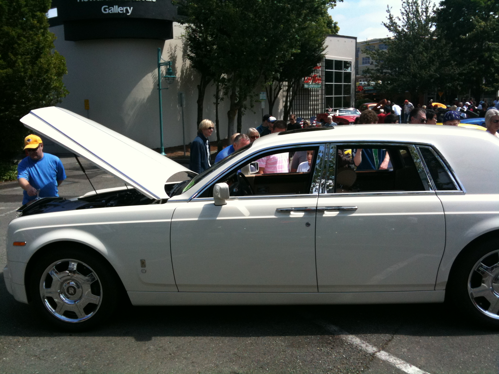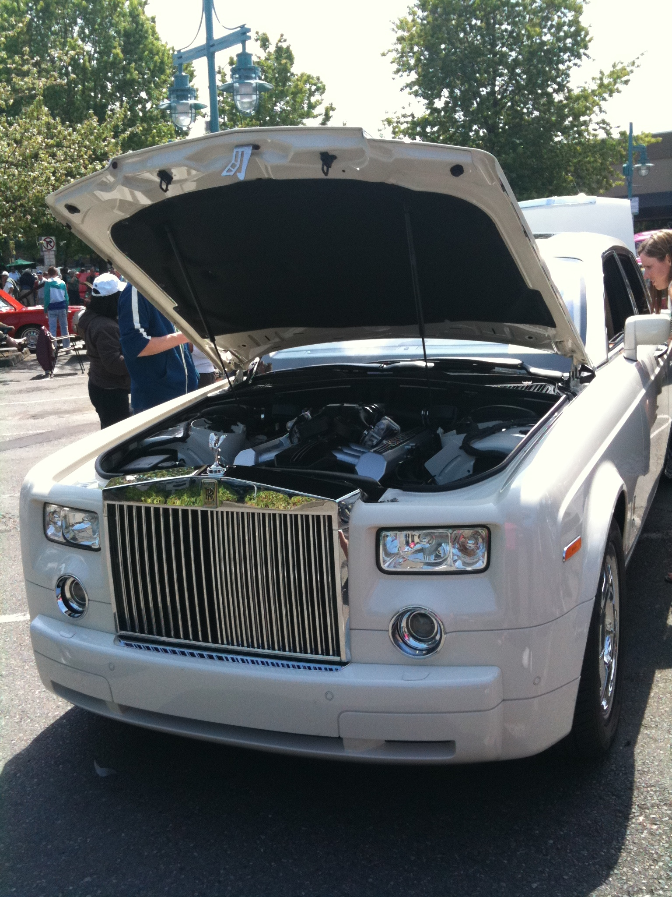롤스로이스의 위엄(두둥!)

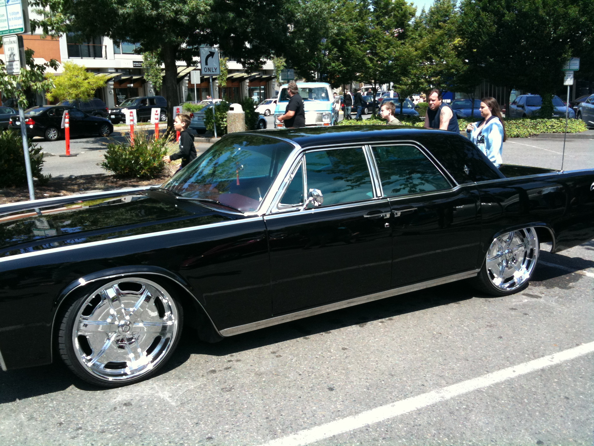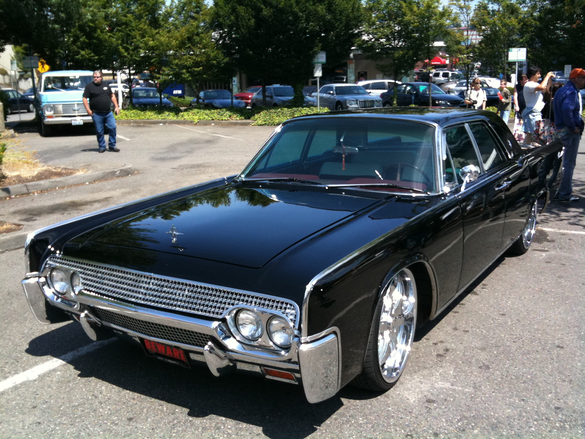그에 못지 않은 링컨 컨티넨탈.

사실 오늘 올린 모든 사진들을 버로우시킬 수 있는 사진을 찍을 기회가 있었다. 바로 말로만 했던 금발 비키니! 진짜 방금 바다에서 나온 듯한 똑같은 땡땡이 무늬 비키니 차림의 언니 네 분이 거리를 나란히 활보하는데! 구릿빛 피부에 금발 생머리, 말그대로 쭉쭉빵빵! 어설픈 레이싱걸은 저리 가라! 친절하게도 주변의 관람객과 포즈를 취해주기까지도.

하지만 우물쭈물하는 사이에 저멀리 사라지심. OTL
역시 인생은 타이밍이라는 교훈을 뼈저리게 떠올렸다. 난 아마 안될거야.

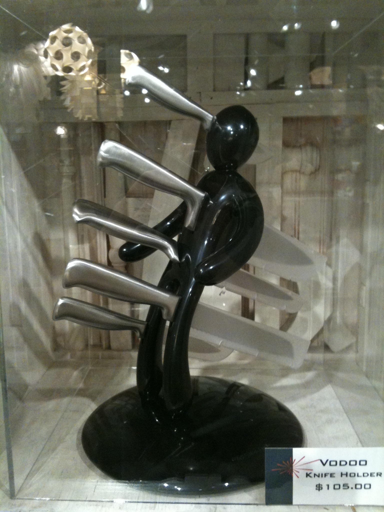

- 2010/07/19 14:16 작성