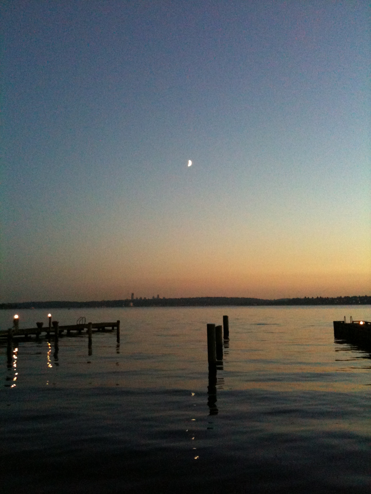
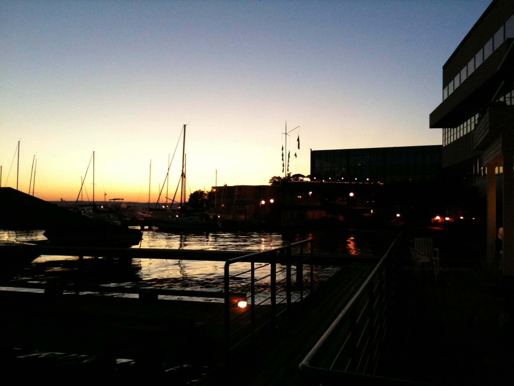
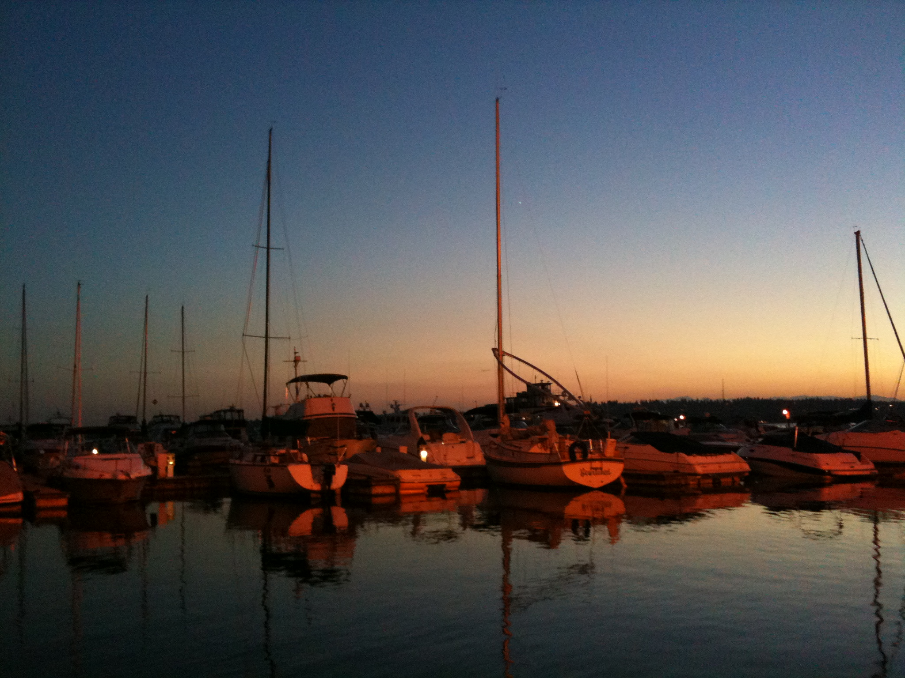
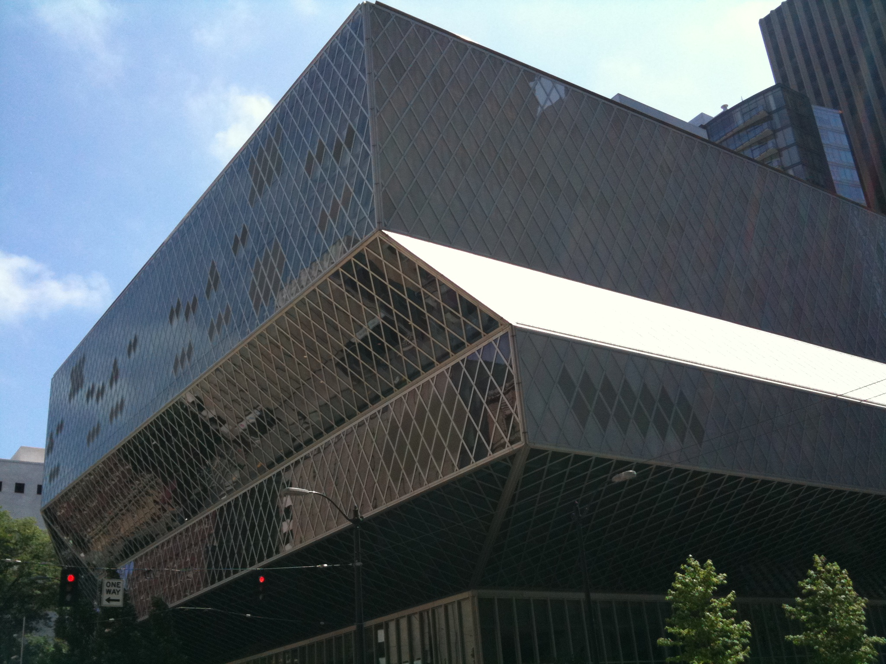

### 이런저런 사진

Kirkland로 와서 사진을 많이 찍어 올렸는데, 마땅한 제목이 없어 그냥 놔두었던 사진들을 모아서 올린다.

Lake Washington의 저녁 노을. 집앞으로 오십 미터만 나가면 이런 풍경이 보인다. 노을 위로 달이 뜬 하늘은 사진보다 훨씬 더 아름다운데, 폰사진이라 느낌을 제대로 살리지 못해서 영 불만스럽다.

호수가를 따라 콘도가 여러 채 늘어서 있는데, 그 앞에는 보트와 요트들을 정박시켜 놓았다. 빛과 그림자가 어우러져 나름 분위기 있는 장면이 연출되었음.

역시 같은 장소에서 찍은 정박중인 배들.

시애틀 시내에 있는 Central Library. 외관이 독특해서 최근 완공한 건물인 줄 알았는데 의외로 쫌 된 녀석인 듯? 하지만 내부는 외관보다 더 놀랍다. 시애틀 여행할 일 있으면 추천하고 싶음. 저래 보여도 나름 10층짜리 건물이다.

- 2010/07/23 14:18 에 작성