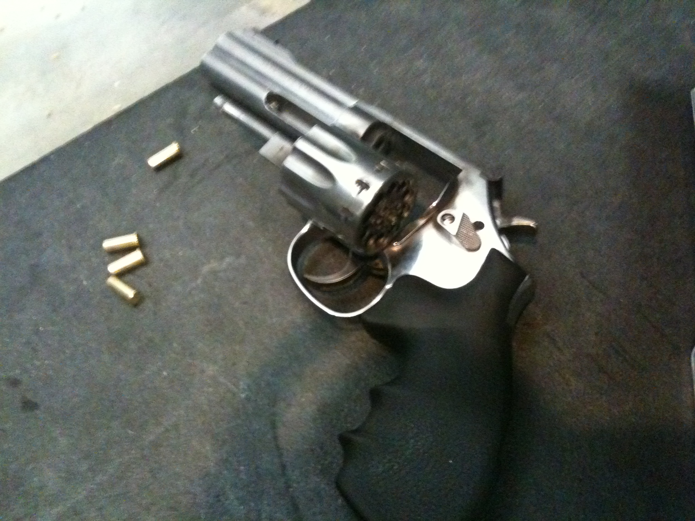
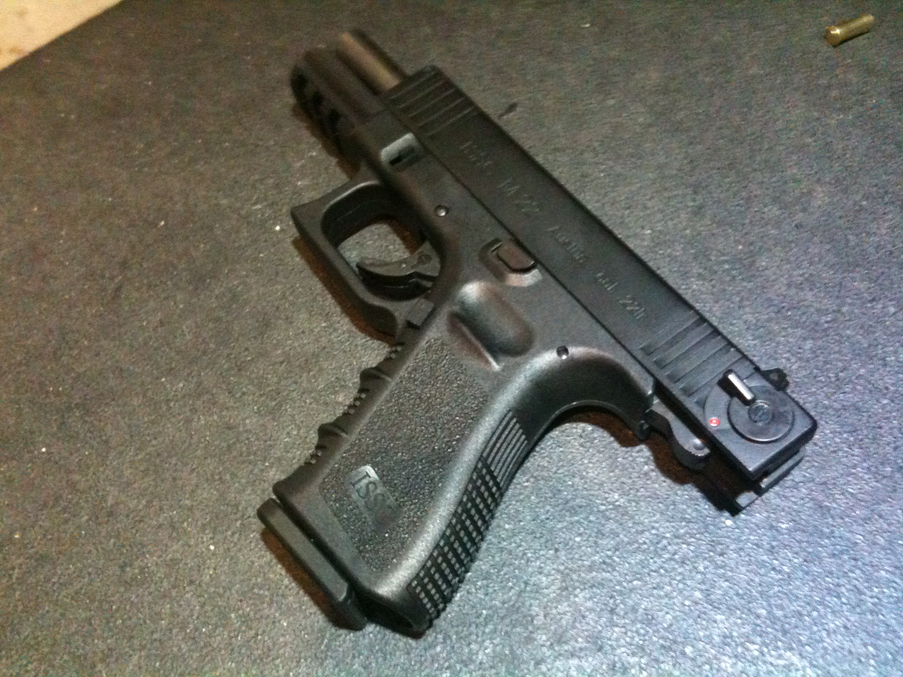
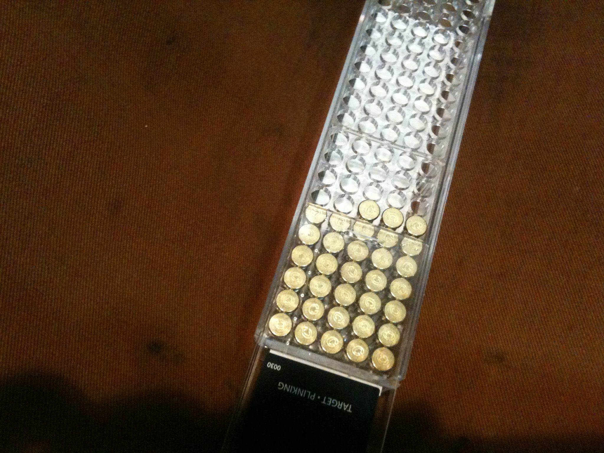
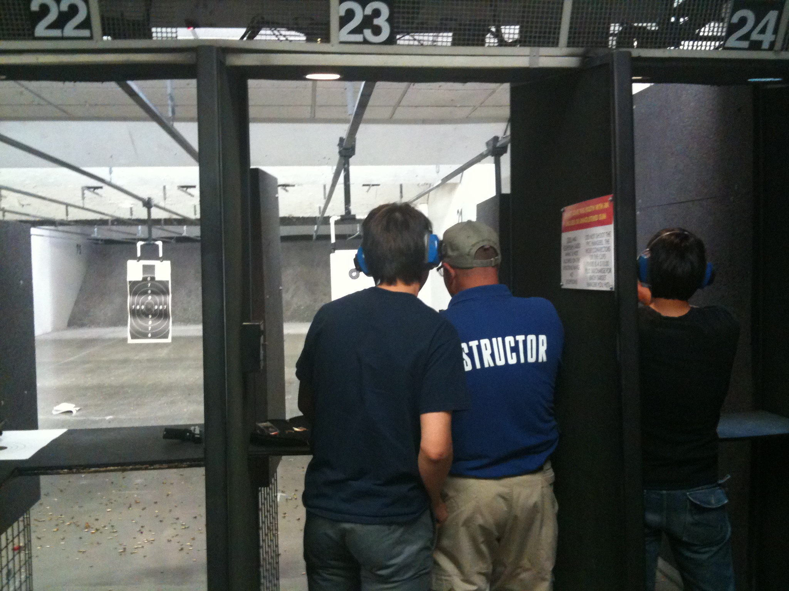

## 제목
Gun Shooting in Kirkland

## 날짜
2010/07/29 14:55

## 본문
어제 점심을 먹고 있는데 같은 팀에 있는 인턴 애가 오더니 "오늘 저녁에 총쏘러 가지 않을래?"하고 묻는다. 웬 총쏘기?하고 얘기를 좀 들어보니 옆동네에 총기연습장이 있는데 마침 Lady's day라고 해서 여자가 끼면 할인을 해주는갑다. 인턴들과 학교 친구들을 모아서 간다길래 나도 낀다고 했다.

얘기만 들었을 때는 놀이공원 공기총이라도 쏘는 줄 알았는데 이곳은 무려 미쿡. 총기가 합법화된 나라지. 권총부터 장총까지 수십여 종이 진열되어 있고, 총알 종류도 여러 가지 된다.

신청서 작성할 때 ID 번호를 적는 곳이 있어서 혹시 여권이 없으면 못쏘는 건 아닌가 걱정했는데, 다행히 학생증으로 대신할 수 있었다.

고글, 귀마개, 총기와 총탄을 지급받고 레인에 들어서니 총소리가 장난이 아니다. 귀마개를 했음에도 불구하고 처음엔 깜짝깜짝 놀랄 정도. 4주 군사훈련 받을 때 겪었지만 몇 년 지나고나니 그때 총소리는 다 잊어버렸는지 면역력이 없었다.

받은 총알은 .22인치. 가장 많은게 이것과 9mm 인 듯. 나야 총기류에 대해 무지하니 적당히 패스.

레인에 들어서고 직원에게 간단히 총기 다루는 법을 교육받았다. 열심히 설명은 들었지만 역시 레인에 들어서면 긴장하게 됨. 우리 그룹은 여섯 명인데, 레인을 두 개 받고 총기도 두 개 받았다. 하나는 옛날 영화에서 많이 본 리볼버. 원통에 돌아가면서 총알을 장전하고 쏘는 녀석이다. 다른 하나는 일반적인 매그넘.

.22인치 총알은 박스당 100개씩 들었는데 2 박스를 샀다. 총 200개니깐 6명이서 쏘면 대충 30여발을 쏜다는 계산인데 그렇게 많이 쐈던가? 아무튼 양쪽 다 두어번 쏴보았다.

7시 반쯤 도착했지만 앞에 기다리는 사람이 많아서 한참 기다렸다가 거의 마지막으로 하는 바람에 폐점 시간인 10시 가까이 되서야 끝났다. 그런데 오히려 행운이었던 게, 사람들이 거의 다 빠져나가고 정리할 때쯤 되니깐 직원 아자씨가 다른 총들도 구경을 시켜 주었다.

라이플도 몇 발 쏴보고, 구경이 다른 매그넘 두 개도 쏴봤다. 특히 매그넘은 그냥 공짜로 쏘게 해줬는데, 앞서 쐈던 두 개와는 차원이 달랐다. 발사 후폭풍(...)이 얼굴을 스치는 게 느껴질 정도. 같은 그룹에 여자애 둘이 있었는데 앞선 발사 장면을 보더니 벌벌 떨면서 간신히 쏘더라. 폭발력이 너무 커서 쏘는 순간 많이 빗나간다. 내가 처음으로 과녁 안쪽에 맞춰서 우쭐했는데 처음 얘기 꺼낸 친구가 불스아이(정중앙)에 맞춰버리는 바람에 버로우...

처음 들어갔을 때는 꽤 겁먹었는데 역시 익숙해지면 별다른 느낌은 안난다. 총쏘기를 취미로 하는 사람들도 많은 듯 한데 역시 좀 신기한 나라야.