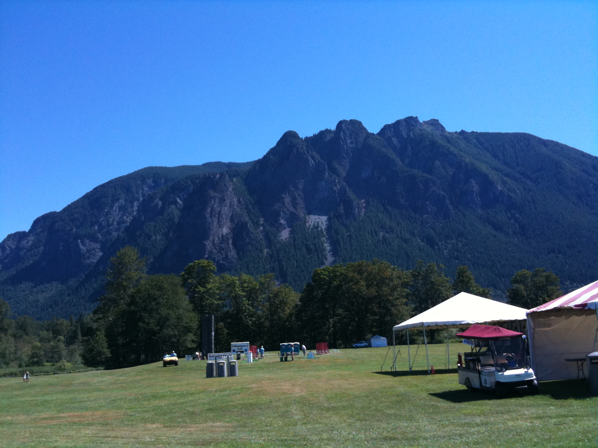
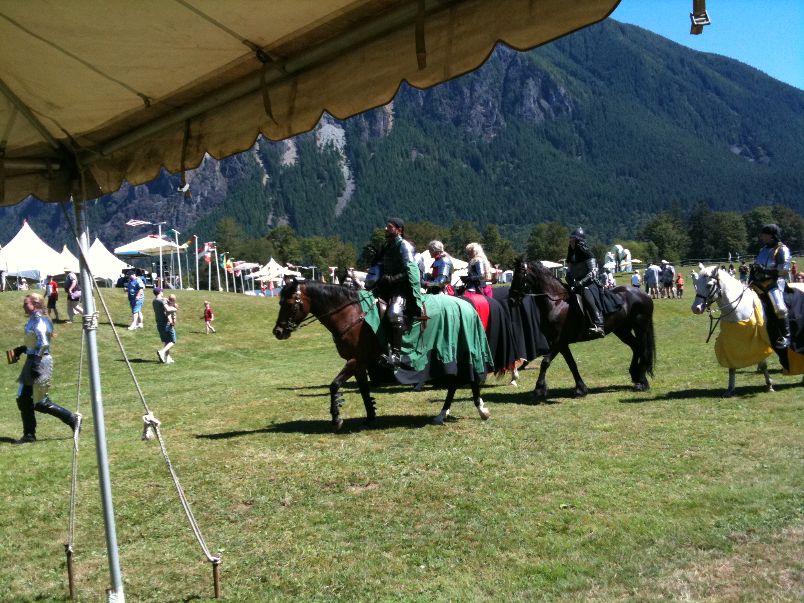
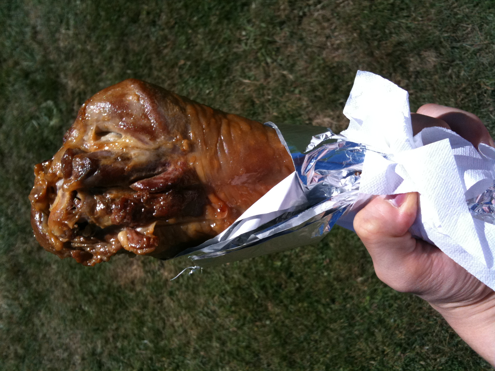

## Summer Picnic - Mountain Meadow

Google에 와서 일하면서 한가지 예상이 빗나갔다. 여기 사람들은 개인주의 성향이 강하기 때문에 회사 단위로 행사를 하는 일이 없을 거라고 생각했는데, 틀렸다. 한국에서처럼 자주는 아니지만 회식도 하고 일종의 야유회도 한다. 바로 오늘처럼.

한여름의 주말을 맞아 직원과 가족들이 참여하는 여름 소풍이 열렸다. 장소는 Kirkland에서 차로 약 40분 거리인 Mountain Meadow. 문자 그대로 산 바로 옆에 널찍한 초원이 있어서 천막을 치고 놀 수 있는 곳이다. 아래 사진과 같은 산이 떡하니 보인다.

하지만 한국 회사와 공통점은 이런 행사가 있다는 것 뿐. 한국에서는 (그래봤자 한군데밖에 일해보지 않았지만) 보통 워크샵이나 체육대회 같은 회사 행사가 있으면 아침부터 오후 늦게까지, 빡빡하게 짜여진 프로그램에 따라서, 시작과 끝날때 높으신 분들이 무대 앞에 나가 뭔가 한마디씩 해야 하고, 신입사원들은 뭔가 장기자랑이라도 준비해가야 하는 법.

그런데 오늘의 소풍은 그야말로 가족나들이였다. 회사에서 셔틀만 제공하고 도착부터 출발까지 뭘 하라는 얘기는 단 한마디도 없었음. 그저 그늘에 갖고온 돗자리 깔고 준비된 음식 가져다 먹고 떠들고 쉬고 구경하고 놀고 춤추고 피곤하면 한숨 자다가 다시 돌아가면 끝이다. 오전 11시에 회사에서 출발해서 돌아오니 오후 5시.

소풍의 주제는 중세시대여서, 행사장에는 중세 기사들의 복장을 한 아저씨 아줌마들이 각종 무기를 들고 나온다. 복장 색깔별로 파벌을 나누고 파벌끼리 창검 대결과 승마 시합을 벌인다. 나름 설정도 있어서 다들 Sir, Dame과 같은 호칭을 붙여 소개된다.

가장 볼만한 건 역시 승마 시합 (Jausting). HOMM에서 보던 단어를 실제로 듣는구나... 아무래도 제대로 하긴 위험하니깐 형식적으로 하긴 하지만 그래도 꽤 재미있다.

이건 승마가 아닌 창검 시합. 사용하는 무기는 장검, 단검, 쌍검, 도끼, 창, 메이스 등 다양하다. 개인적으로는 쌍수 단검을 들고 있던 언니가 인상적이었다. 마치 와우의 도적같은 분위기.

쭉 지켜보면서 멋지다는 생각보다는 이 더운날 땡볕 아래서 저 무거운 갑옷을 입고 뛰어다니려니 얼마나 힘들까 안쓰러운 마음부터 들었다. 나이 먹었어...

더운 날씨에 수고가 많으십니다.

전투(?)가 모두 끝난 뒤에도 각종 게임과 밴드 공연 등이 있었지만 역시나 노는 사람은 제각각. 날이 평소답지 않게 많이 더웠던 탓에 그늘을 많이 찾기 때문이 아닌가 싶었다. 그래도 백인 애들은 햇볕 아래서 신나게 잘 논다. 선크림을 발랐겠지만 나는 부담스러워서 못나가겠더만.

도착했을 때가 12시여서 바로 점심을 먹었는데, 가장 인상깊었던 녀석.

칠면조 다리 되시겠다. 이밖에도 돼지갈비, 구운 감자와 옥수수, 핫도그, 햄버거, 과일, 아이스크림, 케익, 음료수, 맥주 등등 먹거리도 정말 푸짐했다. 한국에서 회사 행사가 있어도 이렇게 음식이 푸짐했던 기억은 없는데. 미쿡애들 참 풍요롭게 산다.

날씨만 좀 시원했더라면 완벽했을 터인데 햇볕이 너무 세서 계속 천막 아래에 앉아 있었다. 다행히 바람이 잘 불어서 앉아있기 괜찮았다. 누구 같이 갈 사람 있었으면 더 재미있었으련만.

- 2010/08/15 12:03 작성